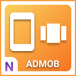
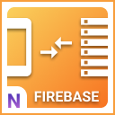
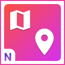
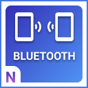

# Nineva Studios documentation

Welcome to the Nineva Studios doucumentation page!

This documentation is open-source: https://github.com/NinevaStudios/nineva-docs. Please submit your fixes/suggestions as pull requests.

Useful links:

- [Our web site](https://ninevastudios.com)
- [Talk to us on discord](https://bit.ly/nineva_support_discord)
- [Explore our Unity plugins](https://assetstore.unity.com/publishers/5296)
- [Explore our Unreal Engine 4 plugins](https://www.unrealengine.com/marketplace/profile/Nineva+Studios)

## Unreal Engine 4 Plugins

<table>
  <tr>
    <td align="center"><a href="#ue-plugins/admob-unreal"> Admob Goodies</a></td>
    <td align="center"><a href="#ue-plugins/android-goodies-unreal"> Android Goodies</a></td>
    <td align="center"><a href="#ue-plugins/ios-goodies"> iOS Goodies</a></td>
	<td align="center"><a href="#ue-plugins/firebase-unreal"> Firebase Goodies</a></td>
  </tr>
  <tr>
    <td align="center"><a href="#ue-plugins/google-maps-unreal"> Google Maps View</a></td>
    <td align="center"><a href="#ue-plugins/ble-goodies"> BLE Goodies</a></td>
    <td align="center"><a href="#ue-plugins/google-play-unreal"> Google Play Goodies</a></td>
    <td align="center"><a href="#ue-plugins/facebook-goodies"> Facebook Goodies</a></td>
  </tr>
  <tr>
    <td align="center"><a href="#ue-plugins/deep-link-unreal"> Deep Link Goodies</a></td>
    <td align="center"><a href="#ue-plugins/monetization-unreal"> Monetization Goodies</a></td>
	  <td align="center"><a href="#ue-plugins/game-center-unreal"> Game Center Goodies</a></td>
  </tr>
</table>

## Unity Plugins

- [Android Goodies](unity-plugins/android-goodies)
- [Google Maps View](unity-plugins/google-maps)
- [iOS Goodies](unity-plugins/ios-goodies)

## Hire us!

We often do custom contract work, so feel free to reach us on our [Discord](https://bit.ly/nineva_support_discord) or drop a line to info at ninevastudios.com
