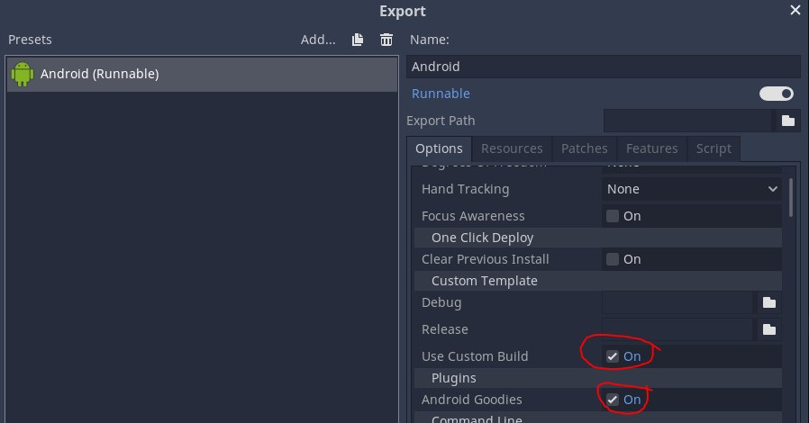
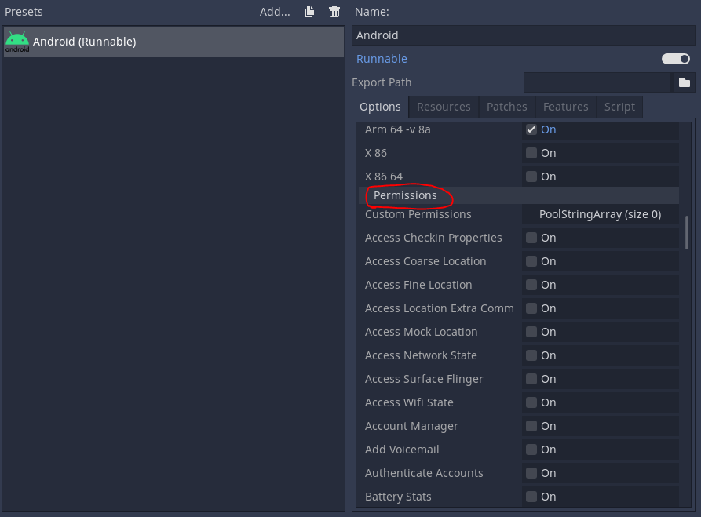

# **Android Goodies**

Welcome to Android Goodies Documentation for Godot

?> **Join our [Discord server](https://bit.ly/nineva_support_discord) and ask us anything!**

___

# **Initial Setup**

Extract the .zip file with the plugin to `[Project]/android/plugins` directory (create, if needed).

## Create build template

Open your project in Godot editor. Go to Project->Export and create an export [preset](https://docs.godotengine.org/en/stable/development/compiling/compiling_for_android.html#using-the-export-templates) for Android build.

Select the custom build option and make sure the plugin is selected, as well.



## Add permissions

Some of the plugin's features require additional permissions. They have to be added manually to the build template:



- vibrate, stop vibration: **Vibrate**;
- file pickers: **Read External Storage**;
- take photo, record video, flashlight: **Camera**;
- save image to gallery: **Write External Storage**;
- send SMS directly: **Send SMS**.

# **Native UI**

Get a reference to a AGNativeUi object:

``` gdscript
var native_ui = AGNativeUi.new()
```

## Native dialogs

### Message dialog

``` gdscript
# Show the default Android message dialog with one, two or three buttons.
# 
# @param title: message title text to be displayed in dialog.
# @param body: message text to be displayed in dialog.
# @param button_dialog_data: ButtonDialogData object containing information about the buttons to be displayed on the dialog.
# @param theme: theme of the dialog. One of the DialogTheme constants.
# @param is_cancelable: whether the dialog can be dismissed by tapping outsude its bounds.
# @param cancel_callback_name: name of the callback function to be invoked if the dialog is cancelled.
# @param cancel_callback_object: object on which the cancel_callback_name is invoked if the dialog is cancelled.
func show_button_dialog(title : String, body : String, button_dialog_data : ButtonDialogData, theme = DialogTheme.DEFAULT, 
		is_cancelable : bool = false, cancel_callback_name : String = "", cancel_callback_object : Object = null)
```

Example:
``` gdscript
var dialog_data = AGNativeUi.ButtonDialogData.new()
	
dialog_data.positive_button_text = "Okay..."
dialog_data.positive_button_callback_name = "_onPositiveButtonClicked"
dialog_data.positive_button_callback_object = self
	
dialog_data.neutral_button_text = "Maybe?"
dialog_data.neutral_button_callback_name = "_onNeutralButtonClicked"
dialog_data.neutral_button_callback_object = self

dialog_data.negative_button_text = "NO!"
dialog_data.negative_button_callback_name = "_onNegativeButtonClicked"
dialog_data.negative_button_callback_object = self

native_ui.show_button_dialog("Title", "Text", 
		dialog_data, AGNativeUi.DialogTheme.DEFAULT, true, "_onDialogCancelled", self)
```

### Dialog with simple items chooser

``` gdscript
# Show the default Android message dialog with choosable items list.
# The dialog is dismissed when an item is selected.
# 
# @param title: message title text to be displayed in dialog.
# @param items: array of choosable text items that are displayed in dialog
# @param item_chosen_callback_name: name of the callback function to be invoked when an item is chosen (returning the index of an item).
# @param item_chosen_callback_name: object on which the item_chosen_callback_object is invoked when an item is chosen.
# @param theme: theme of the dialog. One of the DialogTheme constants.
# @param is_cancelable: whether the dialog can be dismissed by tapping outsude its bounds.
# @param cancel_callback_name: name of the callback function to be invoked if the dialog is cancelled.
# @param cancel_callback_object: object on which the cancel_callback_name is invoked if the dialog is cancelled.
func show_items_dialog(title : String, items : PoolStringArray, item_chosen_callback_name : String, item_chosen_callback_object : Object,
		theme = DialogTheme.DEFAULT, is_cancelable : bool = false, cancel_callback_name : String = "", cancel_callback_object : Object = null)
```

Example:
``` gdscript
native_ui.show_items_dialog("Choose one option", 
		["1", "2", "3"], "_onItemSelected", self,
		AGNativeUi.DialogTheme.DEFAULT, true, "_onDialogCancelled", self)
```

### Dialog with radio buttons items chooser

``` gdscript
# Show the default Android message dialog with single choice items list.
# 
# @param title: message title text to be displayed in dialog.
# @param items: array of choosable text items that are displayed in dialog
# @param selected_index: index of list item that is selected when the dialog is shown.
# @param item_chosen_callback_name: name of the callback function to be invoked when an item is chosen (returning the index of an item).
# @param item_chosen_callback_name: object on which the item_chosen_callback_object is invoked when an item is chosen.
# @param button_dialog_data: ButtonDialogData object containing information about the buttons to be displayed on the dialog.
# @param theme: theme of the dialog. One of the DialogTheme constants.
# @param is_cancelable: whether the dialog can be dismissed by tapping outsude its bounds.
# @param cancel_callback_name: name of the callback function to be invoked if the dialog is cancelled.
# @param cancel_callback_object: object on which the cancel_callback_name is invoked if the dialog is cancelled.
func show_single_choice_dialog(title : String, items : PoolStringArray, selected_index : int, item_chosen_callback_name : String, item_chosen_callback_object : Object, 
		button_dialog_data : ButtonDialogData, theme = DialogTheme.DEFAULT, is_cancelable : bool = false, cancel_callback_name : String = "", cancel_callback_object : Object = null)
```

Example:
``` gdscript
var dialog_data = _create_dialog_data()
	
native_ui.show_single_choice_dialog("Choose only one:", ["Intelligence", "Beauty", "Wealth"], 0, 
		"_onItemSelected", self, dialog_data, AGNativeUi.DialogTheme.DEFAULT, 
		true, "_onDialogCancelled", self)
```

### Dialog with checkboxes buttons items chooser

``` gdscript
# Show the default Android message dialog with multiple choice items list.
# 
# @param title: message title text to be displayed in dialog.
# @param items: array of choosable text items that are displayed in dialog
# @param selected_indices: indices of list item that are selected when the dialog is shown.
# @param item_selected_callback_name: name of the callback function to be invoked when an item is chosen (returning the index of an item).
# @param item_selected_callback_object: object on which the item_chosen_callback_object is invoked when an item is chosen.
# @param button_dialog_data: ButtonDialogData object containing information about the buttons to be displayed on the dialog.
# @param theme: theme of the dialog. One of the DialogTheme constants.
# @param is_cancelable: whether the dialog can be dismissed by tapping outsude its bounds.
# @param cancel_callback_name: name of the callback function to be invoked if the dialog is cancelled.
# @param cancel_callback_object: object on which the cancel_callback_name is invoked if the dialog is cancelled.
func show_multi_choice_dialog(title : String, items : PoolStringArray, selected_indices : Array, item_selected_callback_name : String, item_selected_callback_object, 
		button_dialog_data : ButtonDialogData, theme = DialogTheme.DEFAULT, is_cancelable : bool = false, cancel_callback_name : String = "", cancel_callback_object = null)
```

Example:
``` gdscript
var dialog_data = _create_dialog_data()
	
native_ui.show_multi_choice_dialog("Choose multiple:", ["Intelligence", "Beauty", "Wealth"], 
			[true, false, false], "_onMultiItemSelected", self, dialog_data, 
			AGNativeUi.DialogTheme.DEFAULT, true, "_onDialogCancelled", self)
```

### Progress dialog

``` gdscript
# Show the default Android progress dialog.
# 
# @param title: message title text to be displayed in dialog.
# @param items: array of choosable text items that are displayed in dialog
# @param progress: maximum allowed progress value.
# @param indeterminate: flag that determines whether progress dialog shows infinite animation.
# @param theme: theme of the dialog. One of the DialogTheme constants.
# @param is_cancelable: whether the dialog can be dismissed by tapping outsude its bounds.
# @param dismiss_callback_name: name of the callback function to be invoked if the dialog is dismissed.
# @param dismiss_callback_object: object on which the cancel_callback_name is invoked if the dialog is dismissed
# @param cancel_callback_name: name of the callback function to be invoked if the dialog is cancelled.
# @param cancel_callback_object: object on which the cancel_callback_name is invoked if the dialog is cancelled.
func show_progress_dialog(title : String, message : String, progress : int, max_value : int, 
		indeterminate : bool, theme = DialogTheme.DEFAULT, is_cancelable : bool = false, 
		dismiss_callback_name : String = "", dismiss_callback_object : Object = null,
		cancel_callback_name : String = "", cancel_callback_object : Object = null)
```

When progress dialog is being shown, you can update its progress by calling the `set_progress_dialog_progress` function.

``` gdscript
# Set the progress of the currently displayed progress dialog between 0 and its max_value.
func set_progress_dialog_progress(progress : int)
```

You can also dismiss it whenever you want:

``` gdscript
# Dismiss the currently displayed progress dialog.
func dismiss_progress_dialog()
```

Example:
``` gdscript
var max_progress = 100
var timer_interval = 0.5
native_ui.show_progress_dialog("Such progress", "Fascinating...", 0, max_progress, false, 
		AGNativeUi.DialogTheme.DEFAULT, false, "_onDialogCancelled", self, 
		"_on_progress_dialog_dismissed", self)
			
var timer = Timer.new()
timer.wait_time = timer_interval
self.add_child(timer)
timer.start()
	
for i in range(11):
	yield(timer, "timeout")
	var progress = max_progress * i * timer_interval / 5
	print(progress)
	native_ui.set_progress_dialog_progress(progress)
		
timer.stop()

native_ui.dismiss_progress_dialog()

timer.queue_free()
```

## Show Toasts

``` gdscript
# Show a toast message.
func show_toast(text : String, length = ToastLength.SHORT)
```

Example:
``` gdscript
native_ui.show_toast("Toast", AGNativeUi.ToastLength.SHORT)
```

# **Native sharing**

!> **Warning:** if your target SDK is 29 or higher, you have to add `android:requestLegacyExternalStorage = "true"` line to the `<application ...>` section to the generated Android manifest in `[Project]/android/build` folder.

Get a reference to a AGShare object:

``` gdscript
var sharer = AGShare.new()
```

## Share text, image or both

``` gdscript
# Share the text using default Android intent.
#
# @param subject: subject of message to be shared
# @param text_body: text of message to be shared
# @param with_chooser: flag that indicates whether to show app chooser
# @param chooser_title: chooser title text
func share_text(subject : String, text_body : String, 
		with_chooser : bool = false, chooser_title : String = "")

# Share the image using default Android intent.
#
# @param image: image to be shared
# @param with_chooser: flag that indicates whether to show app chooser
# @param chooser_title: chooser title text
func share_image(image : Image, with_chooser : bool = false, chooser_title : String = "")

# Share text with image using default Android intent.
#
# @param subject: subject of message to be shared
# @param text_body: text of message to be shared
# @param image: image to be shared
# @param with_chooser: flag that indicates whether to show app chooser
# @param chooser_title: chooser title text
func share_text_with_image(subject : String, text_body : String, image : Image,
		with_chooser : bool = false, chooser_title : String = "")
```

Example:
``` gdscript
onready var image = (load("res://icon.png") as Texture).get_data()
const chooser_title = "Choose your destiny..."

func _onShareTextWithImageButtonClicked():
	sharer.share_text_with_image("Android Goodies", "Text message", image, true, chooser_title)
```

## Send SMS

``` gdscript
# Send the sms using default Android intent.
# 
# @param phone_number: telephone number of sms recipient
# @param message: sms message text
# @param with_chooser: flag that indicates whether to show app chooser
# @param chooser_title: chooser title text
func send_sms_via_messaging_app(phone_number : String, message : String, 
		with_chooser : bool = false, chooser_title : String = "")
```

Example:
``` gdscript
sharer.send_sms_via_messaging_app("+1234567890", "SMS via chooser", true, chooser_title)
```

There is also a possibility to send SMS silently (without showing any prompts or messaging app UI) by calling send_sms_directlyfunction. A user can later find the message in the Sent folder.

?> To be able to send SMS make sure that your app has the `SEND_SMS` permission. 

``` gdscript
# Send the sms without opening messaging app. Requires the SEND_SMS permission.
# 
# @param phone_number: telephone number of sms recipient
# @param message: sms message text
func send_sms_directly(phone_number : String, message : String)
```

Example:
``` gdscript
sharer.send_sms_directly("+1234567890", "Direct SMS")
```

## Send Email

``` gdscript
# Send the email using Android intent.
# 
# @param subject: subject of the e-mail
# @param text_body: text of the message
# @param image: optional image to be attached
# @param recipients: array of recipients' addresses 
# @param cc: array of cc' addresses
# @param bcc: array of bcc' addresses
# @param with_chooser: flag that indicates whether to show app chooser
# @param chooser_title: chooser title text
func send_email(subject : String, text_body : String, image : Image, recipients : PoolStringArray, 
		cc : PoolStringArray, bcc : PoolStringArray, with_chooser : bool = false, chooser_title : String = "")
```

Example:
``` gdscript
sharer.send_email("Email with text and image", "A very meaningful text.", image, 
		["carl@borsch.com"], ["cc@gmail.com"], ["bcc@gmail.com"])
```

## Send Email with multiple images

``` gdscript
# Send the email with multiple images using Android intent.
# 
# @param subject: subject of the e-mail
# @param extra_images: images to be attached
# @param recipients: array of recipients' addresses 
# @param cc: array of cc' addresses
# @param bcc: array of bcc' addresses
# @param with_chooser: flag that indicates whether to show app chooser
# @param chooser_title: chooser title text
func send_email_with_images(subject : String, extra_images : Array, recipients : PoolStringArray, 
		cc : PoolStringArray, bcc : PoolStringArray, with_chooser : bool = false, chooser_title : String = "")
```

Example:
``` gdscript
sharer.send_email_with_images("Email with multiple images", [image, image, image],
		["carl@borsch.com"], ["cc@gmail.com"], ["bcc@gmail.com"])
```

## Share video

``` gdscript
# Share the video using default Android intent.
#
# @param video_path: path to video file (on the device) to be shared
# @param with_chooser: flag that indicates whether to show app chooser
# @param chooser_title: chooser title text
func share_video(video_path : String, with_chooser : bool = false, chooser_title : String = "")
```

Example:
``` gdscript
var sharer = AGShare.new()
var pickers = AGPickers.new()

func _onPickAndShareVideoButtonClicked():
	pickers.pick_videos(true, false, "_onVideosPicked", self, "_onPickError", self)
	
func _onVideosPicked(videos : Array):
	sharer.share_video(videos[0].original_path, true, chooser_title)
		
func _onPickError(error : String):
	print(error)
```

# **Getting info**

Get a reference to a AGDeviceInfo object:

``` gdscript
var sharer = AGDeviceInfo.new()
```

## Getting device information

``` gdscript
# Check if the device supports one of the SystemFeature items.
func has_system_feature(feature : String) -> bool

# Get application package name.
func get_package_name() -> String

# Check if the provided package is installed on the device.
func is_package_installed(package_name : String) -> bool

class Build:
	# The name of the underlying board, like "goldfish".
	func board() -> String
	
	# The system bootloader version number.
	func bootloader() -> Stringplugin singleton")
			return ""
	
	# The consumer-visible brand with which the product/hardware will be associated, if any.
	func brand() -> String
	
	# The name of the industrial design. 
	func device() -> String
	
	# A build ID string meant for displaying to the user.
	func display() -> String
			
	# The name of the hardware (from the kernel command line or /proc).
	func hardware() -> String
			
	# The manufacturer of the product/hardware.
	func manufacturer() -> String
			
	# The end-user-visible name for the end product. 
	func model() -> String
			
	# The name of the overall product. 
	func product() -> String
			
	# Returns the version string for the radio firmware.  
	# May return null (if, for instance, the radio is not currently on).
	func radio_version() -> String
			
	# Comma-separated tags describing the build, like "unsigned,debug".
	func tags() -> String
			
	# The type of build, like "user" or "eng".
	func type() -> String
			
	# Various version strings.
	class Version:
		# The SDK version of the software currently running on this hardware device.
		# Possible values are defined in VersionCodes.
		func sdk_int() -> int
				
		# The base OS build the product is based on.
		func base_os() -> String
				
		# A build ID string meant for displaying to the user.
		func codename() -> String
				
		# The user-visible version string.  E.g., "1.0" or "3.4b5" or "bananas".
		func release() -> String
```

Example:
``` gdscript
var device_info = AGDeviceInfo.new()
var build = AGDeviceInfo.Build.new()
var build_version = AGDeviceInfo.Build.Version.new()

print(device_info.has_system_feature(AGDeviceInfo.SystemFeature.MANAGED_USERS))

var package_name = device_info.get_package_name()
info += "Package name: " + package_name + "\n"
info += "Is package installed: " + String(device_info.is_package_installed(package_name)) + "\n"
	
info += "Build Version: \n"
info += "SDK int: " + String(build_version.sdk_int()) + "\n"
info += "Base OS: " + build_version.base_os() + "\n"
info += "Codename: " + build_version.codename() + "\n"
info += "Release: " + build_version.release() + "\n"
	
info += "Build: \n"
info += "Board: " + build.board() + "\n"
info += "Bootloader: " + build.bootloader() + "\n"
info += "Brand: " + build.brand() + "\n"
info += "Device: " + build.device() + "\n"
info += "Display: " + build.display() + "\n"
info += "Hardware: " + build.hardware() + "\n"
info += "Manufacturer: " + build.manufacturer() + "\n"
info += "Model: " + build.model() + "\n"
info += "Product: " + build.product() + "\n"
info += "Radio version: " + build.radio_version() + "\n"
info += "Tags: " + build.tags() + "\n"
info += "Type: " + build.type() + "\n"
```
___

# **File tools**

Get a reference to a AGPickers object:

``` gdscript
var pickers = AGPickers.new()
```

## Images

!> `take_photo` requires the [CAMERA](https://developer.android.com/reference/android/Manifest.permission_group.html#CAMERA) permission.

``` gdscript
# Pick image from gallery.
#
# @param max_size: size of the resulting image (pick smaller value to save memory). Pass value <=0 to keep original size.
# @param generate_thumbnails: flag that indicates whether to generate thumbnails
# @param allow_multiple: flag that indicates whether to pick multiple files
# @param images_picked_callback_name: name of the callback function to be invoked after successful pick (Array of PickedImage)
# @param images_picked_callback_object: object on which the images_picked_callback_name is invoked
# @param pick_error_callback_name: name of the callback function to be invoked if the pick results in an error (String)
# @param pick_error_callback_object: object on which the pick_error_callback_name is invoked
func pick_image_from_gallery(max_size : int, generate_thumbnails : bool, allow_multiple : bool, images_picked_callback_name : String, 
		images_picked_callback_object : Object, pick_error_callback_name : String, pick_error_callback_object : Object)

# Pick photo from camera.
#
# @param max_size: size of the resulting image (pick smaller value to save memory). Pass value <=0 to keep original size.
# @param generate_thumbnails: flag that indicates whether to generate thumbnails
# @param images_picked_callback_name: name of the callback function to be invoked after successful pick (Array of PickedImage)
# @param images_picked_callback_object: object on which the images_picked_callback_name is invoked
# @param pick_error_callback_name: name of the callback function to be invoked if the pick results in an error (String)
# @param pick_error_callback_object: object on which the pick_error_callback_name is invoked
func take_photo(max_size : int, generate_thumbnails : bool, images_picked_callback_name : String, images_picked_callback_object : Object,
		pick_error_callback_name : String, pick_error_callback_object : Object)
```

Example:
``` gdscript
onready var result_image = get_node("PickedImage") as TextureRect

func _onPickImagesButtonClicked():
	pickers.pick_image_from_gallery(-1, false, true, "_onImagesPicked", self, "_onPickError", self)
		
func _onTakePhotoButtonClicked():
	pickers.take_photo(128, true, "_onImagesPicked", self, "_onPickError", self)

func _onImagesPicked(images : Array):
	_set_texture(images[0].original_path)
	_rotate_rect(images[0].image_orientation)

func _onPickError(error : String):
	print(error)

func _set_texture(path : String):
	var image = Image.new()
	image.load(path)
	var texture = ImageTexture.new()
	texture.create_from_image(image)
	result_image.texture = texture

func _rotate_rect(orientation : int):
	var rotation_degree = 0
	match orientation:
		AGPickers.orientation_normal:
			rotation_degree = 0
		AGPickers.orientation_rotate_90:
			rotation_degree = PI / 2
		AGPickers.orientation_rotate_180:
			rotation_degree = PI
		AGPickers.orientation_rotate_270:
			rotation_degree = 3 * PI / 2
			
	result_image.set_rotation(rotation_degree)
```

## Videos

!> `record_video` requires the [CAMERA](https://developer.android.com/reference/android/Manifest.permission_group.html#CAMERA) permission.

``` gdscript
# Pick videos from gallery.
#
# @param generate_preview_images: whether generate preview images for the picked videos
# @param allow_multiple: flag that indicates whether to pick multiple files
# @param videos_picked_callback_name: name of the callback function to be invoked after successful pick (Array of PickedVideo)
# @param videos_picked_callback_object: object on which the images_picked_callback_name is invoked
# @param pick_error_callback_name: name of the callback function to be invoked if the pick results in an error (String)
# @param pick_error_callback_object: object on which the pick_error_callback_name is invoked
func pick_videos(generate_preview_images : bool, allow_multiple : bool, 
		videos_picked_callback_name : String, videos_picked_callback_object : Object,
		pick_error_callback_name : String, pick_error_callback_object : Object)

# Record video on camera. Requires the Camera permission.
#
# @param generate_preview_images: whether generate preview images for the picked videos
# @param videos_picked_callback_name: name of the callback function to be invoked after successful pick (Array of PickedVideo)
# @param videos_picked_callback_object: object on which the images_picked_callback_name is invoked
# @param pick_error_callback_name: name of the callback function to be invoked if the pick results in an error (String)
# @param pick_error_callback_object: object on which the pick_error_callback_name is invoked
func record_video(generate_preview_images : bool,
		videos_picked_callback_name : String, videos_picked_callback_object : Object,
		pick_error_callback_name : String, pick_error_callback_object : Object)
```

Example:
``` gdscript
func _onPickVideoButtonClicked():
	pickers.pick_videos(true, true, "_onVideosPicked", self, "_onPickError", self)

func _onVideosPicked(videos : Array):
	_set_texture(videos[0].video_preview_image_path)
	_rotate_rect(videos[0].video_orientation)
	print(videos[0].original_path)
	OS.native_video_play(videos[0].original_path, 100, "default", "default")

func _onPickError(error : String):
	print(error)
```

## Audio

``` gdscript
# Pick audio files.
#
# @param allow_multiple: flag that indicates whether to pick multiple files
# @param audio_picked_callback_name: name of the callback function to be invoked after successful pick (Array of PickedAudio)
# @param audio_picked_callback_object: object on which the images_picked_callback_name is invoked
# @param pick_error_callback_name: name of the callback function to be invoked if the pick results in an error (String)
# @param pick_error_callback_object: object on which the pick_error_callback_name is invoked
func pick_audio(allow_multiple : bool,
		audio_picked_callback_name : String, audio_picked_callback_object : Object,
		pick_error_callback_name : String, pick_error_callback_object : Object)
```

Example:
``` gdscript
func _onTakeVideoButtonClicked():
	pickers.record_video(true, "_onVideosPicked", self, "_onPickError", self)

func _onAudioPicked(audios : Array):
	print("Picked audio: " + String(audios[0].original_path))
		
func _onPickError(error : String):
	print(error)
```

## Other files

``` gdscript
# Pick files.
#
# @param allow_multiple: flag that indicates whether to pick multiple files
# @param mime_type: preferred MIME type of the file. List of MIME types can be found here: https://www.freeformatter.com/mime-types-list.html
# @param files_picked_callback_name: name of the callback function to be invoked after successful pick (Array of PickedFile)
# @param files_picked_callback_object: object on which the images_picked_callback_name is invoked
# @param pick_error_callback_name: name of the callback function to be invoked if the pick results in an error (String)
# @param pick_error_callback_object: object on which the pick_error_callback_name is invoked
func pick_files(allow_multiple : bool, mime_type : String,
		files_picked_callback_name : String, files_picked_callback_object : Object,
		pick_error_callback_name : String, pick_error_callback_object : Object)
```

Example:
``` gdscript
func _on_PickFilesButtonClicked():
	pickers.pick_files(false, "application/pdf", "_onFilesPicked", self, "_onPickError", self)

func _onFilesPicked(files : Array):
	print("Picked " + String(files.size()) + " files.")
		
func _onPickError(error : String):
	print(error)
```

___

# **Hardware**

Get a reference to a AGHardware object:

``` gdscript
var hardware = AGHardware.new()
```

## Flashlight

!> `enable_flashlight` requires the [CAMERA](https://developer.android.com/reference/android/Manifest.permission_group.html#CAMERA) permission.

``` gdscript
# Enable or disable the camera flashlight.
func enable_flashlight(enable : bool)
```

Example:
``` gdscript
var flashlight_state : bool = false

func _onToggleFlashlightButtonClicked():
	flashlight_state = not flashlight_state
	hardware.enable_flashlight(flashlight_state)
```

## Vibrations

!> All of the vibration functions require the [VIBRATE](https://developer.android.com/reference/android/Manifest.permission#VIBRATE) permission.

``` gdscript
# Check if device can vibrate.
func has_vibrator() -> bool

# Check whether the vibrator has amplitude control.
func has_amplitude_control() -> bool

# Vibrate with specified parameters.
# @param durations: array of intervals to split the vibration into (in milliseconds). 
# @param amplitudes: array of amplitudes for each interval (0-255). Lengths of the arrays have to be the same.
# @param repeat: the index of the element in the intervals array, from which to repeat the sequence, or -1 for a single playback.
# @param usage: one of the Usage constants.
# @param flags: one of the Flags constants.
# @param content_type: one of the ContentType constants.
func vibrate(durations : PoolIntArray, amplitudes : PoolIntArray, repeat : int = -1, 
		usage = Usage.Unknown, flags = Flags.AudibilityEnforced, content_type = ContentType.Unknown)

# Stop the current vibration sequence (if any).
func stop_vibration()
```

Example:
``` gdscript
func _onVibrateButtonClicked():
	if (hardware.has_vibrator()):
		var intervals = [ 100, 200, 300, 400, 500]
		var amplitudes = [ 255, 0, 255, 0 , 255]
		hardware.vibrate(intervals, amplitudes)
	else:
		print("Device can not vibrate")

func _onStopVibrateButtonClicked():
	hardware.stop_vibration()
```

## Battery

``` gdscript
# The remaining battery charge time in seconds. Returns -1, on OS version <28 and if something went wrong.
func compute_battery_charge_time_remaining() -> int
		
# The current battery capacity (0 - 100 %). Returns -1, if something went wrong.
func get_battery_capacity() -> int
		
# The battery capacity in micro ampere-hours, as an integer.
func get_battery_charge_counter() -> int
		
# The average battery current in micro amperes, as an integer.
# Positive values indicate net current entering the battery from a charge source,
# negative values indicate net current discharging from the battery.
# The time period over which the average is computed may depend on the fuel gauge hardware and its configuration.
func get_average_battery_current() -> int
		
# Instantaneous battery current in micro amperes, as an integer.
# Positive values indicate net current entering the battery from a charge source,
# negative values indicate net current discharging from the battery.
func get_battery_current() -> int
		
# Battery remaining energy in nano watt-hours. -1 if not supported.
func get_battery_energy_counter() -> int
		
# Battery charge status. One of the BatteryStatus constants.
func get_battery_status() -> int
		
# Whether the battery is currently considered to be low,
# that is whether an Intent.ActionBatteryLow broadcast has been sent.
func is_battery_low() -> bool
		
# Current BatteryHealth constant.
func get_battery_health() -> int
		
# The current battery level, from 0 to "get_battery_scale()". -1 if something went wrong.
func get_battery_level() -> int
		
# One of the BatteryPluggedState values indicating whether the device is plugged in to a power source.
func get_battery_plugged_state() -> int
		
# Whether a battery is present.
func is_battery_present() -> bool
		
# The maximum battery level. -1 if something went wrong.
func get_battery_scale() -> int
		
# The technology of the current battery.
func get_battery_technology() -> String
		
# The current battery temperature in the tenth parts of a Celsius degree.
func get_battery_temperature() -> int
		
# The current battery voltage level in milli-volts.
func get_battery_voltage() -> int
```

Example:
``` gdscript
onready var battery_info_text = get_node("BatteryInfoText") as RichTextLabel

func print_battery_info():
	var info = "Battery info: \n"
	
	if (hardware.is_battery_present()):
		info += _get_battery_status()
		info += _get_battery_health()
		info += _get_battery_plugged_state()
		info += "Current: " + String(hardware.get_battery_current() / 1000000.0) + " A\n"
		info += "Average current: " + String(hardware.get_battery_current() / 1000000.0) + " A\n"
		info += "Capacity: " + String(hardware.get_battery_capacity()) + " %\n"
		info += "Energy counter: " + String(hardware.get_battery_charge_counter()) + " nW⋅h\n"
		info += "Is low: " + String(hardware.is_battery_low()) + "\n"
		info += "Level: " + String(hardware.get_battery_level()) + "/" + String(hardware.get_battery_scale()) + "\n"
		info += "Technology: " + hardware.get_battery_technology() + "\n"
		info += "Temperature: " + String(hardware.get_battery_temperature() / 10.0) + " C\n"
		info += "Voltage: " + String(hardware.get_battery_voltage() / 1000.0) + " V\n"
	else:
		info = "Battery is not present. No data available."
	
	battery_info_text.text = info

func _get_battery_status() -> String:
	var status_int = hardware.get_battery_status()
	var result = "Status: "
	
	match status_int:
		AGHardware.BatteryStatus.Unknown:
			result += "Unknown"
		AGHardware.BatteryStatus.Charging:
			result += "Charging"
		AGHardware.BatteryStatus.Discharging:
			result += "Discharging"
		AGHardware.BatteryStatus.Full:
			result += "Full"
		AGHardware.BatteryStatus.NotCharging:
			result += "Not Charging"
			
	result += "\n"
	return result

func _get_battery_health() -> String:
	var status_int = hardware.get_battery_health()
	var result = "Health: "
	
	match status_int:
		AGHardware.BatteryHealth.Unknown:
			result += "Unknown"
		AGHardware.BatteryHealth.Good:
			result += "Good"
		AGHardware.BatteryHealth.Overheat:
			result += "Overheat"
		AGHardware.BatteryHealth.OverVoltage:
			result += "OverVoltage"
		AGHardware.BatteryHealth.Cold:
			result += "Cold"
		AGHardware.BatteryHealth.Dead:
			result += "Dead"
		AGHardware.BatteryHealth.UnspecifiedFailure:
			result += "Unspecified Failure"
	result += "\n"
	return result
	
func _get_battery_plugged_state() -> String:
	var status_int = hardware.get_battery_plugged_state()
	var result = "Plugged state: "
	
	match status_int:
		AGHardware.BatteryPluggedState.OnBattery:
			result += "On Battery"
		AGHardware.BatteryPluggedState.PluggedAc:
			result += "Plugged AC"
		AGHardware.BatteryPluggedState.PluggedUsb:
			result += "Plugged USB"
		AGHardware.BatteryPluggedState.PluggedWireless:
			result += "Plugged Wireless"
	result += "\n"
	return result
```

___

# Changelog

v.1.0.0

* Initial release

___
