# **Admob Goodies Documentation for Unreal Engine**

Join our [Discord server](https://bit.ly/nineva_support_discord) and ask us anything!

This plugin gives you the ability to load and show banner, interstitial, and rewarded video ads.
Note that this plugin wraps official AdMob API and requires a valid AdMob account. Please follow the [instructions](#getting-started) on how to setup your AdMob account and project settings for this plugin to function properly.

You can find all available blueprint nodes and their description [here](#blueprint-nodes).

Features:

* Banner Ads
* Interstitial Ads
* Rewarded Ads

# **Getting started**

* Create an AdMob account at https://admob.google.com/home (skip this step if you already have a valid AdMob account)
* Create an app on your AdMob dashboard and save the App ID

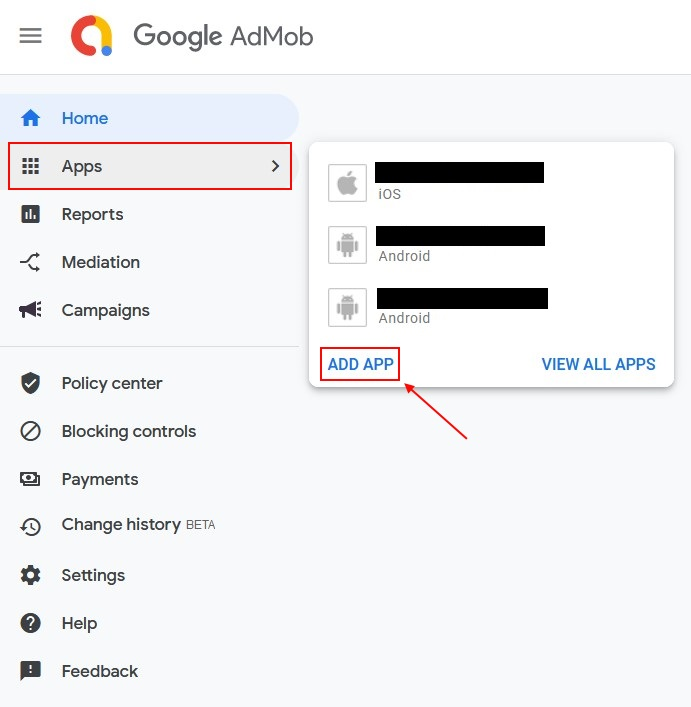

* Copy your app's unique ID to your UE project settings

For existing apps you can find the unique app ID in the app's settings section:

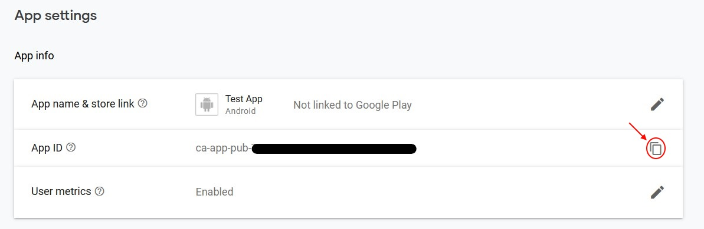

It is recommended to copy the ID via the highlighted copy to clipboard button to avoid copying any unnecessary symbols.

!> **Warning:** If you do not input a valid app ID your app will crash at startup when running on a device. The device log will have a descriptive message that will notify you if the app ID is missing or not correct.

?> Please refer to AdMob guides to fill in all the necessary information in your account. When you receive an email that your account is approved and see this banner on your home page you are all set up to use real ads in your application.

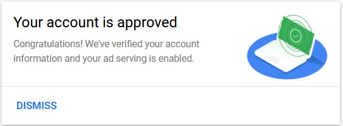

## Project Settings

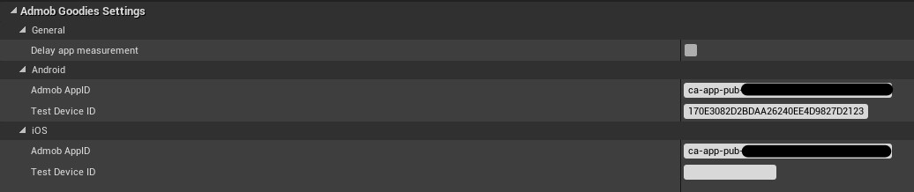

* Delay app measurement - delays app measurement until the Ad Subsystem is explicitly initialized. Use this option if you need to collect any kind of consent before gathering user-level event data. By default event data is being sent to Google as soon as the app launches.
* Admob AppID - unique AdMob app ID. If this field is empty your application will crash when launched on an actual device.
* Test Device ID - this option specifies the ID of a device that will receive test ads for real ad units. Refer to the test ads section for more information.

## Loading and showing ads

To actually display ads you will also need to setup ad units in your AdMob account. Later you can copy these ad units into respective blueprint nodes. Make sure that you are using an ad unit for the correct ad format. As with the app ID - use the copy button to only get the required data from the website.

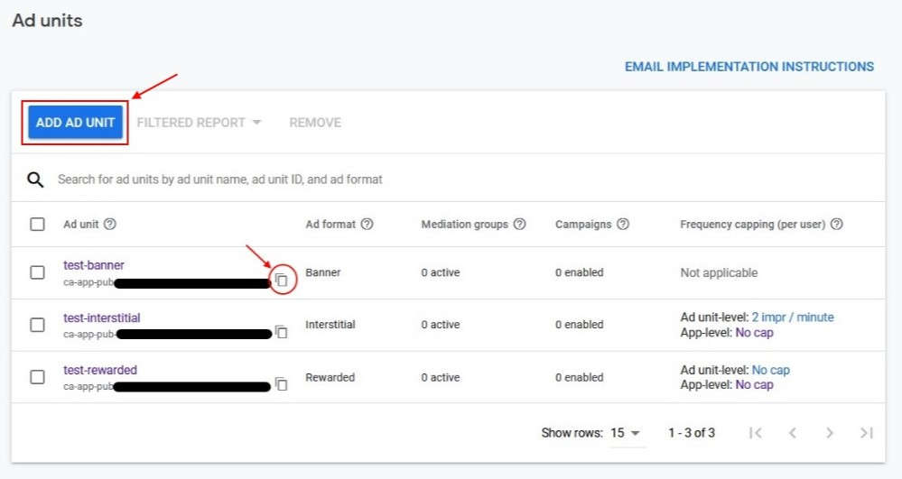

?> During development you can use special Google provided test ad unit IDs. Please refer to [this](#testing-ads) page for more information.

To present an ad to your users you will need to perform these actions:

1. Create an Ad object using the special blueprint make nodes (MakeBannerAd, MakeInterstitialAd, and MakeRewardedAd)
2. Pass your AdMob ad unit ID to these blueprint nodes
3. Bind to any events you are interested (for interstitial and rewarded ads you always need to bind to the OnLoaded event to know when it is safe to show the ad)
4. Load the ad from the network
5. Show the ad when it loaded successfully

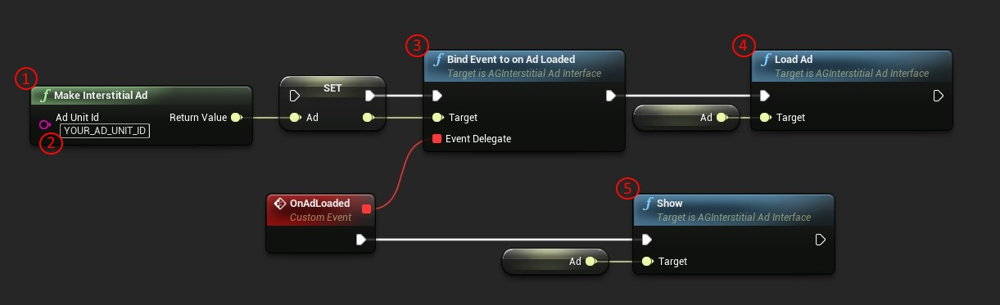

As banner ads are not intrusive you have the ability to show them as soon as they load. Interstitial and rewarded ads disrupt the flow of the application so it is recommended to show them only during breakpoints in your app. If you want to present multiple ads you will have to load this amount of ads separately.

All blueprint nodes are described in the [here](#blueprint-nodes) section.

# **Testing Ads**

There are two ways to verify that your application will display ads:

## Google provided test ad units

You can find ready for testing ad units at [this](https://developers.google.com/admob/unity/test-ads#sample_ad_units) page. These units are different for Android and IOS and will work only on the platform they are provided for. Simply copy an ad unit for a specific ad type and pass it to a respective make function in blueprints.

## Test Devices

You can use real ad units and click ads on test devices. These ads will have a "Test Ad" label and are safe to click on.

!> **Warning:** do not click ads that don't have the "Test Ad" label during development as your AdMob account might be flagged and suspended for fraud

To find out your device ID you need to launch the application on an actual device and load an ad. In the device log you should see a message containing your device ID.

For **Android** you can view this message in logcat (UE device log or via Android Studio) and it will have the following format:
`RequestConfiguration.Builder().setTestDeviceIds(Arrays.asList("YOUR_DEVICE_ID")` 

For **IOS** device first build and deploy your project using UE. After deploying your application to a device you can launch it via a generated XCode project located at *[Path_to_UE_Project]/Intermidiate/ProjectFilesIOS/[Project_Name].xcodeproj*. Now you can view your device logs in the XCode debug console. Search for a message of this format:
`GADMobileAds.sharedInstance.requestConfiguration.testDeviceIdentifiers = @[ @"YOUR_DEVICE_ID" ]` 

# **Error codes**

In case you encounter an error you will receive an error code and message in your callback. The message is useful to quickly identify the problem and the code can be used to react to certain errors (e. g. in case of a no fill error you can cross advertise your other applications yourself). Android and IOS have different error codes - keep this in mind when checking them.

* Android error codes

| Error Code | Description                                                  |
| ---------- | ------------------------------------------------------------ |
| 0          | Internal Error. Something happened internally; for instance, an invalid response was received from the ad server. |
| 1          | Invalid request. The ad request was invalid; for instance, the ad unit ID was incorrect. |
| 2          | Network Error. The ad request was unsuccessful due to network connectivity. |
| 3          | No Fill. The ad request was successful, but no ad was returned due to lack of ad inventory. |

* IOS error codes

| Error Code | Description                                                  |
| ---------- | ------------------------------------------------------------ |
| 0          | Invalid request. The ad request was invalid; for instance, the ad unit ID was incorrect. |
| 1          | No Fill. The ad request was successful, but no ad was returned due to lack of ad inventory. |
| 2          | Network Error. The ad request was unsuccessful due to network connectivity. |
| 3          | Server Error. The ad server experienced a failure in processing the request. |
| 4          | Version to low Error. The current device’s OS is below the minimum required version. |
| 5          | Timeout Error. The ad request was unable to be loaded before being timed out. |
| 6          | Interstitial ad already used Error. This happens when you try to show the same interstitial ad more than once. |
| 11         | Internal Error. Something happened internally; for instance, an invalid response was received from the ad server. |
| 14         | Rewarded ad already used Error. This happens when you try to show the same rewarded ad more than once. |

# **Blueprint nodes**

## Ad Subsystem

* Init

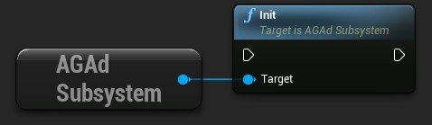

Initializes the ad subsystem. You should only call this method when the `Delay app measurement` option is enabled.

* Enable Personalized Ads

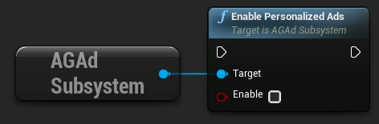

Enable/disable personalized ads (enabled by default).

## Banner Ads

* Make Banner Ad

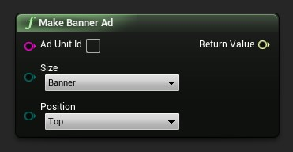

Create a banner ad

Parameters:
Ad Unit Id - Ad unit id (provided by AdMob)
Size - Size of the ad. The following sizes are available:

| Size constant   | Size in dp (WxH)          | Availability       |
| --------------- | ------------------------- | ------------------ |
| Banner          | 320x50                    | Phones and Tablets |
| LargeBanner     | 320x100                   | Phones and Tablets |
| FullBanner      | 468x60                    | Tablets            |
| Leaderboard     | 728x90                    | Tablets            |
| MediumRectangle | 300x250                   | Phones and Tablets |
| Smart           | Screen Width x 32\|50\|90 | Phones and Tablets |

Position - Position of the ad (Top, Bottom, TopLeft, TopRight, BottomLeft, BottomRight, Center)

* Load Ad

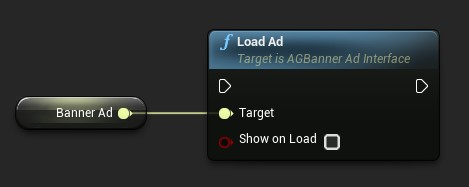

Load the ad

Parameters:
Show On Load - Show the ad when it finishes loading

* Show

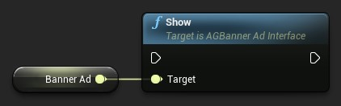

Show banner ad

	

* Hide

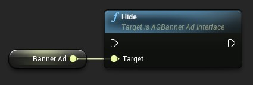

Hide banner ad

* Destroy

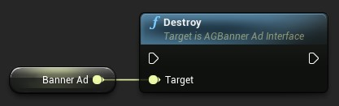

Destroy banner ad

* Events

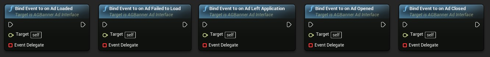

You can bind to the following events:

* Ad Loaded - fires when an ad finishes loading
* Ad Failed to Load - fires when an ad request fails (it is not recommended to load ads from this event's callback)
* Ad Opened - fires when an ad opens an overlay that covers the screen
* Ad Left Application - fires when the user clicks on an ad
* Ad Closed - fires when the user is about to return to the app after tapping on an ad

## Interstitial Ads

* Make Interstitial Ad

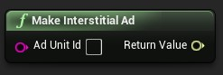

Create an interstitial ad

Parameters:
AdUnitId - Ad unit id (provided by Admob)

	

* Load Ad

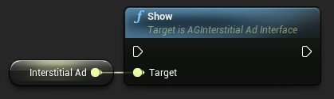

Load the ad

* Is Loaded

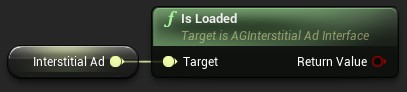

Check if the ad has loaded. Return true if ad loaded successfully, false otherwise

	

* Show

Show interstitial ad

* Is Valid

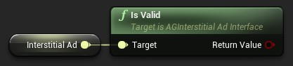

Check if the ad is valid. This always returns true on Android. On IOS the ad becomes invalid after a single-use. Trying to load an invalid ad will raise an error.

* Events

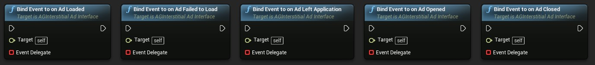

You can bind to the following events:

* Ad Loaded - fires when an ad finishes loading
* Ad Failed to Load - fires when an ad request fails (it is not recommended to load ads from this event's callback)
* Ad Opened - fires when an ad opens an overlay that covers the screen.
* Ad Left Application - fires when the user clicks on an ad	
* Ad Closed - fires when the user is about to return to the app after tapping on an ad

## Rewarded Ads

* Make Rewarded Ad

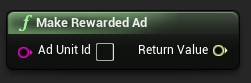

Create a rewarded video ad

Parameters:
AdUnitId - Ad unit id (provided by Admob)

* Load Ad

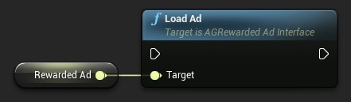

Load the ad

* Is Loaded

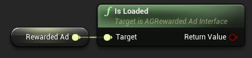

Check if the ad has loaded. Return true if ad loaded successfully, false otherwise

* Show

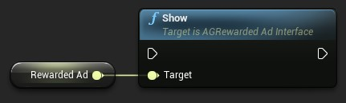

Show rewarded ad

* Get Reward Item

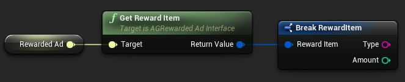

Get the reward data before the user earned it. This data contains the type and amount of the reward.

* Events

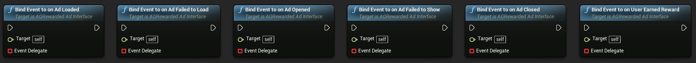

You can bind to the following events:

* Ad Loaded - fires when an ad finishes loading
* Ad Failed to Load - fires when an ad request fails (it is not recommended to load ads from this event's callback)
* Ad Opened - fires when an ad opens an overlay that covers the screen
* Ad Failed to Show - fires when a rewarded ad failed to show
* Ad Closed - fires when a rewarded ad is closed
* User earned reward - fires when a rewarded ad triggers a reward. The app is responsible for crediting the user with the reward.

# **FAQ**

* Is there an example showing how to use this plugin?

The plugin content contains a demo that shows how to create all the different ad formats. To show plugin content tick the options `Show Engine Content` and `Show Plugin Content` in your content browser and load the `AdmobGoodies Content/Maps/Demo.umap` map.

***

* I can show ads with test unit IDs but when I use real unit IDs no ads are shown.

If you see test ads using Google provided test unit IDs then you are all set for showing ads in your release application. If no ads are shown with real unit IDs after this the problem is most likely with your Admob account. Either it is not set up fully or it just does not send any ads because your app is not generating enough traffic. To further investigate this issue we recommend to directly contact the Admob support team.

***
