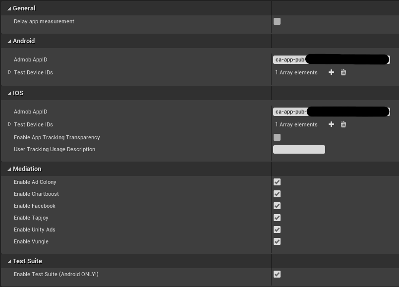
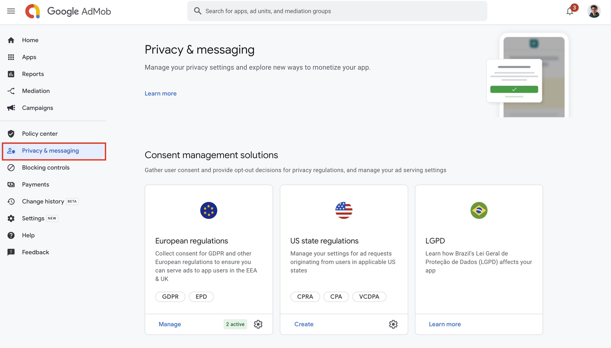

# **Admob Goodies**

Welcome to Admob Goodies Documentation for Unreal Engine

?> **Join our [Discord server](https://bit.ly/nineva_support_discord) and ask us anything!**

[filename](common/copy_plugin.md ':include')

---

This plugin gives you the ability to load and show banner, interstitial, and rewarded video ads.
Note that this plugin wraps official AdMob API and requires a valid AdMob account. Please follow the [instructions](#getting-started) on how to setup your AdMob account and project settings for this plugin to function properly.

You can find all available blueprint nodes and their description [here](#blueprint-nodes).

Supported ad formats:

* Banner Ads
* Interstitial Ads
* Rewarded Ads
* Rewarded Interstitials
* Open App Ads

# **Getting started**

!> **Warning:** First of all, make sure to disable the built-in support for AdMob ads in UE, since they are not compatible with this plugin

!> For Android, it is recommended to update the build tools to 32.0.0 or higher and set Target SDK version in project settings to 32 or higher

* Create an AdMob account at https://admob.google.com/home (skip this step if you already have a valid AdMob account)
* Create an app on your AdMob dashboard and save the App ID

* Copy your app's unique ID to your UE project settings

For existing apps you can find the unique app ID in the app's settings section:

It is recommended to copy the ID via the highlighted copy to clipboard button to avoid copying any unnecessary symbols.

!> **Warning:** If you do not input a valid app ID your app will crash at startup when running on a device. The device log will have a descriptive message that will notify you if the app ID is missing or not correct.

?> Please refer to AdMob guides to fill in all the necessary information in your account. When you receive an email that your account is approved and see this banner on your home page you are all set up to use real ads in your application.

!> **Warning:** For the real ads to be shown in your application you have to fill in the Funding Choices section.

## Project Settings

* Delay app measurement - delays app measurement until the Ad Subsystem is explicitly initialized. Use this option if you need to collect any kind of consent before gathering user-level event data. By default event data is being sent to Google as soon as the app launches.
* Admob AppID - unique AdMob app ID. If this field is empty your application will crash when launched on an actual device.
* Test Device IDs - this option specifies the IDs of devices that will receive test ads for real ad units. Refer to the [testing ads section](#testing-ads) for more information.
* Enable App Tracking Transparency - add the App Tracking Transparency framework to show the *App Tracking Transparency* (ATT) dialog.
* User Tracking Usage Description - this field is required for iOS14. This message will be shown to the user when presenting the *App Tracking Transparency* (ATT) dialog.
* Mediation - specify which mediation network providers should be enabled.
* [DEPRECATED] Test Suite - allows you to test whether you have correctly configured your app and ad units to be able to display ads from third-party networks through mediation. Refer to the [Test Suite](#test-suite) section for more information. 

## Gathering consent

This plugin wraps the official Google User Messaging Platform SDK. Please read the official guides to better understand the process:
- [iOS official guide](https://developers.google.com/admob/ump/ios/quick-start)
- [Android official guide](https://developers.google.com/admob/ump/android/quick-start)

**You must read the official guides above to understand better how the SDK works.** 

!> This is quite complicated topic, and it is really difficult to troubleshoot why your implementation does not work in your particular case. Things that usually go wrong: wrong setup on [Funding Choices](https://fundingchoices.google.com) portal, not adding device test ids correctly, etc. If you encounter errors or something does not work as expected, please explore the official guides, the source code in the plugin and the blueprints and try also googling your issue.

!> **Warning:** After you finish your setup in Funding choices portal, make sure your app is published and active as displayed in the images below.

Once everything is setup in your AdMob and [Funding Choices](https://fundingchoices.google.com) accounts you can follow this simple workflow to get user consent:
1. Request the consent info to determine if you need to show a consent form.
2. After a successful request the Get Consent Status node can be used to check if consent is required.
3. If it is required - load and show the consent form.
4. If no error occurred during form loading and it was dismissed by the user you will receive a callback and can proceed with your app's workflow.

!> If an error occurs during form loading and consent is required the SDK treats this the same as if the user did not grant consent.

## Loading and showing ads

To actually display ads you will also need to setup ad units in your AdMob account. Later you can copy these ad units into respective blueprint nodes. Make sure that you are using an ad unit for the correct ad format. As with the app ID - use the copy button to only get the required data from the website.

?> During development you can use special Google provided test ad unit IDs. Please refer to [testing ads section](#testing-ads) page for more information.

To present an ad to your users you will need to perform these actions:

1. Create an Ad object using the special blueprint make nodes (MakeBannerAd, MakeInterstitialAd, and MakeRewardedAd)
2. Pass your AdMob ad unit ID to these blueprint nodes
3. Bind to any events you are interested (for interstitial and rewarded ads you always need to bind to the OnLoaded event to know when it is safe to show the ad)
4. Load the ad from the network
5. Show the ad when it loaded successfully

As banner ads are not intrusive you have the ability to show them as soon as they load. Interstitial and rewarded ads disrupt the flow of the application so it is recommended to show them only during breakpoints in your app. If you want to present multiple ads you will have to load this amount of ads separately.

All blueprint nodes are described in the [here](#blueprint-nodes) section.

# **Testing Ads**

There are few ways to verify that your application will display ads:

## Google provided test ad units

You can find ready for testing ad units at [this](https://developers.google.com/admob/unity/test-ads#sample_ad_units) page. These units are different for Android and IOS and will work only on the platform they are provided for. Simply copy an ad unit for a specific ad type and pass it to a respective make function in blueprints.

## Test Devices

You can use real ad units and click ads on test devices. These ads will have a "Test Ad" label and are safe to click on.

!> **Warning:** do not click ads that don't have the "Test Ad" label during development as your AdMob account might be flagged and suspended for fraud

To find out your device ID you need to launch the application on an actual device and load an ad. In the device log you should see a message containing your device ID.

For **Android** you can view this message in logcat ([via Android Studio - learn how to do this](https://developer.android.com/studio/debug/am-logcat)) and it will have the following format:
`RequestConfiguration.Builder().setTestDeviceIds(Arrays.asList("YOUR_DEVICE_ID")`

For **IOS** device first build and deploy your project using UE. After deploying your application to a device you can launch it via a generated XCode project located at *[Path_to_UE_Project]/Intermidiate/ProjectFilesIOS/[Project_Name].xcodeproj*. Now you can view your device logs in the XCode debug console. Search for a message of this format:
`GADMobileAds.sharedInstance.requestConfiguration.testDeviceIdentifiers = @[ @"YOUR_DEVICE_ID" ]`

?> View the logs in an IDE, UE device output log window may filter out the message and you won't see it.

Video from Google about this: https://www.youtube.com/watch?v=Gsd26EuSg4g&feature=emb_logo

Another way to add test devices: https://support.google.com/admob/answer/9691433

## Ad Inspector - Testing Mediation

Ad inspector allows you to test the mediation providers, please see more info on it here:
- https://support.google.com/admob/answer/10159602?hl=en
- https://developers.google.com/admob/android/ad-inspector
- https://developers.google.com/admob/ios/ad-inspector

See the demo level for the implementation details.

# **Error codes**

In case you encounter an error you will receive an error code and message in your callback. The message is useful to quickly identify the problem and the code can be used to react to certain errors (e. g. in case of a no fill error you can cross advertise your other applications yourself). Android and IOS have different error codes - keep this in mind when checking them.

## Ad error codes

* Android

| Error Code | Description                                                  |
| ---------- | ------------------------------------------------------------ |
| 0          | Internal Error. Something happened internally; for instance, an invalid response was received from the ad server. |
| 1          | Invalid request. The ad request was invalid; for instance, the ad unit ID was incorrect. |
| 2          | Network Error. The ad request was unsuccessful due to network connectivity. |
| 3          | No Fill. The ad request was successful, but no ad was returned due to lack of ad inventory. |

* IOS

| Error Code | Description                                                  |
| ---------- | ------------------------------------------------------------ |
| 0          | Invalid request. The ad request was invalid; for instance, the ad unit ID was incorrect. |
| 1          | No Fill. The ad request was successful, but no ad was returned due to lack of ad inventory. |
| 2          | Network Error. The ad request was unsuccessful due to network connectivity. |
| 3          | Server Error. The ad server experienced a failure in processing the request. |
| 4          | Version to low Error. The current device’s OS is below the minimum required version. |
| 5          | Timeout Error. The ad request was unable to be loaded before being timed out. |
| 6          | Interstitial ad already used Error. This happens when you try to show the same interstitial ad more than once. |
| 11         | Internal Error. Something happened internally; for instance, an invalid response was received from the ad server. |
| 14         | Rewarded ad already used Error. This happens when you try to show the same rewarded ad more than once. |

## Consent form error codes

* Android

| Error Code | Description                                                  |
| ---------- | ------------------------------------------------------------ |
| 1          | Internal Error. |
| 2          | Internet Error. here was an error loading data from the network. |
| 3          | Invalid Operations. The SDK is being invoked incorrectly. |
| 4          | Time Out. The operation has timed out. |

* IOS

| Error Code | Description                                                  |
| ---------- | ------------------------------------------------------------ |
| 5          | Internal Error. |
| 6          | Form was already used. |
| 7          | Form is unavailable. |
| 8          | Time Out. The operation has timed out. |

# **Mediation**

This plugin supports the following mediation providers:
* AdColony
* Chartboost
* Facebook Audience Network
* Tapjoy
* Unity Ads
* Vungle
* AppLovin
* IronSource

For mediation to work you will need to properly setup an application on the provider's website and setup mediation groups for your unit IDs on the AdMob website. Please follow the official instructions provided by Google for specific providers: [AdColony](https://developers.google.com/admob/android/mediation/adcolony#step_1_set_up_adcolony), [Chartboost](https://developers.google.com/admob/android/mediation/chartboost#step_1_set_up_chartboost), [Facebook](https://developers.google.com/admob/android/mediation/facebook#step_1_set_up_facebook_audience_network), [Tapjoy](https://developers.google.com/admob/android/mediation/tapjoy#step_1_set_up_tapjoy), [Unity Ads](https://developers.google.com/admob/android/mediation/unity#step_1_set_up_unity_ads), [Vungle](https://developers.google.com/admob/android/mediation/vungle#step_1_set_up_vungle). All the necessary information is specified in steps 1 and 2, all other steps can be skipped.

You are not required to setup all available mediation providers. If you only use some of them or none at all you can disable them so that your app does not ship with additional libraries that are not used. You can select which providers are enabled in the plugin's settings.

# **Blueprint nodes**

## Ad Subsystem

* Init

Initializes the ad subsystem. You should only call this method when the `Delay app measurement` option is enabled.

* Enable Personalized Ads

Enable/disable personalized ads (enabled by default).

?> If you are not using the Funding Choices service to manage user consent you can create your own consent form and use this node to disable personalized ads if the user does not grant his consent (required to be GDPR compliant).

!> This only works for admob itself and not for mediation partners. If you are using mediation please use the Funding Choices consent management platform.

## Consent Library

* Request Consent Info

Request the latest consent information. This will allow you to determine if your user needs to provide consent.

* Request Consent Info Debug

This node allows you to easily test your app's behaviour by simulating your location. This method requires a valid test device ID. Refer to this [section](#test-devices) on how to get your device's test ID.

* Load And Show Consent Form

* Get Consent Status

Gets the current consent status. Possible values are:
- Unknown
- Required
- Not Required
- Obtained

?> Obtained status does not mean that the user gave your app consent. This only indicates that the user made a choice on the consent form.

* Get Consent Type

Gets the current consent type. Possible values are:
- Unknown
- Personalized
- Non Personalized

!> Currently always returns *Unknown*. Possible bug in the underlying SDK.

* Reset Consent Info

This resets the state of the consent SDK so that you can simulate a user's first install experience.

### iOS14 App Transparency Tracking Dialog

If you are using Funding Choices as your consent management solution you can trigger the ATT dialog when using the *Load And Show Consent Form* node. If you are not using any consent managers use the following nodes to display the ATT dialog and get the authorization status from the user.

## Banner Ads

* Make Banner Ad

Create a banner ad

Parameters:
Ad Unit Id - Ad unit id (provided by AdMob)
Size - Size of the ad. The following sizes are available:

| Size constant   | Size in dp (WxH)          | Availability       |
| --------------- | ------------------------- | ------------------ |
| Banner          | 320x50                    | Phones and Tablets |
| LargeBanner     | 320x100                   | Phones and Tablets |
| FullBanner      | 468x60                    | Tablets            |
| Leaderboard     | 728x90                    | Tablets            |
| MediumRectangle | 300x250                   | Phones and Tablets |
| Smart           | Screen Width x 32\|50\|90 | Phones and Tablets |

Position - Position of the ad (Top, Bottom, TopLeft, TopRight, BottomLeft, BottomRight, Center)

* Load Ad

Load the ad

Parameters:
Show On Load - Show the ad when it finishes loading

* Show

Show banner ad

* Hide

Hide banner ad

* Destroy

Destroy banner ad

* Events

You can bind to the following events:

* Ad Loaded - fires when an ad finishes loading
* Ad Failed to Load - fires when an ad request fails (it is not recommended to load ads from this event's callback)
* Ad Opened - fires when an ad opens an overlay that covers the screen
* Ad Left Application - fires when the user clicks on an ad
* Ad Closed - fires when the user is about to return to the app after tapping on an ad

## Interstitial Ads

* Make Interstitial Ad

Create an interstitial ad

Parameters:
AdUnitId - Ad unit id (provided by Admob)

* Load Ad

Load the ad

* Is Loaded

Check if the ad has loaded. Return true if ad loaded successfully, false otherwise

* Show

Show interstitial ad

* Is Valid

Check if the ad is valid. This always returns true on Android. On IOS the ad becomes invalid after a single-use. Trying to load an invalid ad will raise an error.

* Events

You can bind to the following events:

* Ad Loaded - fires when an ad finishes loading
* Ad Failed to Load - fires when an ad request fails (it is not recommended to load ads from this event's callback)
* Ad Opened - fires when an ad opens an overlay that covers the screen.
* Ad Left Application - fires when the user clicks on an ad
* Ad Closed - fires when the user is about to return to the app after tapping on an ad

## Rewarded Ads

* Make Rewarded Ad

Create a rewarded video ad

Parameters:
AdUnitId - Ad unit id (provided by Admob)

* Load Ad

Load the ad

* Is Loaded

Check if the ad has loaded. Return true if ad loaded successfully, false otherwise

* Show

Show rewarded ad

* Get Reward Item

Get the reward data before the user earned it. This data contains the type and amount of the reward.

* Events

You can bind to the following events:

* Ad Loaded - fires when an ad finishes loading
* Ad Failed to Load - fires when an ad request fails (it is not recommended to load ads from this event's callback)
* Ad Opened - fires when an ad opens an overlay that covers the screen
* Ad Failed to Show - fires when a rewarded ad failed to show
* Ad Closed - fires when a rewarded ad is closed
* User earned reward - fires when a rewarded ad triggers a reward. The app is responsible for crediting the user with the reward.

## Rewarded Iterstitials

Rewarded interstitials are almost identical to rewarded ads. Please check the demo for the usage example.

## Open App Ads

App open ads are a special ad format intended for publishers wishing to monetize their app load screens. App open ads can be closed by your users at any time. App open ads can be shown when users bring your app to the foreground.

You can check the use cases and the suggested implementation logic in the official docs:

- [Android](https://developers.google.com/admob/android/app-open}
- [iOS](https://developers.google.com/admob/ios/app-open)

In the demo, we have implemented the logic to show it every time you app is brought to foreground, it is probably a good starting point to start your implementation from.

# **Known issues**

* When Vungle mediation is enabled the `SaveGameToSlot`/`LoadGameFromSlot` functions do not work on Android for some reason. We unfortunately still cannot figure out why is this happening. If you are using this functionality please disable Vungle mediation in plugin settings.

* This plugin is not compatible on Android with built-in Google Play Login (external login) as it uses modern versions of Google Play libs that are not compatible with very old google play libs version which UE uses.

# **FAQ**

* Is there an example showing how to use this plugin?

The plugin content contains a demo that shows how to create all the different ad formats. To show plugin content tick the options `Show Engine Content` and `Show Plugin Content` in your content browser and load the `AdmobGoodies Content/Maps/Demo.umap` map.

* I can show ads with test unit IDs but when I use real unit IDs no ads are shown (e. g. no fill errors).

If you see test ads using Google provided test unit IDs then you are all set for showing ads in your release application. If no ads are shown with real unit IDs after this the problem is most likely with Admob itself and not the plugin. Either your account is not set up fully or it just does not send any ads because your app is not generating enough traffic. To further investigate this issue we recommend to directly contact the Admob support team.

___

# Changelog

v.3.2.0

+ FIXED TapJoy mediation comppile issue
+ UPDATE Various Android library versions

---

v.3.1.0

+ FIXED Memory leaks on Android with `jstring` conversion
+ FIXED Project not building on Android when all mediation providers were disabled
+ UPDATE Gradle version
+ ADDED Adaptive banners functionality

---

v.3.0.0

+ UPDATED Added UE5 support.
+ UPDATE iOS libs to 9.1 and other adapter versions (See `versions.txt` file in the 3rdParty folder)
+ REMOVED Deprecated test suite method (breaking change)
+ Improved compatibility with other plugins

---

v.2.3.1

+ UPDATED Disable mediations by default. Now mediations need to be explicitly enabled in the plugin settings.

v.2.3.0

+ Added 'Open App Ads' ad format for Android and iOS

v.2.2.0

+ Added 'Rewarded interstitials' ad format for Android and iOS

v.2.1.0

+ FIXED Unity mediation on Android not working properly
+ ADDED IronSource mediation provider

---

v.2.0.4

+ FIXED Build issues on Android because of Bintray deprecation

---

v.2.0.3

+ ADDED AppLovin mediation provider

---

v.2.0.0

!> This version introduces various major changes, such as some breaking API updates, make sure to backup your project before updating.

+ IMPROVED Updated AdMob to the latest versions on Android and iOS
+ UPDATED Some new events according to new native APIs
+ IMPROVED Updated all the mediation providers SDKs
+ ADDED Targeting params for ad requests
+ ADDED Mediation ad inspector
+ REMOVED Mediation test suite is no longer available

---

v.1.3.3

*ADDED Plugin version logging
*UPDATED Mediation versions for Android & iOS

v.1.3.2

* ADDED Mediation test suite for Android
* UPDATED some library version
* ADDED support for UE 4.26

v.1.3.1

* FIXED an issue with Chartboost mediation on Android

v.1.3.0

* ADDED Google User Messaging Platform SDK
* ADDED iOS14 App Transparency Tracking Dialog
* UPDATE Mediation libraries and adapters
* FIXED iOS build when certain mediation providers were disabled

v.1.2.0

* UPDATE iOS SDK to version 7.64 (compatible with iOS 14)
* UPDATE Android SDK to version 19.3.0
* UPDATE Mediation libraries and adapters
* FIXED Proguard errors in shipping builds

?> This release uses AndroidX libraries and may cause conflicts with other Android plugins

v.1.1.2

* ADDED Ability to specify an array of test device IDs
* FIXED Screen orientation change when exiting a full screen ad on iOS
* FIXED Compatibility with FirebaseGoodies
* FIXED Compatibility with FacebookGoodies

v.1.1.0

* NEW FEATURE Mediation support (AdColony, Chartboost, Facebook Ads, Tapjoy, Unity Ads, Vungle)

v.1.0.0

* Initial release

___
