# **Native UI**

## Native dialogs

You can show standard Android AlertDialog with:
* [Only positive button](#message-dialog-with-positive-button)
* [Positive and negative buttons](#message-dialog-with-positive-and-negative-buttons)
* [Positive, negative and neutral buttons](#message-dialog-with-positive-negative-and-neutral-buttons)
* [Dialog with simple items chooser](#dialog-with-simple-items-chooser)
* [Dialog with radio buttons items chooser](#dialog-with-radio-buttons-items-chooser)
* [Dialog with checkboxes buttons items chooser](#dialog-with-check-boxes-buttons-items-chooser)
* [Progress dialog (spinner)](#progress-dialog-spinner)
* [Progress dialog (progress bar)](#progress-dialog-horizontal-progress-bar)

It is also possible to set native dialog theme (`Light`, `Dark` or `Default`, which will apply global device's dialog theme).

Native dialogs support callbacks for different events like button click or dialog cancellation. User must provide appropriate event handlers for those callbacks.

#### *Message dialog with positive button*{docsify-ignore}

Show this dialog by calling `ShowSingleButtonDialog` function.


#### *Message dialog with positive and negative buttons*{docsify-ignore}

Show this dialog by calling `ShowTwoButtonsDialog` function.

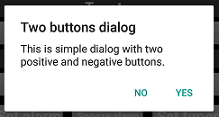

#### *Message dialog with positive, negative and neutral buttons*{docsify-ignore}

Show this dialog by calling `ShowThreeButtonsDialog` function.

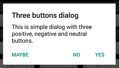

#### *Dialog with simple items chooser*{docsify-ignore}

Show this dialog by calling `ShowChooserDialog` function.

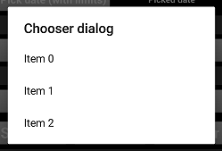

#### *Dialog with radio buttons items chooser*{docsify-ignore}

Show this dialog by calling `ShowSingleItemChoiceDialog` function.

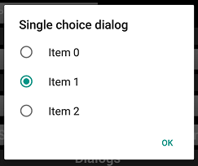

#### *Dialog with checkboxes buttons items chooser*{docsify-ignore}

Show this dialog by calling `ShowMultipleItemChoiceDialog` function.

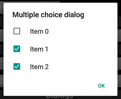

#### *Progress dialog (spinner)*{docsify-ignore}

To show this dialog it first should be created with `CreateProgressDialog` function (pass `AGProgressDialogData` structure with specified `Spinner` style as a parameter). Then just call `Show` method of the received object interface instance. Call `Dismiss` method to close this dialog.

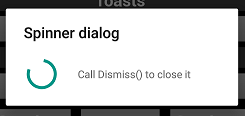

#### *Progress dialog (horizontal progress bar)*{docsify-ignore}

To show this dialog it first should be created with `CreateProgressDialog` function (pass `AGProgressDialogData` structure with specified `Progress Bar` style as a parameter). Then just call `Show` method of the received object interface instance. Call `Dismiss` method to close this dialog.

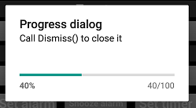

To update progress value use dialog's `SetProgress` method.

___

## Date and time picker

You can show standard Android Date and Time pickers.

#### *Showing Date Picker*{docsify-ignore}

To show the default Android date picker call `ShowDatePicker` function.

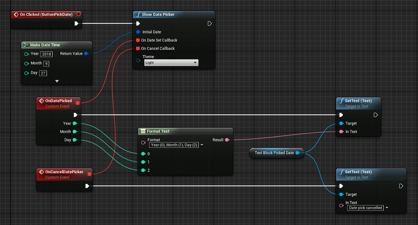

Result:

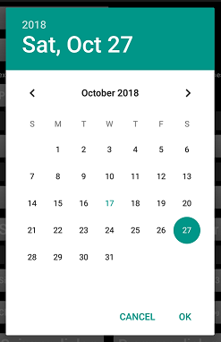

There is a possibility to limit a range of dates that can be picked by a user. To do that call `ShowDatePickerWithLimits` function instead. The only difference here is that it takes two additional parameters - start and end dates of picking range.

#### *Showing Time Picker*{docsify-ignore}

To show the default Android time picker call `ShowTimePicker` function.

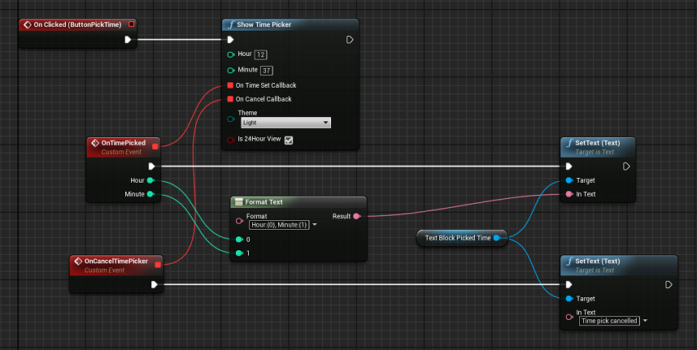

Result:

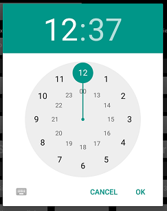

___

## Show Toasts

You can show standard Android toast messages.

To show toast call `ShowToast` function and pass message text and toast duration length as parameters.

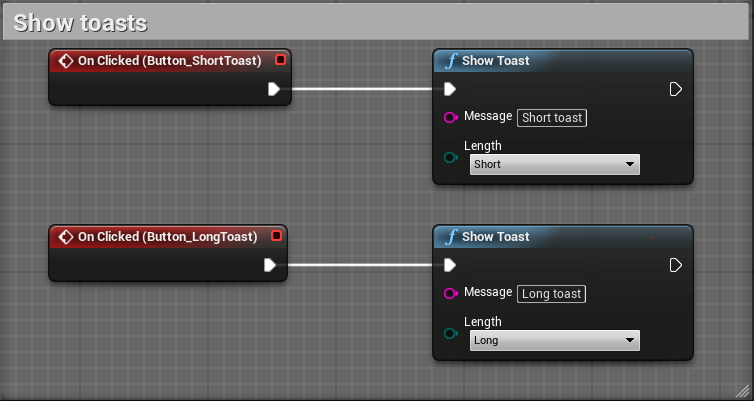

Duration can be either `Short` or `Long` (corresponds to Android [default values](https://developer.android.com/reference/android/widget/Toast.html#constants)).

___

## Native sharing text or/and image

You can use native Android sharing functionality.

* [Share text, image or both](#share-text-image-or-both)
* [Sending SMS](#sending-sms)
* [Sending Email](#sending-email)
* [Sharing via Social Media](#sharing-via-social-media)
* [Share video](#share-video)

Image sharing functions take 2D-texture as one of their parameters. Before actual sharing happens this texture is converted and saved in temporary PNG-file which is stored in an external storage Pictures folder (not in the app folder).

Pay attention to 2D-texture settings. `Compression Settings` - must be `VectorDisplacementmap`, `Mip Gen Settings` - must be `NoMipmaps`, `sRGB` - should be unchecked. Otherwise you won't be able to share image!

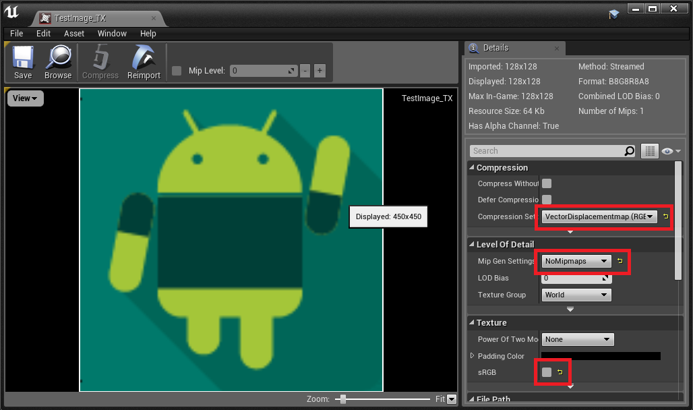

### *Share text, image or both*{docsify-ignore}

You can share text, image or both using default Android intent by calling corresponding functions: `ShareText`, `ShareImage` or `ShareTextWithImage`. A user can specify data that should be shared and choose whether he wants to display chooser window to select a sharing app.


Result:

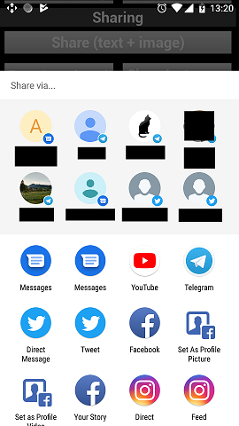

### *Sending SMS*{docsify-ignore}

To send SMS call `SendSmsWithDefaultApp` function.


There is also a possibility to send SMS silently (without showing any prompts or messaging app UI) by calling `SendSmsSilently` function. A user can later find the message in the Sent folder.

To be able to send SMS make sure that your app has `SEND_SMS`. Check out this [Setup](https://github.com/NinevaStudios/AndroidGoodiesUnreal-SampleProject/wiki/Setup#required-permission-for-certain-features) instruction to make sure that the right permission is granted.

### *Sending Email*{docsify-ignore}

To send email call `SendEMail` function. Pass to it initialized `AGShareEmailData` structure as a parameter. This structure includes data fields like subject, email body, image (if any), list of recipients, CC recipients and BCC recipients.


### *Sending Email with multiple images*{docsify-ignore}

To send email with multiple images call `SendMultipleImagesEmail` function. Pass to it initialized `AGShareEmailData` structure as parameter and array of extra images. The structure includes data fields like subject, image, list of recipients, CC recipients and BCC recipients. **Adding email body is not possible in case of multiple images attached, this is native android limitation that can not be overridden.**

_* this feature is not yet released._

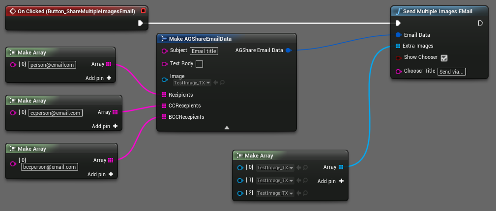

### *Sharing via Social Media*{docsify-ignore}

Android Goodies plugin has a set of functions that allow sharing text and images via a number of popular social media.

* `ShareInstagram` - to share image via Instagram
* `TweetText`, `TweetTextWithImage` - to share text or text+image via Twitter
* `SendFacebookText`, `SendFacebookImage` - to share text or image via Facebook
* `SendWhatsAppText`, `SendWhatsAppImage` - to share text or image via WhatsApp
* `SendTelegramText`, `SendTelegramImage` - to share text or image via Telegram
* `SendViberText`, `SendViberImage` - to share text or image via Viber


### *Share video*{docsify-ignore}

Currently, this functionality is experimental and doesn't provide any high-level API. But you still can share video by calling `ShareVideo` function and pass a string with video file path to it as a parameter. You have to figure out that path on your own.

___

## Notifications

* [General overview](#general-overview)
* [Setup](#setup)
* [Notification channels](#notification-channels)
* [Notification Channel Groups](#notification-channel-groups)
* [Notifications](#notifications-1)

### General overview{docsify-ignore}

Official Android documentation on notification essentials can be found [here](https://developer.android.com/guide/topics/ui/notifiers/notifications).

Our plugin includes most of the common features for creating different types of custom notifications.

### Setup{docsify-ignore}

In order to make notifications work properly, you have to tweak settings of the Android Goodies plugin. Go to _Project Settings -> Android Goodies_ and set path to the folder that contains small notification icon which is required by Android API.

### *Notification channels*{docsify-ignore}

Starting from Android Oreo (API level 26), all notifications have to be posted to a notification channel.

Call the `AreNotificationChannelsSupported` method to find if the device supports Notification Channels.
Use the `NewNotificationChannel` function to create a new object representing the notification channel settings, providing a unique identifier, name, and importance of the channel.
You can then customize it using the following methods: 
* `SetBypassDnd` - set whether or not notifications posted to this channel can bypass the Do Not Disturb mode;
* `SetShowBadge` - set whether notifications posted to this channel can appear as badges in a Launcher application;
* `SetEnableLights` - set whether notifications posted to this channel should display notification lights;
* `SetEnableVibration` - set whether notification posted to this channel should vibrate. Requires the "VIBRATE" permission;
* `SetDescription` - set the user-visible description of this channel;
* `SetImportance` - set the notification importance;
* `SetLightColor` - set the notification light color for notifications posted to this channel. Works with `SetEnableLights(true)`;
* `SetLockScreenVisibility` - set whether or not notifications posted to this channel are shown on the lock screen in full or redacted form;
* `SetVibrationPattern` - set the vibration pattern for notifications posted to this channel. Will be ignored if the vibration is not enabled by `SetEnableVibration(true)`. Requires the "VIBRATE" permission;
* `SetSound` - set the sound that should be played for notifications posted to this channel and its audio attributes;
* `SetGroup` - set what [group](https://github.com/NinevaStudios/AndroidGoodiesUnreal-SampleProject/wiki/Notifications#notification-channel-groups) this channel belongs to.

After the channel settings are modified it can be created in the system using the `CreateNotificationChannel` method.

!> **_Note:_** most of the setters will work only before creating the notification channel.

You can later find the notification channel by calling the `GetNotificationChannel` method and providing the unique identifier of the channel, used during its creation. Alternatively, you can call the `GetNotificationChannels` channels to obtain an array of all the notification channels, registered for the calling package. You can then call the `GetXXX` methods to read the respective properties of the notification channels.

To delete the notification channel call the `DeleteNotificationChannel` method providing the unique identifier of the channel, used during its creation.

You can also call the `OpenNotificationChannelSettings` to open a system window with the settings for the respective notification channel.

### *Notification Channel Groups*{docsify-ignore}

Notification channel groups can be used to visually categorize and sort the notification channels.

Use the `NewNotificationChannelGroup` function to create a new object representing the notification channel group settings, providing a unique identifier, and name of the group. You can also set the user-visible description of the group by calling the `SetDescription` method. Use the `CreateNotificationChannelGroup` method to register the group in the system. After that, you can call the `SetGroup` method on a notification channel object, providing the group's unique identifier, to bind the channel to this group.

You can later find the notification channel group by calling the `GetNotificationChannelGroup` method and providing the unique identifier of the group, used during its creation. Alternatively, you can call the `GetNotificationChannelGroups` channels to obtain an array of all the notification channel groups, registered for the calling package. You can then call the `GetXXX` methods to read the respective properties of the notification channel groups.

To delete the notification channel group call the `DeleteNotificationChannelGroup` method providing the unique identifier of the group, used during its creation.

!> **_Note!_** When you delete a group, all of the channels bound to it will be deleted, too.

### *Notifications*{docsify-ignore}

Helper class `AGNotificationBuilder` is used to construct notifications. Use the `NewNotificationBuilder` method to create a new instance of this type, providing the unique identifier of the previously created [notification channel](https://github.com/NinevaStudios/AndroidGoodiesUnreal-SampleProject/wiki/Notifications#notification-channels). While you can not create notification channels on Android versions less than Oreo, the `NewNotificationBuilder` takes the channel ID parameter anyway to support all of the Android versions. 

You can also provide additional data in the format of a Dictionary<key, value> to be later retrieved using the `GetNotificationDataForKey` method if the user opens the application by tapping the notification (call the `WasApplicationOpenViaNotification` method to find out).

After creating a notification builder object, you need to provide the title, text, and icon for notification by calling the `SetTitle`, `SetText`, and `SetSmallIcon` methods. These are the three fields mandatory for any notification.

For the small icon to be set, the respective image has to be in the Android drawable directory in the application folder.
We designed our plugin to be able to automatically copy the files from the folder, specified in the "Android Drawables Folder" setting in the Project Settings / Android Goodies Settings menu in the Editor to the Android drawable directory during build time. 

For example, if you provide the path "D:\Projects\Images", all the files from this directory will be copied to the "PROJECT_PATH\Intermediate\Android\APK\res\drawable" folder during build time. If there is a file "Icon.png" in the "D:\Projects\Images" folder, you will then be able to call the `SetSmallIcon` method and provide "Icon" as the file name.

**_For the sample project to work, please, set the "PROJECT_PATH\Resources\Drawable" directory in the "Android Drawables Folder" setting in the Project Settings / Android Goodies Settings menu in the Editor and make sure that "notification_icon.png" file is there._**

You can look at different examples of custom notifications in the demo project, specifically in the `MenuNotifications_BP.uasset`.

You can also check the official documentation on the [NotificationCompat.Builder](https://developer.android.com/reference/android/support/v4/app/NotificationCompat.Builder) class to get familiar with its functionality.

Call the `Build` method on the AGNotificationBuilder object to obtain the Notification object. It can then be passed to the `Notify` method which actually shows the notification on the screen.

You can also schedule notifications to appear at the needed time using the `ScheduleNotification` function or even make it repeating by calling the `ScheduleRepeatingNotification` function, respectively.

Call the `CancelNotification` method to cancel a specific notification by its ID. You can also use the `CancelAllNotifications` to cancel all of the notifications, posted by the `Notify` function.

!> **_Note: scheduled notifications can not be cancelled using these methods. Use the `CancelScheduledNotification` method, instead._**

___

# **App interaction**

## Setup alarms/timers

* [Required permissions](#reqiured-permissions)
* [Showing all alarms and timers](#showing-all-alarms-and-timers)
* [Setting an alarm](#setting-an-alarm)
* [Setting timer](#setting-timer)
* [Snooze alarm](#snooze-alarm)

### *Required permissions*{docsify-ignore}

In order to invoke the `SetAlarm` function, your app must have the `SET_ALARM` permission in your `AndroidManifest.xml`:

```xml
<uses-permission android:name="com.android.alarm.permission.SET_ALARM" />
```

Check out this [Setup](https://github.com/NinevaStudios/AndroidGoodiesUnreal-SampleProject/wiki/Setup#required-permission-for-certain-features) instruction to make sure that the right permission is granted.

### *Showing all alarms and timers*{docsify-ignore}

To show a list of all alarms or timers calls `ShowAllAlarms` or `ShowAllTimers` function respectively.

### *Setting an alarm*{docsify-ignore}

You can set an alarm by invoking `SetAlarm` function, optionally specifying whether to vibrate, whether to skip the UI when creating an alarm and days on which alarm has to be invoked (repeating alarm). 
Note: repeating alarm is available from API level 19 and forth.


Result:

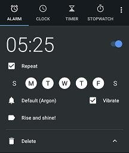

### *Setting timer*{docsify-ignore}

To set a timer call `SetTimer` function providing time in seconds, label and whether to skip the UI.


Result:

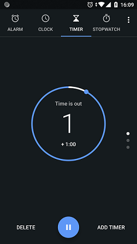

### *Snooze alarm*{docsify-ignore}

To snooze ringing alarm call `SnoozeAlarm` function and pass snooze duration (in minutes) as a parameter. If currently there is no ringing alarm function call won't make any impact.

___


