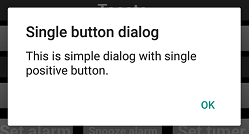
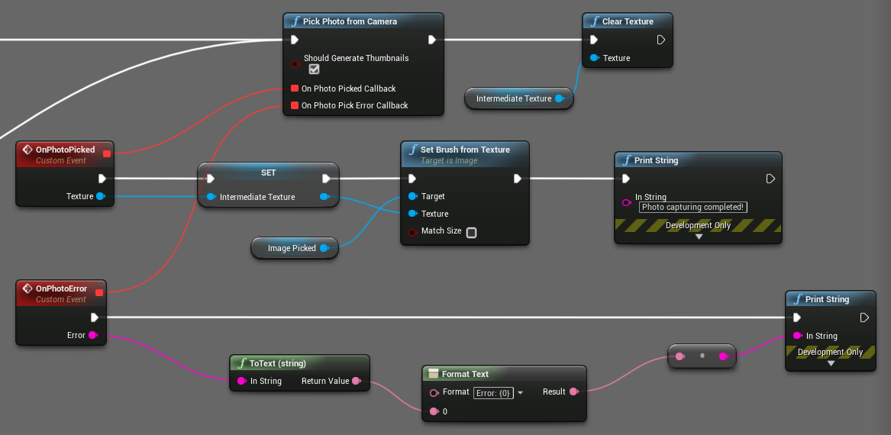
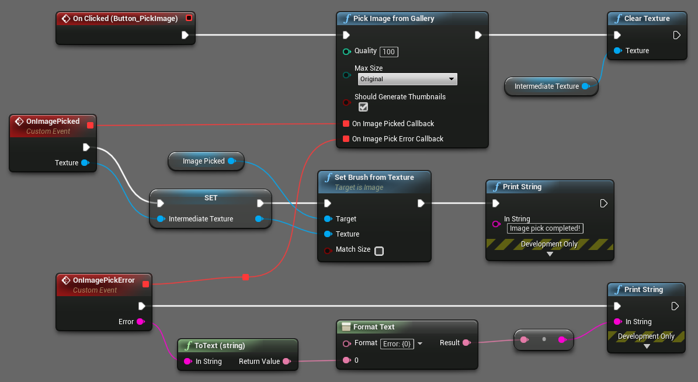
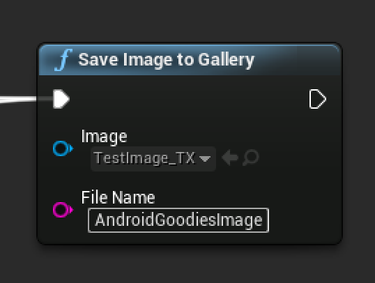
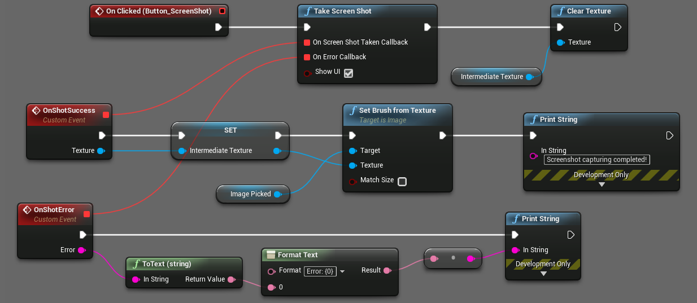
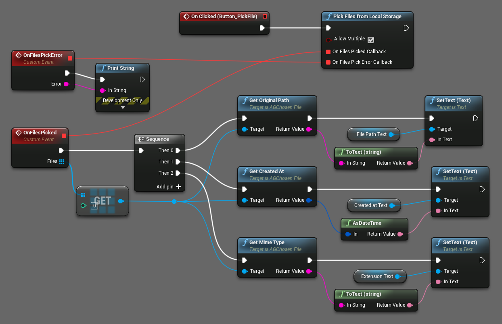
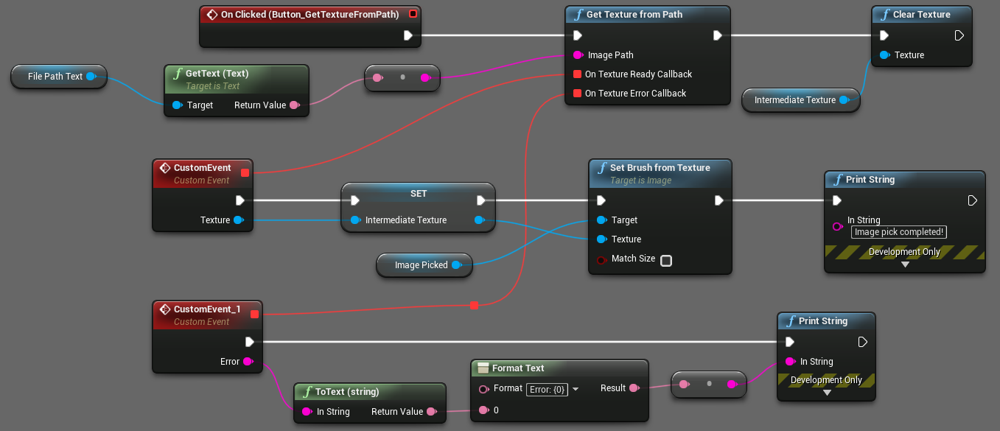

[filename](common/common_ue_header.md ':include')

# **Android Goodies**

Welcome to Android Goodies Documentation for Unreal Engine

___

# **Native UI**

## Native dialogs

You can show standard Android AlertDialog with:

* [Only positive button](#message-dialog-with-positive-button)
* [Positive and negative buttons](#message-dialog-with-positive-and-negative-buttons)
* [Positive, negative and neutral buttons](#message-dialog-with-positive-negative-and-neutral-buttons)
* [Dialog with simple items chooser](#dialog-with-simple-items-chooser)
* [Dialog with radio buttons items chooser](#dialog-with-radio-buttons-items-chooser)
* [Dialog with checkboxes buttons items chooser](#dialog-with-check-boxes-buttons-items-chooser)
* [Progress dialog (spinner)](#progress-dialog-spinner)
* [Progress dialog (progress bar)](#progress-dialog-horizontal-progress-bar)

It is also possible to set native dialog theme ( `Light` , `Dark` or `Default` , which will apply global device's dialog theme).

Native dialogs support callbacks for different events like button click or dialog cancellation. User must provide appropriate event handlers for those callbacks.

### Message dialog with positive button

Show this dialog by calling `ShowSingleButtonDialog` function.



### Message dialog with positive and negative buttons

Show this dialog by calling `ShowTwoButtonsDialog` function.


### Message dialog with positive, negative and neutral buttons

Show this dialog by calling `ShowThreeButtonsDialog` function.


### Dialog with simple items chooser

Show this dialog by calling `ShowChooserDialog` function.


### Dialog with radio buttons items chooser

Show this dialog by calling `ShowSingleItemChoiceDialog` function.


### Dialog with checkboxes buttons items chooser

Show this dialog by calling `ShowMultipleItemChoiceDialog` function.


### Progress dialog (spinner)

To show this dialog it first should be created with `CreateProgressDialog` function (pass `AGProgressDialogData` structure with specified `Spinner` style as a parameter). Then just call `Show` method of the received object interface instance. Call `Dismiss` method to close this dialog.


### Progress dialog (horizontal progress bar)

To show this dialog it first should be created with `CreateProgressDialog` function (pass `AGProgressDialogData` structure with specified `Progress Bar` style as a parameter). Then just call `Show` method of the received object interface instance. Call `Dismiss` method to close this dialog.


To update progress value use dialog's `SetProgress` method.

## Date and time picker

You can show standard Android Date and Time pickers.

### Showing Date Picker

To show the default Android date picker call `ShowDatePicker` function.


Result:


There is a possibility to limit a range of dates that can be picked by a user. To do that call `ShowDatePickerWithLimits` function instead. The only difference here is that it takes two additional parameters - start and end dates of picking range.

### Showing Time Picker

To show the default Android time picker call `ShowTimePicker` function.


Result:


## Show Toasts

You can show standard Android toast messages.

To show toast call `ShowToast` function and pass message text and toast duration length as parameters.


Duration can be either `Short` or `Long` (corresponds to Android [default values](https://developer.android.com/reference/android/widget/Toast.html#constants)).

## Native sharing text or/and image

You can use native Android sharing functionality.

* [Share text, image or both](#share-text-image-or-both)
* [Sending SMS](#sending-sms)
* [Sending Email](#sending-email)
* [Sharing via Social Media](#sharing-via-social-media)
* [Share video](#sharing-video)

!> **Warning:** if your target SDK is 29 or higher, you have to add `android:requestLegacyExternalStorage = "true"` line to the `Extra Tags for the <application> node` in the Project Settings -> Android -> Advanced APK packaging.

!> **Warning:** In some cases when sharing image that is on external storage you must make sure that `android.permission.WRITE_EXTERNAL_STORAGE` permission was added to manifest and granted at runtime to your application before calling this function.


Image sharing functions take 2D-texture as one of their parameters. Before actual sharing happens this texture is converted and saved in temporary PNG-file which is stored in an external storage Pictures folder (not in the app folder).

Pay attention to 2D-texture settings. `Compression Settings` - must be `VectorDisplacementmap` , `Mip Gen Settings` - must be `NoMipmaps` , `sRGB` - should be unchecked. Otherwise you won't be able to share image!


### Share text, image or both

You can share text, image or both using default Android intent by calling corresponding functions: `ShareText` , `ShareImage` or `ShareTextWithImage` . A user can specify data that should be shared and choose whether he wants to display chooser window to select a sharing app.


Result:


### Sending SMS

To send SMS call `SendSmsWithDefaultApp` function.


There is also a possibility to send SMS silently (without showing any prompts or messaging app UI) by calling `SendSmsSilently` function. A user can later find the message in the Sent folder.

To be able to send SMS make sure that your app has `SEND_SMS` . Check out this [Setup](https://github.com/NinevaStudios/AndroidGoodiesUnreal-SampleProject/wiki/Setup#required-permission-for-certain-features) instruction to make sure that the right permission is granted.

### Sending Email

To send email call `SendEMail` function. Pass to it initialized `AGShareEmailData` structure as a parameter. This structure includes data fields like subject, email body, image (if any), list of recipients, CC recipients and BCC recipients.


### Sending Email with multiple images

To send email with multiple images call `SendMultipleImagesEmail` function. Pass to it initialized `AGShareEmailData` structure as parameter and array of extra images. The structure includes data fields like subject, image, list of recipients, CC recipients and BCC recipients. **Adding email body is not possible in case of multiple images attached, this is native android limitation that can not be overridden.**


### Sharing via Social Media

Android Goodies plugin has a set of functions that allow sharing text and images via a number of popular social media.

* `ShareInstagram` - to share image via Instagram
* `TweetText` , `TweetTextWithImage` - to share text or text+image via Twitter
* `SendFacebookText` , `SendFacebookImage` - to share text or image via Facebook
* `SendWhatsAppText` , `SendWhatsAppImage` - to share text or image via WhatsApp
* `SendTelegramText` , `SendTelegramImage` - to share text or image via Telegram
* `SendViberText` , `SendViberImage` - to share text or image via Viber


### Sharing video

Currently, this functionality is experimental and doesn't provide any high-level API. But you still can share video by calling `ShareVideo` function and pass a string with video file path to it as a parameter. You have to figure out that path on your own.

## Notifications

* [General overview](#general-overview)
* [Setup](#setup)
* [Notification channels](#notification-channels)
* [Notification Channel Groups](#notification-channel-groups)
* [Notifications](#notifications-1)

### General overview

Official Android documentation on notification essentials can be found [here](https://developer.android.com/guide/topics/ui/notifiers/notifications).

Our plugin includes most of the common features for creating different types of custom notifications.

### Setup

In order to make notifications work properly, you have to tweak settings of the Android Goodies plugin. Go to _Project Settings -> Android Goodies_ and set path to the folder that contains small notification icon which is required by Android API.

### Notification channels

Starting from Android Oreo (API level 26), all notifications have to be posted to a notification channel.

Call the `AreNotificationChannelsSupported` method to find if the device supports Notification Channels.
Use the `NewNotificationChannel` function to create a new object representing the notification channel settings, providing a unique identifier, name, and importance of the channel.
You can then customize it using the following methods:

* `SetBypassDnd` - set whether or not notifications posted to this channel can bypass the Do Not Disturb mode;
* `SetShowBadge` - set whether notifications posted to this channel can appear as badges in a Launcher application;
* `SetEnableLights` - set whether notifications posted to this channel should display notification lights;
* `SetEnableVibration` - set whether notification posted to this channel should vibrate. Requires the "VIBRATE" permission;
* `SetDescription` - set the user-visible description of this channel;
* `SetImportance` - set the notification importance;
* `SetLightColor` - set the notification light color for notifications posted to this channel. Works with `SetEnableLights(true)` ;
* `SetLockScreenVisibility` - set whether or not notifications posted to this channel are shown on the lock screen in full or redacted form;
* `SetVibrationPattern` - set the vibration pattern for notifications posted to this channel. Will be ignored if the vibration is not enabled by `SetEnableVibration(true)` . Requires the "VIBRATE" permission;
* `SetSound` - set the sound that should be played for notifications posted to this channel and its audio attributes;
* `SetGroup` - set what [group](https://github.com/NinevaStudios/AndroidGoodiesUnreal-SampleProject/wiki/Notifications#notification-channel-groups) this channel belongs to.

After the channel settings are modified it can be created in the system using the `CreateNotificationChannel` method.

!>  Most of the setters will work only before creating the notification channel.

You can later find the notification channel by calling the `GetNotificationChannel` method and providing the unique identifier of the channel, used during its creation. Alternatively, you can call the `GetNotificationChannels` channels to obtain an array of all the notification channels, registered for the calling package. You can then call the `GetXXX` methods to read the respective properties of the notification channels.

To delete the notification channel call the `DeleteNotificationChannel` method providing the unique identifier of the channel, used during its creation.

You can also call the `OpenNotificationChannelSettings` to open a system window with the settings for the respective notification channel.

### Notification Channel Groups

Notification channel groups can be used to visually categorize and sort the notification channels.

Use the `NewNotificationChannelGroup` function to create a new object representing the notification channel group settings, providing a unique identifier, and name of the group. You can also set the user-visible description of the group by calling the `SetDescription` method. Use the `CreateNotificationChannelGroup` method to register the group in the system. After that, you can call the `SetGroup` method on a notification channel object, providing the group's unique identifier, to bind the channel to this group.

You can later find the notification channel group by calling the `GetNotificationChannelGroup` method and providing the unique identifier of the group, used during its creation. Alternatively, you can call the `GetNotificationChannelGroups` channels to obtain an array of all the notification channel groups, registered for the calling package. You can then call the `GetXXX` methods to read the respective properties of the notification channel groups.

To delete the notification channel group call the `DeleteNotificationChannelGroup` method providing the unique identifier of the group, used during its creation.

!> When you delete a group, all of the channels bound to it will be deleted, too.

### Notifications

Helper class `AGNotificationBuilder` is used to construct notifications. Use the `NewNotificationBuilder` method to create a new instance of this type, providing the unique identifier of the previously created [notification channel](https://github.com/NinevaStudios/AndroidGoodiesUnreal-SampleProject/wiki/Notifications#notification-channels). While you can not create notification channels on Android versions less than Oreo, the `NewNotificationBuilder` takes the channel ID parameter anyway to support all of the Android versions.

You can also provide additional data in the format of a Dictionary<key, value> to be later retrieved using the `GetNotificationDataForKey` method if the user opens the application by tapping the notification (call the `WasApplicationOpenViaNotification` method to find out).

After creating a notification builder object, you need to provide the title, text, and icon for notification by calling the `SetTitle` , `SetText` , and `SetSmallIcon` methods. These are the three fields mandatory for any notification.

For the small icon to be set, the respective image has to be in the Android drawable directory in the application folder.
We designed our plugin to be able to automatically copy the files from the folder, specified in the "Android Drawables Folder" setting in the Project Settings / Android Goodies Settings menu in the Editor to the Android drawable directory during build time.

For example, if you provide the path "D:\Projects\Images", all the files from this directory will be copied to the "PROJECT_PATH\Intermediate\Android\APK\res\drawable" folder during build time. If there is a file "Icon.png" in the "D:\Projects\Images" folder, you will then be able to call the `SetSmallIcon` method and provide "Icon" as the file name.

!> **_For the sample project to work, please, set the "PROJECT_PATH\Resources\Drawable" directory in the "Android Drawables Folder" setting in the Project Settings / Android Goodies Settings menu in the Editor and make sure that "notification_icon.png" file is there._**

You can look at different examples of custom notifications in the demo project, specifically in the `MenuNotifications_BP.uasset` .

You can also check the official documentation on the [NotificationCompat. Builder](https://developer.android.com/reference/android/support/v4/app/NotificationCompat.Builder) class to get familiar with its functionality.

Call the `Build` method on the AGNotificationBuilder object to obtain the Notification object. It can then be passed to the `Notify` method which actually shows the notification on the screen.

You can also schedule notifications to appear at the needed time using the `ScheduleNotification` function or even make it repeating by calling the `ScheduleRepeatingNotification` function, respectively.

Call the `CancelNotification` method to cancel a specific notification by its ID. You can also use the `CancelAllNotifications` to cancel all of the notifications, posted by the `Notify` function.

!> Scheduled notifications can not be cancelled using these methods. Use the `CancelScheduledNotification` method, instead.

## In-app review dialog

?> Please [read the official docs about this feature](https://developer.android.com/guide/playcore/in-app-review) thoroughly before contacting support!


This functionality allows to request the review of the app right from the app. You can read more about it in the [documentation](https://developer.android.com/guide/playcore/in-app-review).

?> In order to test it your app MUST be published on Google Play! [Learn more about testing in-app reviews](https://developer.android.com/guide/playcore/in-app-review/test).

?> The dialog will NOT be shown every time you request it to prevent you from spamming the user. Also, there is NO way to find out if the user actually rated your app.

___

# **App interaction**

## Setup alarms/timers

### Required permissions

In order to invoke the `SetAlarm` function, your app must have the `SET_ALARM` permission in your `AndroidManifest.xml` :

``` xml
<uses-permission android:name="com.android.alarm.permission.SET_ALARM" />
```

Check out this [Setup](https://github.com/NinevaStudios/AndroidGoodiesUnreal-SampleProject/wiki/Setup#required-permission-for-certain-features) instruction to make sure that the right permission is granted.

### Showing all alarms and timers

To show a list of all alarms or timers calls `ShowAllAlarms` or `ShowAllTimers` function respectively.

### Setting an alarm

You can set an alarm by invoking `SetAlarm` function, optionally specifying whether to vibrate, whether to skip the UI when creating an alarm and days on which alarm has to be invoked (repeating alarm).
!> Repeating alarm is available from API level 19 and forth.


Result:


### Setting timer

To set a timer call `SetTimer` function providing time in seconds, label and whether to skip the UI.


Result:


### Snooze alarm

To snooze ringing alarm call `SnoozeAlarm` function and pass snooze duration (in minutes) as a parameter. If currently there is no ringing alarm function call won't make any impact.

## Open maps app

Android Goodies provides a simple and easy interface to [open a map application (providing coordinates or address) using intent](https://developer.android.com/guide/components/intents-common.html#Maps).

### Check if a user has a maps app

To check whether there is any maps app installed call `UserHasMapsApp` function. You should always call it before trying to work with other map-related functions.


### Open location with zoom level

Show the map at the given longitude and latitude at a certain zoom level by calling `OpenMapLocation` . A zoom level of 1 shows the whole Earth, centered at the given latitude and longitude. The highest (closest) zoom level is 23.


### Open location with the label

Show the map at the given longitude and latitude with a certain label by calling `OpenMapLocationWithLabel` function.


### Open location with address

Open the map location with the provided address by calling `OpenMapLocationWithAddress` function.


## Open, install or uninstall apps

Android Goodies plugin contains various functions to open other applications, as well as installing and uninstalling packages.

### Open users Facebook profile

To open a specific Facebook profile call `OpenFacebookProfile` function and provide the profile ID parameter. If there is no installed Facebook app on Android device specified profile will be opened in a browser.


### Open users Instagram profile

To open a specific Instagram profile call `OpenInstagramProfile` function and provide the profile ID parameter (i.e. "taylorswift"). If there is no installed Instagram app on Android device specified profile will be opened in a browser.


### Open users Twitter profile

To open a specific Twitter profile call `OpenTwitterProfile` function and provide the profile ID parameter (i.e. "CNN"). If there is no installed Twitter app on Android device specified profile will be opened in a browser.


### Open YouTube video

To open the video in YouTube app call `OpenYoutubeVideo` function and provide video ID parameter (a part that follows after "https://www.youtube.com/watch?v=").


### Open application

To open a specific application call `OpenAnotherApplication` function and provide its package name parameter. If there is no such application installed on Android device nothing will happen and the corresponding message will be logged.


### Install application

To install an application on your Android device call `InstallApkFromFile` function and pass APK file path as a parameter. Note that APK file must be located on device's SD card. Always check if this file exists before calling a function.


### Uninstall application

To uninstall an application call `UninstallPackage` function and provide its package name parameter. A user then will be prompted to remove the app.


### Dial/call phone number

To dial/call phone number use `DialPhoneNumber` or `CallPhoneNumber` functions respectively. Also, there is a function allowing to check whether the phone app is installed - `HasPhoneApp` .

___

# **Getting info**

## Get device info and check supported features

Device information functions allow retrieving various information about Android device and OS.

### Getting device information

To retrieve device information there are functions that allow getting properties of `android.os.Build` and `android.os.Build$VERSION` classes.

### Check if certain package installed

To check whether package with specified name installed on current device use `IsPackageInstalled` function.

### Check supported device features

The plugin includes a series of functions that allow checking whether a certain feature is supported by Android device.

Patterns for those function names are `Supports<feature name>` or `Has<feature name>` . Right-click in blueprint editor and start typing "Supports" or "Has" to see the full list of available functions.

Check out a detailed description of all features [here](https://developer.android.com/guide/topics/manifest/uses-feature-element#features-reference).

___

# **Image & File tools**

## Pick images from gallery and camera, save an image to gallery

You can perform various operations with images such as:

### Take a photo with a camera

Call the `PickPhotoFromCamera` function to open the native camera view, allowing the user to take a photo. You can state, whether the resulting image should generate thumbnails. You should also provide the callback handlers for successful and unsuccessful outcomes (same as in the `PickImageFromGallery` ).



Also, make sure that `android.permission.CAMERA` permission was granted to your application before calling this function.

### Pick an image from the gallery

Call the `PickImageFromGallery` function to pick an image from the gallery. You can specify image quality, maximal dimensions (e.g. 256), and a boolean value, indicating, whether the picked image should generate thumbnails. You should also provide callback handlers to process picked image or error message.



### Save an image to the gallery

Call the `SaveImageToGallery` function to save a texture to file with a given name to the `Pictures` folder in the external storage directory and make it discoverable in the gallery.



Also, make sure that `android.permission.WRITE_EXTERNAL_STORAGE` permission was granted to your application before calling this function.

### Capture screenshot

Call the `TakeScreenShot` function to capture a screenshot. Screen image is automatically converted to 2D-texture which then can be used with other AndroidGoodies plugin functions. You can specify whether the resulting screenshot should capture app UI by setting `ShowUI` flag.



## Retrieve picked files and images data

### Pick files from local storage

Call the `PickFilesFromLocalStorage` function to pick files from local storage. You can allow multiple files pick by setting `Allow Multiple` flag. Upon successful callback array of [`ChosenFile`](#chosenfile-methods) objects is received, which can be used to retrieve available information about files picked.



### Get chosen images data

Call the `GetChosenImagesData` function to pick images from gallery. You can allow multiple images pick by setting `Allow Multiple` flag. You can specify image quality, maximal dimensions (e.g. 256), and a boolean value, indicating, whether the picked image should generate thumbnails. Upon successful callback array of [`ChosenImage`](#chosenimage-methods) objects is received, which can be used to retrieve available information about images picked.


!> [`ChosenImage`](#chosenimage-methods) inherits [`ChosenFile`](#chosenfile-methods), so you can call all the methods available for [`ChosenFile`](#chosenfile-methods) objects too.

### Get photo data from camera

Call the `GetPhotoDataFromCamera` function to open the native camera view, allowing the user to take a photo. You can state, whether the resulting image should generate thumbnails. Upon successful callback array of [`ChosenImage`](#chosenimage-methods) objects is received, which can be used to retrieve available information about photo taken.


!> Even though successful callback returns an array of [`ChosenImage`](#chosenimage-methods) objects it contains single picture.

### Get texture from path

To obtain a texture from given path call `GetTextureFromPath` method. You should also provide callback handlers to process texture or error message.



### Chosen objects functionality
#### ChosenFile methods


#### ChosenImage methods


## Image utility Methods
### Clear texture

Utility method for clearing memory dedicated to UTexture2D object to prevent memory leaks.

Use this method in case UTxeture2D object is no longer needed, as Unreal doesn't seem to automatically GC objects of this type for some reason.


___

# **Hardware**

* [Flashlight, vibrations, battery](https://github.com/NinevaStudios/AndroidGoodiesUnreal-SampleProject/wiki/Hardware)

## Flashlight

You can call `EnableFlashlight` function, passing a bool parameter, indicating whether to turn the flashlight on or off.

!> This function requires the [CAMERA](https://developer.android.com/reference/android/Manifest.permission_group.html#CAMERA) permission.

## Vibrations

!> All of the vibration functions require the [VIBRATE](https://developer.android.com/reference/android/Manifest.permission#VIBRATE) permission.

### Check the vibration availability

You can monitor the device's capability of vibrations using the following functions: `HasVibrator` indicating whether the device has the vibrator engine, `HasAmplitudeControl` indicating whether the device supports vibrations of different amplitudes, and `AreVibrationEffectsSupported` indicating, whether the device (usually with  Android OS version Oreo and higher) supports the vibration effects.

### Simple vibrations

Call the `Vibrate` function for a simple vibration, passing a floating point value, indicating the vibration duration in seconds.

Use the `VibrateWithPattern` function to create a vibration pattern. Pass in an array of the floating point values that are the durations for which to turn on or off the vibrator in seconds. The first value indicates the number of seconds to wait before turning the vibrator on. The next value indicates the number of seconds for which to keep the vibrator on before turning it off. Subsequent values alternate between durations in seconds to turn the vibrator off or to turn the vibrator on. You can also specify if the pattern is to be repeated.


!> Pass the index of the element in the intervals array, from which to repeat the sequence, or -1 for a single playback.

### Vibration effects

!> Call `AreVibrationEffectsSupported` to know, whether the vibration effects are supported on the device. Use simple vibrations if it returns false.

Call the `VibrateWithEffect` function to vibrate with one of the following effects:

* `VibrationEffectOneShot` , creating a single vibration at the specified amplitude (1 for minimal, 255 for maximal);


* `VibrationEffectWaveForm` , creating a sequence, similar to the `VibrateWithPattern` function;

* `VibrationEffectWaveFormWithAmplitudes` , creating a sequence with the ability to specify the amplitude for the different fragments.

Call the `VibrateWithEffectAndAttributes` function to provide an additional AudioAttributes parameter for the vibration, that contains the usage, content type and flags, indicating the purpose of vibration.

## Battery

You can get one of the many battery characteristics, such as capacity, health, plugged status, temperature and others using the `GetBatteryXXX` functions.


## Wifi

### Check/Set Wifi state

Call `IsWifiEnabled` function to check whether Wifi is enabled on the device.

Call `ToggleWifiState` to turn on/off Wifi on the device. Requires `android.permission.CHANGE_WIFI_STATE` permission enabled in the project settings.

?> On Android 29 and higher you can't turn wifi on/off directly. Instead, this function will open a system window, where the user can do it.

### Scan Networks

You can use the Wi-Fi scanning capabilities provided by the WifiManager API to get a list of Wi-Fi access points that are visible from the device.

You should check if the following permissions are granted


You also must request the `android.permission.ACCESS_FINE_LOCATION` runtime permission before using this function.


* `On Wifi Scan Success` - callback which returns you founded Wi-Fi networks;
* `On Wifi Scan Failure` - callback which returns you error message;

### Connect to Wifi network

If you know the `SSID` and `Password` to a Wifi network, you can connect to it programmatically using the `ConnectToWifiNetwork` function. 

?> On Android 29 and higher you can't connect to a network directly. You can only make a suggestion to the system to do it. Read more [here](https://developer.android.com/guide/topics/connectivity/wifi-suggest)

# **Contacts**

## Fetch, find and add contacts

### Get SIM number

Call the 'GetUserPhoneNumber' to get the phone number stored in the SIM card.
Requires the "android.permission. READ_PHONE_STATE" permission.

!> This method only works on devices where the number is stored on the SIM card, which only some carriers do.

### Fetch Contacts

You can find contacts by name, number or just fetch all of them using the 'GetContactsWithName', 'GetContactsWithNumber' and 'GetAllContacts' methods, respectively.

All of these methods require the "android.permission. READ_CONTACTS" permission.

### Add Contact

Call the `AddContact` method to add a contact to the phone book.

Requires the "android.permission. WRITE_CONTACTS" permission.

___

# Changelog

v.1.9.0

* FIXED Notification crash issues for Android 12+
* ADDED Various Wi-Fi funcitonality (connect to network, toggle Wi-Fi state, check if Wi-Fi is enabled)

v.1.8.1

* ADDED Wi-Fi check and turn on/off, connect to specific wifi network

v.1.8.0

* ADDED Wi-Fi scan
* FIXED incorrect demo behaviour with permissions

v.1.7.0

* FIXED Issues with sharing images
* FIXED Issues with saving images to the gallery on Android 30+
* FIXED Months conversions for date pickers
* FIXED Various proguard issues
* ADDED UPL Logging for easier debugging

v.1.6.0

* ADDED in-app review dialog feature

v.1.5.0

* FIXED Proguard errors in shipping builds

?> This release uses AndroidX libraries and may cause conflicts with other Android plugins

v.1.4.0

* ADDED PickedFile and PickedImage abstractions to expose more properties for the media and files, picked by Image and File pickers

v.1.3.1

* ADDED Unreal Engine 4.25 support
* ADDED Sharing of multiple images via email app
* ADDED Permissions setup via plugin settings
* FIXED Issues with date and time picker initialization
* FIXED Texture to image conversion

v.1.3.0

* ADDED Check for notification channels support
* FIXED Some method categories

v.1.2.3

* ADDED Unreal Engine 4.24 support
* FIXED Issues with native callbacks

v.1.2.3

* ADDED Fetching contacts info

v.1.2.2

* ADDED Toggle flashlight
* ADDED Vibrations
* ADDED Device battery information
* ADDED Basic telephony operations (dial/call number)
* FIXED Issue with image color format while sharing

v.1.2.1

* ADDED Capture screenshot
* FIXED Performace issue with picking image from gallery
* FIXED Image functions callback handling in game thread

v.1.2.0

* ADDED Capture photo
* ADDED Pick image from gallery
* ADDED Save image to gallery

v.1.1.2

* ADDED Unreal Engine 4.22 support
* REMOVED Redundant parameters in Java callback functions

v.1.1.1

* FIXED Crash for release application builds with enabled IAP

v.1.1.0

* ADDED Unreal Engine 4.21 support
* UPDATED Image sharing functionality

v.1.0.0

* Initial release

___
