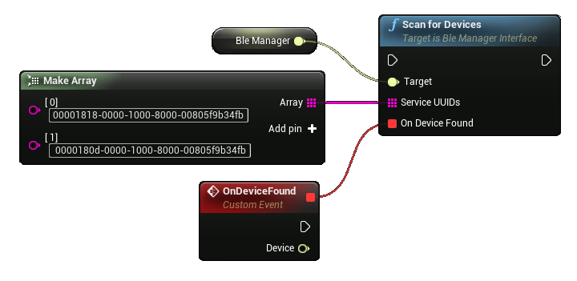
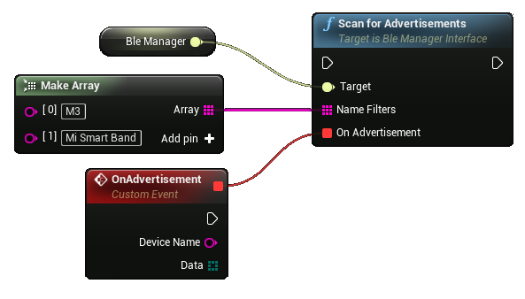
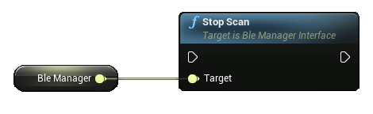
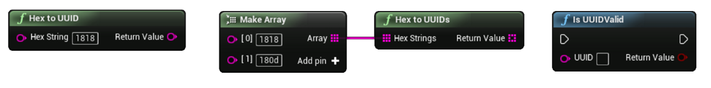

# **BLE Goodies**

Welcome to BLE Goodies Documentation for Unreal Engine

?> **Join our [Discord server](https://bit.ly/nineva_support_discord) and ask us anything!**

---

# Setup

Android Bluetooth requires the following permissions:
```
android.permission.BLUETOOTH
android.permission.BLUETOOTH_ADMIN
android.permission.ACCESS_COARSE_LOCATION
android.permission.ACCESS_FINE_LOCATION
```

These permissions are added to the manifest by default but `ACCESS_FINE_LOCATION` is considered a dangerous permission so on Android version 10 and above you will need to explicitly ask for this permission using a built-in UE4 `Request Android Permissions` function.


?> If your app targets API level 28 or lower you can request either `ACCESS_COARSE_LOCATION` or `ACCESS_FINE_LOCATION` permissions. If the API target is 29 and above only `ACCESS_FINE_LOCATION` permission will work.

iOS does not require any action from you - the plugin handles plist modification so that the app has access to Bluetooth.

# BLE Manager

The BLE Manager can check and control Bluetooth state and perform scans to find nearby BLE devices. You can create a BLE Manager using the `Create Ble Manager` node and storing the output in a variable.


?> The service and characteristic UUIDs need be in the 128 bit fully qualified format e. g. XXXXXXXX-XXXX-XXXX-XXXX-XXXXXXXXXXXX. Any other format will not work. For converting and checking the validity of UUIDs check the [BLE Utils](#ble-utils) section.

## Bluetooth Controls


- `Is BLE Supported` - Check if the device supports Bluetooth low energy mode.
- `Is Bluetooth Enabled` - Check if Bluetooth is enabled on the device.
- `Set Bluetooth State` - Enable/disable Bluetooth on the device (Android only).
- `Is Scanning` - Check if the manager is currently performing a scan.

## Scan for devices



The `Scan for Devices` node will start a BLE scan that will search for devices that contain at least one service specified in the `Service UUIDs` field. If that field is empty all devices will be found regardless of running services - this approach is not recommended as it is more resource-intensive. Each time a device is found an event is fired and you can capture the device in the `On Device Found` callback.

## Scan for advertisements



If you do not need to connect to a BLE Device but require the device's manufacturer data you can use the `Scan for Advertisements` node. The `NameFilters` array specifies the device names that will be reported in the callback. If no names are provided all the callback will receive data from all available nearby devices The names must fully match and do not support regex.

**Android** devices will report the manufacturer's data as many times as it is advertised. On **iOS** the data is returned once for each device and you will only receive it again if the data changes.

?>  <br>You can only scan for either devices or advertisements. If you want to change the scan target you can stop the current scan using the `Stop Scan` function.

# BLE Device

You discover BLE devices by running a device scan from a BLE Manager and listening for the `On Device Found` callback.

By storing a reference to a device you can access its functionality:

## General Information


These nodes return the general information about the device:
- `Get Device ID` - Unique device ID. This is the device MAC address on Android and a generated UUID on iOS. It is not recommended to rely on this field as it can be different for the same device in certain scenarios.
- `Get Device Name` - The name of the device.
- `Is Connected` - Indicates if the device is connected.

## Connection State


To start working with service characteristic data you need to connect to the device. You can listen for the `On Connect` event to determine that a connection attempt was successful. In case an error occurs it will be raised in the `On Connect Error` event (currently iOS only).


After you finish working with a device you should disconnect from it. The `On Disconnect` event will notify of a successful disconnect. In case an error occurs it will be raised in the `On Disconnect Error` event (currently iOS only).

## Device services and characteristics

All operations will report the result to the specific operations handler. All of these handlers will contain the exact service and characteristic UUID of the operation. Use these UUIDs to determine which operation status you are handling. For proper event propagation make sure you bind to an event before invoking a characteristic operation.

### Get services

You can get all available service UUIDs from a connected device by using the `Get Services` node. The `Filter UUIDs` pin allows you to specify which services you are interested in so that the resulting array will contain only available services that are specified in that list.


If you simply want to check is a certain service is available - you can use the `Is Service Available` function.


### Read


Allows you to read data from a characteristic. The `On Read` event will contain said data in a byte array (`TArray<uint8>`).

### Write


Tries to write the provided byte array to the characteristic provided. Will fire an `On Write` event to indicate the status of the operation.

!> Some devices do not indicate write operations successes so the `On Write` event may never occur. This does not mean a write failure.

### Subscribe


Subscribe to notifications from the provided characteristic. Each time a notification is received the *On Notification* event will fire. The notification data is represented as an array of bytes (`TArray<uint8>`).
Some characteristics are classified as **Indicate** instead of **Notify**. To receive notifications from these types of characteristics set the `Is Indication Characteristic` flag to true

?> iOS internally handles indication characteristics so the flag `Is Indication Characteristic` does nothing on the iOS platform.


If you wish to stop receiving notifications use this node. The `On Unsubscribe` event will fire if no errors occurred.

### Handle errors


In case any of the operations above throws an error you can handle them in the `On Error` event. It is a good idea to always bind to this event and log the errors for troubleshooting.

# BLE Utils

The plugin contains utility methods that might come in handy when working with BLE.



- `Hex to UUID` - Convert a 16 bit hex value into a UUID string (e. g. 0x1818 -> 00001818-0000-1000-8000-00805f9b34fb).
- `Hex to UUIDs` - Convert an array of 16 bit hex values into an array of UUID strings.
- `Is UUID Valid` - Check if a provided UUID is a valid 128 bit fully qualified UUID in the format XXXXXXXX-XXXX-XXXX-XXXX-XXXXXXXXXXXX.
