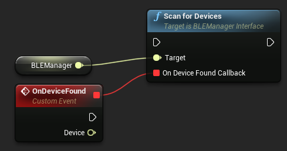
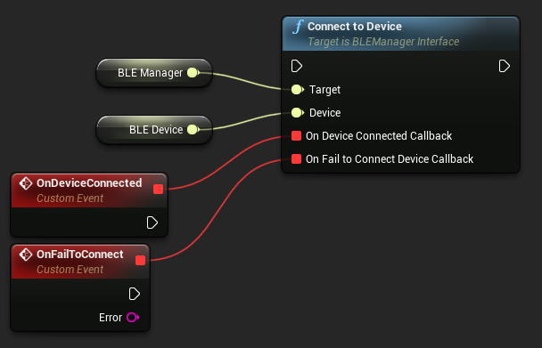
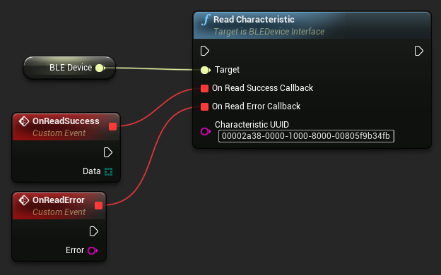
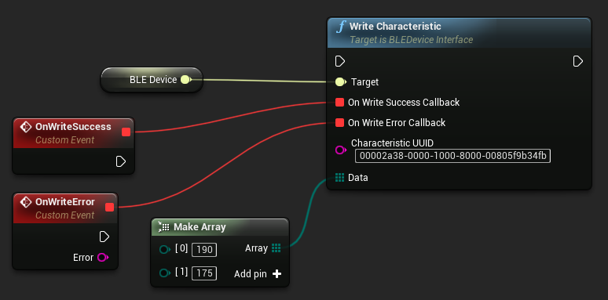
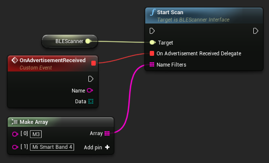

# **BLE Utilities**

This plugin enables you to do the following:

- Scan for available BLE devices
- Read device manufacturer data
- Connect to BLE devices
- Subscribe to notify characteristics
- Read/Write characteristic data

# **Project Setup**

On Android Bluetooth requires the following permissions:
```
android.permission.BLUETOOTH
android.permission.BLUETOOTH_ADMIN
android.permission.ACCESS_COARSE_LOCATION
```

These permissions are added to the manifest by default.

# **Examples**

## Working with BLE devices

To start working with BLE devices you need to create an instance of BLEManager. BLEManager takes an array of service UUIDs to scan for. You can use two formats to specify these UUIDs:
- String representing a 128 bit fully qualified UUID e. g. XXXXXXXX-XXXX-XXXX-XXXX-XXXXXXXXXXXX
- String representing a 16 bit Bluetooth standard UUID e. g. XXXX which is converted to a 128 bit UUID via the `HexToUUID` helper node


The BLE Manager contains a set of helper nodes to check BLE status on the device:
- `CheckBleSupport` - check if the device supports Bluetooth low energy mode;
- `IsBluetoothEnabled` - check if Bluetooth is enabled on the device;
- `SetBluetoothState` - enable/disable Bluetooth on the device (Android only).

With a BLE manager, you can start/stop scanning for available BLE devices by invoking the ScanForDevices/StopScan node.



Each time a device is found an event is fired and you can capture the device in the *OnDeviceFound* callback.
Having both a BLE manager and a BLE device you can connect/disconnect to it using respective nodes:



The BLE Device object can return the following information:

- `GetDeviceID` - unique device ID. This is the device MAC address on Android and a generated UUID on iOS. It is not recommended to rely on this field as it can be different for the same device in certain scenarios;
- `GetDeviceName` - the name of the device;
- `GetServiceUUID` - the UUID of the service that was used to find this device;
- `IsConnected` - indicates if the device is connected.

You can only access the characteristics of the service that was specified in BLE Manager. The available operations are:

**Subscribe/Unsubscribe**


Each time a notification is received the *OnNotificationReceived* event will fire. The notification data is represented as an array of bytes `TArray<uint8>`.
Some characteristics are classified as Indicate instead of Notify. To receive notifications from these types of characteristics set the `IsIndicationCharacteristic` flag to true (Note: iOS internally handles this so this flag can be disregarded on the iOS platform).

**Read**



Fires an *OnReadSuccess* event with the data read from the device or an *OnReadError* event if something went wrong.

**Write**



Tries to write the provided byte array to the device. Will fire an event to indicate the status of the operation (Note: some devices do not indicate write operations successes).

## Working with BLE manufacturer data

If you do not need to connect to a BLE Device but require the device's manufacturer data you can use the BLE Scanner object. The scanner only supports start/stop scanning operations.



The `NameFilters` array specifies the device names that will be reported in the callback. The names must fully match and do not support regex. To receive data from all devices do not connect this pin.
Android devices will report the manufacturer's data as many times as it is advertised. On iOS the data is returned once for each device and you will only receive it again if the data changes.
