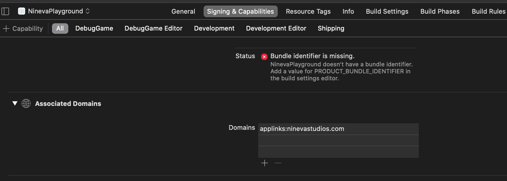

[filename](common/common_ue_header.md ':include')

[filename](common/copy_plugin.md ':include')

# **Deep Link Goodies**

Welcome to Deep Link Goodies Documentation for Unreal Engine.

---

## About the plugin

The plugin allows your application to intercept specific URLs and handle them on Android and iOS.
Specifically, it is a wrapper around [App Links](https://developer.android.com/training/app-links) for Android and [Universal Links](https://developer.apple.com/documentation/xcode/allowing_apps_and_websites_to_link_to_your_content?language=objc) for iOS.

!> Universal Links and App Links offer a potential attack vector into your app, so make sure to validate all URL parameters and discard any malformed URLs. In addition, limit the available actions to those that don’t risk the user’s data. For example, don’t allow universal links to directly delete content or access sensitive information about the user. When testing your URL-handling code, make sure your test cases include improperly formatted URLs.

## Add associated domains

Go to plugin settings (Project Settings -> Deep Link Goodies) and set the respective fields for the platform(-s) you plan to build for:


?> Note: you have to enable deep linking for iOS manually in the project settings.

## Verify ownership of the domains

Both iOS and Android require domain ownership verification for your application to be allowed to handle the specified URL's.

### Android

You have to add a specific `JSON` file to your domain at the following address: `https://YOUR_HOST_NAME/.well-known/assetlinks.json`

Its content is more thoroughly described [here](https://developer.android.com/training/app-links/verify-site-associations).

You can take a look at our example [here](https://deeplinks.ninevastudios.com/.well-known/assetlinks.json).

Example:
```
[{
	"relation": ["delegate_permission/common.handle_all_urls"],
	"target": {
		"namespace": "android_app",
		"package_name": "YOUR_PACKAGE_NAME",
		"sha256_cert_fingerprints": ["SHA256_FINGERPRINT_1", "SHA256_FINGERPRINT_2"]
	}
}]
```

### iOS

!> Due to some limitations, for iOS to work properly the plugin must be copied to the project `Plugins` folder.

You have to add a specific file to your domain at the following address: `https://YOUR_HOST_NAME/.well-known/apple-app-site-association`

?> Note: the file has to be without the `.json` resolution in the end.

Official documentation on this topic can be found [here](https://developer.apple.com/library/archive/documentation/General/Conceptual/AppSearch/UniversalLinks.html).

You can take a look at our example [here](https://deeplinks.ninevastudios.com/.well-known/apple-app-site-association).

?> There is a newer approach to form this file (should work only on iOS 13 and higher), described [here](https://developer.apple.com/documentation/safariservices/supporting_associated_domains?language=objc), but it hasn't worked for us.

Example:
```
{
	"applinks": {
		"apps": [],
		"details": [
			{
				"appID": "TEAM_ID_1.PACKAGE_NAME_1",
				"paths": [ "*" ],
			},
			{
				"appID": "TEAM_ID_2.PACKAGE_NAME_2",
				"paths": [ "*" ],
			},
		]
	}
}
```

### Add entitlements for iOS

Unfortunately, we could not add an automated task to add the Associated Domains capability to the output xcode project during build time, so you will have to add those entitlements manually and relaunch the application on the device.

?> If you are using modernized XCode workflow, you can set the custom entitlements file via `PremadeIOSEntitlements=(FilePath="/Game/Build/IOS/Resources/Entitlements.plist")` setting in the `[/Script/MacTargetPlatform.XcodeProjectSettings]` section in `DefaultEngine.ini` (make sure this file has the correct format and structure as described below). 

It has to be in the following format: `applinks:YOUR_DOMAIN_NAME`



But if you are using an Engine version from Github, you can add the following lines to the `Engine\Source\Programs\UnrealBuildTool\Platform\IOS\IOSExports.cs` in the body of the `WriteEntitlements` method just before the
``` csharp 
// End of entitlements
Text.AppendLine("</dict>");
Text.AppendLine("</plist>");
```
lines:

``` csharp
/// <summary>
/// 
/// </summary>
/// <param name="Platform"></param>
/// <param name="PlatformGameConfig"></param>
/// <param name="AppName"></param>
/// <param name="MobileProvisionFile"></param>
/// <param name="bForDistribution"></param>
/// <param name="IntermediateDir"></param>
public static void WriteEntitlements(UnrealTargetPlatform Platform, ConfigHierarchy PlatformGameConfig,
string AppName, FileReference MobileProvisionFile, bool bForDistribution, string IntermediateDir)
{
	...
	
	// Associated Domains
	List<string> AssociatedDomains;
	
	if (PlatformGameConfig.GetArray("/Script/DeepLinkGoodies.DeepLinkGoodiesSettings", 	"AssociatedDomains", out AssociatedDomains))
	{
		Text.AppendLine("\t<key>com.apple.developer.associated-domains</key>");
		Text.AppendLine("\t<array>");
	
		foreach (var Domain in AssociatedDomains)            
		{
			if (string.IsNullOrEmpty(Domain))
			{
				continue;
			}
	
			Text.AppendLine(string.Format("\t\t<string>applinks:{0}</string>", Domain));
		}
	
		Text.AppendLine("\t</array>");
	}
	
	...
	
	// End of entitlements
	Text.AppendLine("</dict>");
	Text.AppendLine("</plist>");
```

## Handle the URL

Basically, there are two scenarios that your application needs to handle:
- your application was not open when the link prompted it to be opened;
- your application was open when the link prompted it to be opened.

In first case, you can check the URL in the `EventConstruct` node in your blueprint:


?> Note: it is recommended to clear the deep link URL after handling it. It makes its handling when the application was reopened when it was on pause a lot easier.

You also should subscribe to the `ApplicationHasEnteredForeground` event to handle the case when your application was in the background when another application opened the link that the application is subscribed to.


___

# Changelog

v1.0.4

* ADDED Supoort for URL schemes on iOS and Facebook app links

v1.0.3

* FIXED 'exported' tag on acitivities for Android 12

v1.0.0

* Initial release

___
