# **Facebook Goodies**

Welcome to Facebook Goodies Documentation for Unreal Engine

?> **Join our [Discord server](https://bit.ly/nineva_support_discord) and ask us anything!**

---

# Setup

?> When dealing with setup we highly encourage you to also read/explore Facebook docs because it's the original source

## Create an app on the Facebook Developer portal

Log in on the [Facebook Developer portal](https://developers.facebook.com/apps/) and create an app.


## Copy your App ID to UE Project settings

After you create your app you will see a screen of your app. Your App ID will be displayed at the top. Now go to your UE project `Edit -> Project Settings` and find the Facebook Goodies section in settings and paste your App ID there.


When you add the App ID to your settings `FacebookGoodies.xml` file will be created in the root folder of your project. This file is required for Android builds to work so do **not** delete it.

?> In case you don't have the default folder structure for your project there might be an issue when copying this file to the Android APK. If you experience crashes when your Android app is launching please verify that this file is present in the built APK located at *Project\Intermediate\Android\APK\res\values\*. If there is absent, integrate the copy process into your build pipeline.

## Fill in settings and add Android and iOS platforms

Go to `Settings -> Basic` and fill in all the information you need there. Now scroll down to the bottom of the page and add Android and iOS platforms to your app. You will see new sections for Android and iOS after you do this.


## iOS Setup

Fill in the Bundle id that you are using for your app


## Android setup


In the Android section of your app you need to setup a few things

1. Put your application package name in this field
2. As a class name put `com.epicgames.ue4.GameActivity` which is the default name of the main activity
3. You need to find your keystore hashes which you are signing your app with. Please follow the [instructions on Facebook developers](https://developers.facebook.com/docs/android/getting-started/#release-key-hash).

## Products setup

Add all the products you need and follow the setup instructions for each product on the portal. Please ignore the Plist file modifications, the plugin will do them for you automatically.


If properly configured your app should have green checkboxes for Login and Analytics in the products section.

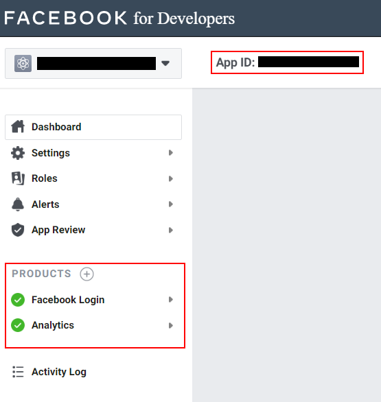


# **Login**

There are 3 blueprint nodes that you can use to login via Facebook:

* Simple login node. Use this node if you do not require any additional permissions. The user will only be asked to grant access to his public profile data.

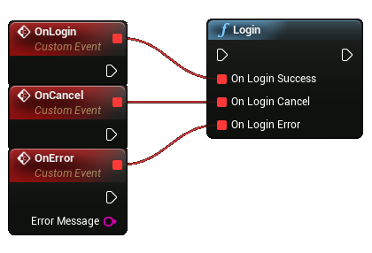

* Login with read permissions. Use this node if you require specific read permissions. If at any time you need to ask the user for more permissions simply call this node again with the new permissions specified.

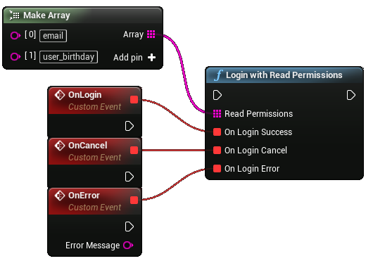

* Login with publish permissions. Use this node if you require specific publish permissions. If at any time you need to ask the user for more permissions simply call this node again with the new permissions specified.

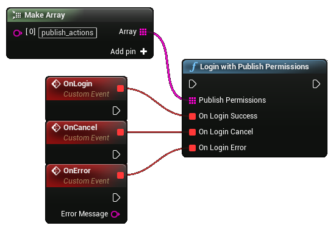

?> Some permissions require your app to be reviewed by Facebook. Please consult the official Facebook documentation if your app is authorized to ask for specific permissions.

If the user successfully authorized you can get his login information in the form of an **Access Token** and **User ID** by calling an appropriate node. These nodes return empty strings if the user is not logged in.


To check if a user is logged in you can use the *Is logged in* node. The *Logout* node will log out the current user and will clear the active access token.


To customize your app with user data you can run special queries. These queries will return a JSON string with the requested data. A query can also contain additional parameters and execute different Http methods (Get, Post, Delete). Please consult the official Facebook documentation for all available parameters and endpoints. A good starting point is the official [API Explorer](https://developers.facebook.com/tools/explorer?method=GET&path=me&version=v7.0), you can see what data is available to you and what permission you require to access it. Below is an example of a query that retrieves the users birthday:

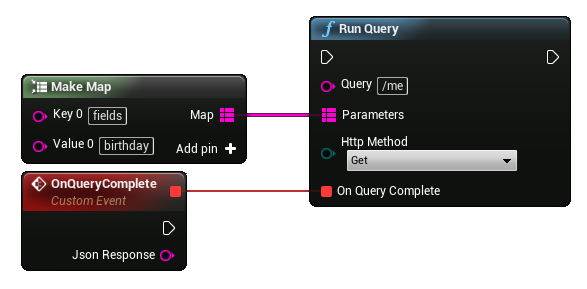

!> This plugin does not provide any helper methods to parse JSON responses.

For convenience, there is a special node that runs a query to retrieve the user's name, email (requires email read permission), and profile picture.

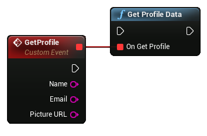

To access certain data the user needs to grant specific permissions. You can check at any time what permissions were granted, declined, or expired by using these nodes:


# **Analytics**

To test the events please use the [Event Manager](https://www.facebook.com/events_manager)

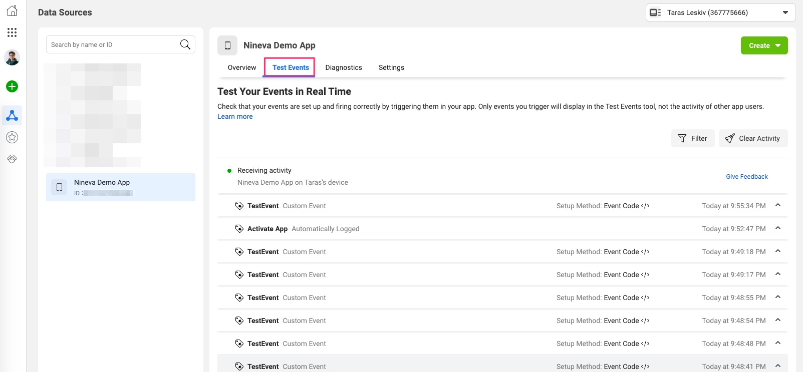


## Permissions

These are the methods to get permissions


## Log events

There are three convenience methods for event logging:

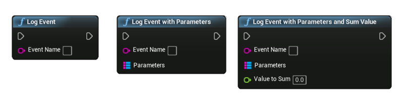

You can either just log event with a name, with name and parameters or with name, parameters and a sum value, that will be added for the events with this name.

## Set event flush behaviour

By default, the logged events are flushed automatically by the SDK, but if you want, you can change it to manual and flush them whenever it's convenient for you.

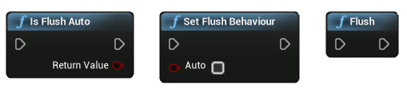

## Use user data

You can also set, get and clear the personal user information:

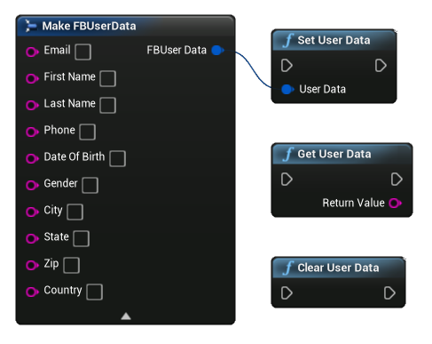

## Application identifiers

You can get the Facebook Application ID and the unique identifier for the application installation on the current device for your needs:


## Advertiser tracking (iOS Only)
It's a privacy feature that allows users to control if advertisers receive data about activity generated by their devices.

Starting with iOS 14, you will need to set ```AdvertiserTrackingEnabled``` and log each time you give a device permission to share data with Facebook.

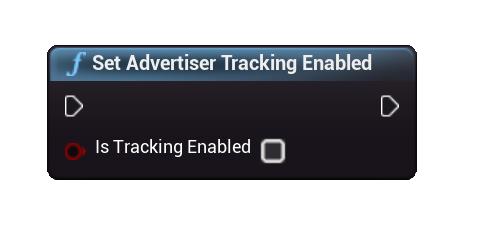

# **Share**

Official documentation on sharing can be found [here](https://developers.facebook.com/docs/sharing/).

The plugin allows users to share different types of content (photos, videos, links, stories).

?>  Your app should not pre-fill any content to be shared. This is inconsistent with Facebook Platform Policy, see [Facebook Platform Policy, 2.3](https://developers.facebook.com/policy/#control).

To share content simply call the following function, providing the content to share, share dialog type, and the respective callbacks:

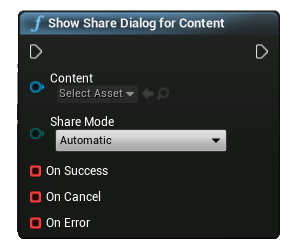

## Share modes

!> Automatic, Native, Web and FeedWeb sharing modes are supported on both Android and iOS, while ShareSheet, Browser and FeedBrowser modes are supported only for iOS.

In most cases it is best to use the automatic mode and let the SDK select the best mode for you.

## Create share content assets

Most common cases for sharing are the photo and video sharing.

### Share Photo

You can create a Share Photo or Share Video objects using the following nodes:

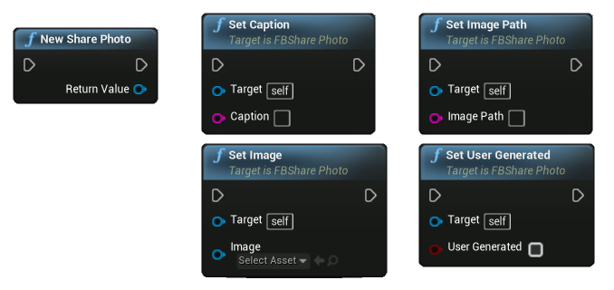

You can provide either a UTexture2D object or a full path to the image on the device for the Share Photo.

### Share Video

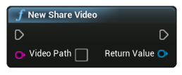

The Share Video object is initialized with a full path to a video on the user's device.

?> On iOS it has to be in specific format:  "assets-library://asset/asset.[FILE_EXTENSION]?id=[FILE_ID]&ext=[FILE_EXTENSION]" where FILE_EXTENSION is mov, or mp4, etc., and FILE_ID is the asset ID from PhotoLibrary. Example: assets-library://asset/asset.mp4?id=225640F8-597C-4E71-A1E9-490C7737B0E4&ext=mp4Create share content. Can be obtained as a result of the native image picker - under the deprecated UIImagePickerControllerReferenceURL key.

There are different types of contents available for sharing: photos, video, media, link, and story.
There are common functions for all of the types of content:

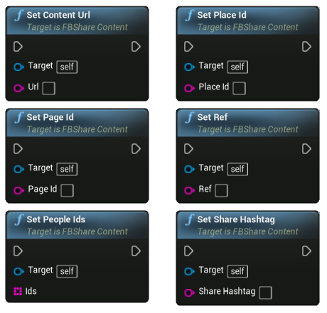

### Share Link Content

You can share a link with an optional quote using the Share Link Content:

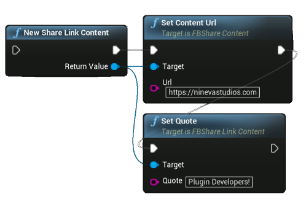

### Share Media Content

!> Currently, only works on iOS due to Android SDK issues!

You can share multiple photos and videos using the Share Media Content:

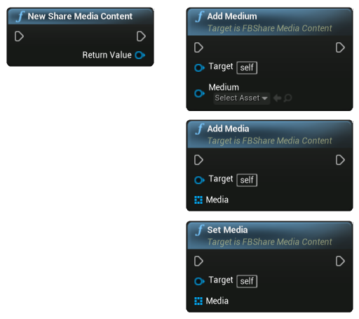

?> The maximum allowed amount of images and videos shared at the same time can be found in the official Facebook documentation for [Android](https://developers.facebook.com/docs/sharing/android#multimedia) and [iOS](https://developers.facebook.com/docs/sharing/ios#multimedia).

### Share Photo Content

You can share single or multiple photos using the Share Photo Content:

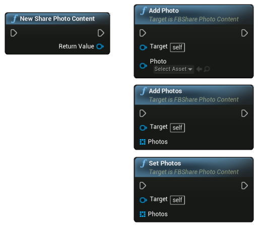

### Share Story Content

You can share content to story using the Share Story Content and providing a sticker asset and either a background asset or background colors:

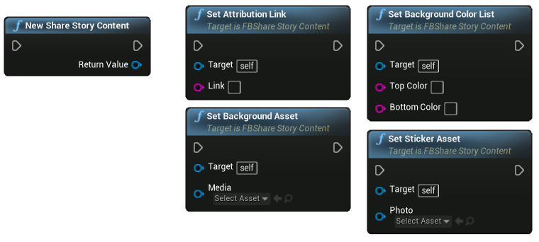

?> On iOS sharing to stories works different under the hood, therefore, the callbacks are not received during it.

### Share Video Content

You can share video using the Share Video Content, providing a previously created Share Video object:

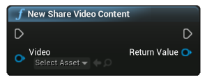

# **Friends**

?> Only users with granted ```user_friends``` permission are displayed in fetched friends list.

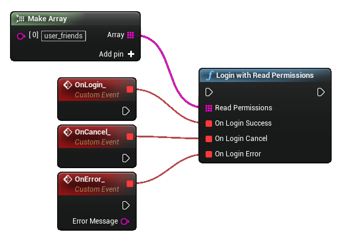

## User's Friends

To retrieve user's friends data use ```GetUserFriendsData``` method. Callback returns ```FFBFetchedFriendsData``` object that contains fetched data.

?> Note that facebook limits page to **25** friends in a single response.

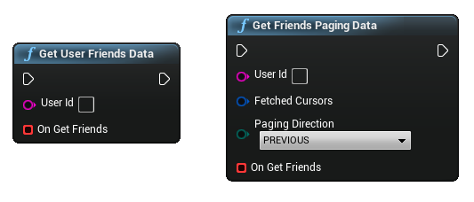
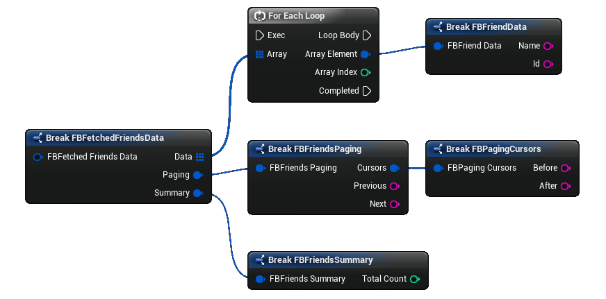

?> If there are more friends to display ```FFBFetchedFriendsData``` response will contain string data in ```Next``` and/or ```Previous``` fields in ```Paging``` subobject. Otherwise those fields are empty strings. 

### Paged Friends

In order to get another page of friends use ```GetFriendsPagingData``` method. It returns ```FFBFetchedFriendsData``` object in callback with updated friends list and new data for further paging requests.

?> ```GetFriendsPagingData``` method requires ```UserId``` parameter only for iOS!


# **Profile Picture**

To get user's profile picture call ```GetProfilePicture``` method. Callback returns image's url.

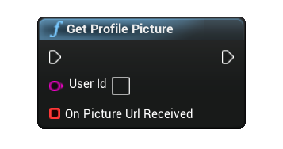

# **Audience Network setup for iOS 14**

You can change the Advertising Tracking status using the plugin.

First, you will need to enable the Audience Network SDK inclusion in the Project Settings -> Facebook Goodies.

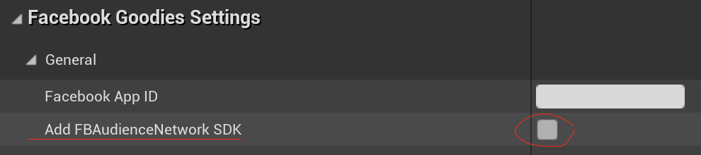

Enabling Audience Network SDK will automatically add the `-lxml2` flag to the linker flags for iOS (both development and shipping builds).

Then you can call the `SetAudienceNetworkAdvertiserTrackingEnabled` function to enable or disable the Advertiser Tracking.
___

# Changelog

v 1.3.5

* UPDATE iOS SDK to version 8.2.2
* ADD Advertiser Tracking for iOS

v 1.2.2

* ADD Friends permission check for fetching friends demo blueprint
* FIXED FBShareLibrary packaging issue
* FIXED Fetch Friends use of removed reference

v 1.2.1

* ADD Fetch Friends functionality

v.1.2.0

* UPDATE iOS SDK to version 7.1.1
* FIXED iOS plist generation duplicates

v.1.1.0

* UPDATE Android SDK to version 7.1.0

?> This release uses AndroidX libraries and may cause conflicts with other Android plugins

v.1.0.0

* Initial release

___
