# **Facebook Goodies**

To start using Facebook in your application you will need to log in on the [Facebook Developer portal](https://developers.facebook.com/) and create an app. In your app, you will need to setup Login and Analytics. Follow the instructions there and provide the necessary info (e. g. iOS Bundle ID, Android Package Name, etc.).

?> This plugin will do all the necessary changes to the Android manifest and iOS plist, so you can skip those steps.

If properly configured your app should have green checkboxes for Login and Analytics in the products section. The last step is to copy the App ID to your UE4 project settings.

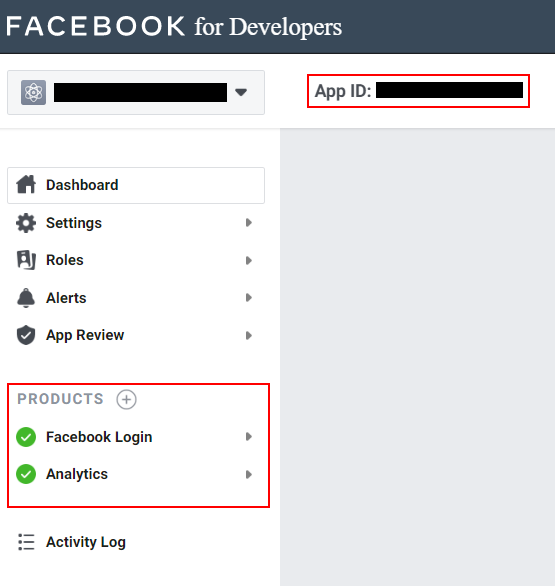

When you add the App ID to your settings a file *FacebookGoodies.xml* will be created in the root folder of your project. This file is required for Android builds to work so do **not** delete it.

?> In case you don't have the default folder structure for your project there might be an issue when copying this file to the Android APK. If you experience crashes when your Android app is launching please verify that this file is present in the built APK located at *Project\Intermediate\Android\APK\res\values\*. If there is absent, integrate the copy process into your build pipeline.

# **Login**

There are 3 blueprint nodes that you can use to login via Facebook:

* Simple login node. Use this node if you do not require any additional permissions. The user will only be asked to grant access to his public profile data.

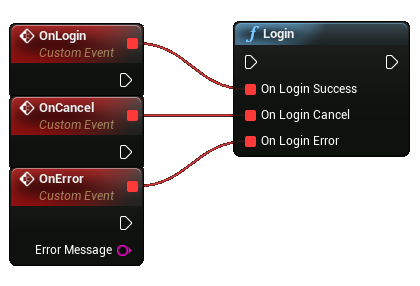

* Login with read permissions. Use this node if you require specific read permissions. If at any time you need to ask the user for more permissions simply call this node again with the new permissions specified.

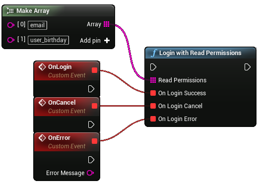

* Login with publish permissions. Use this node if you require specific publish permissions. If at any time you need to ask the user for more permissions simply call this node again with the new permissions specified.

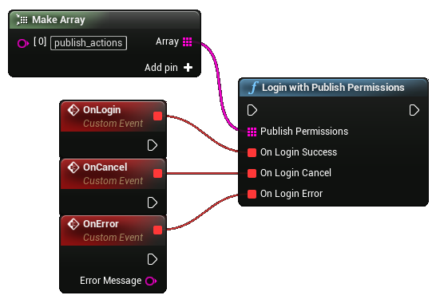

?> Some permissions require your app to be reviewed by Facebook. Please consult the official Facebook documentation if your app is authorized to ask for specific permissions.

If the user successfully authorized you can get his login information in the form of an **Access Token** and **User ID** by calling an appropriate node. These nodes return empty strings if the user is not logged in.

To check if a user is logged in you can use the *Is logged in* node. The *Logout* node will log out the current user and will clear the active access token.

To customize your app with user data you can run special queries. These queries will return a JSON string with the requested data. A query can also contain additional parameters and execute different Http methods (Get, Post, Delete). Please consult the official Facebook documentation for all available parameters and endpoints. A good starting point is the official [API Explorer](https://developers.facebook.com/tools/explorer?method=GET&path=me&version=v7.0), you can see what data is available to you and what permission you require to access it. Below is an example of a query that retrieves the users birthday:

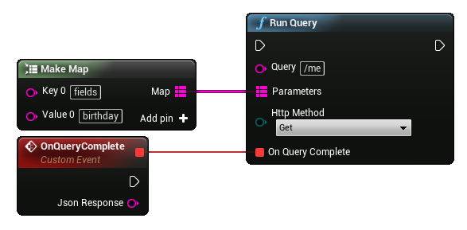

!> This plugin does not provide any helper methods to parse JSON responses.

For convenience, there is a special node that runs a query to retrieve the user's name, email (requires email read permission), and profile picture.

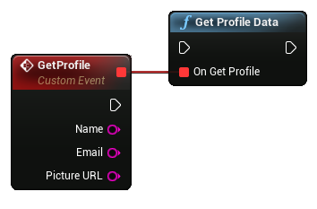

To access certain data the user needs to grant specific permissions. You can check at any time what permissions were granted, declined, or expired by using these nodes:

# **Analytics**

# **Sharing**

Official documentation on sharing can be found [here](https://developers.facebook.com/docs/sharing/).

The plugin allows users to share different types of content (photos, videos, links, stories).

?>  Your app should not pre-fill any content to be shared. This is inconsistent with Facebook Platform Policy, see [Facebook Platform Policy, 2.3](https://developers.facebook.com/policy/#control).

To share content simply call the following function, providing the content to share, share dialog type, and the respective callbacks:

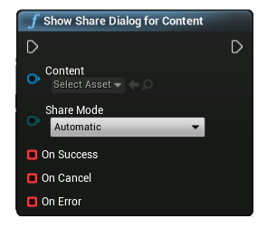

## Share modes

!> Automatic, Native, Web and FeedWeb sharing modes are supported on both Android and iOS, while ShareSheet, Browser and FeedBrowser modes are supported only for iOS.

In most cases it is best to use the automatic mode and let the SDK select the best mode for you.

## Create share content assets

Most common cases for sharing are the photo and video sharing.

### Share Photo

You can create a Share Photo or Share Video objects using the following nodes:

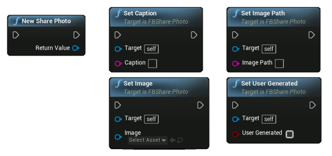

You can provide either a UTexture2D object or a full path to the image on the device for the Share Photo.

### Share Video

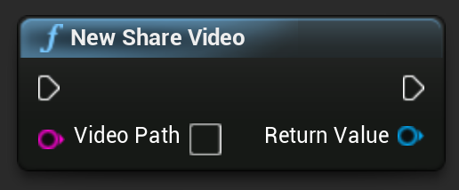

The Share Video object is initialized with a full path to a video on the user's device.

?> On iOS it has to be in specific format:  "assets-library://asset/asset.[FILE_EXTENSION]?id=[FILE_ID]&ext=[FILE_EXTENSION]" where FILE_EXTENSION is mov, or mp4, etc., and FILE_ID is the asset ID from PhotoLibrary. Example: assets-library://asset/asset.mp4?id=225640F8-597C-4E71-A1E9-490C7737B0E4&ext=mp4Create share content. Can be obtained as a result of the native image picker - under the deprecated UIImagePickerControllerReferenceURL key.

There are different types of contents available for sharing: photos, video, media, link, and story.
There are common functions for all of the types of content:

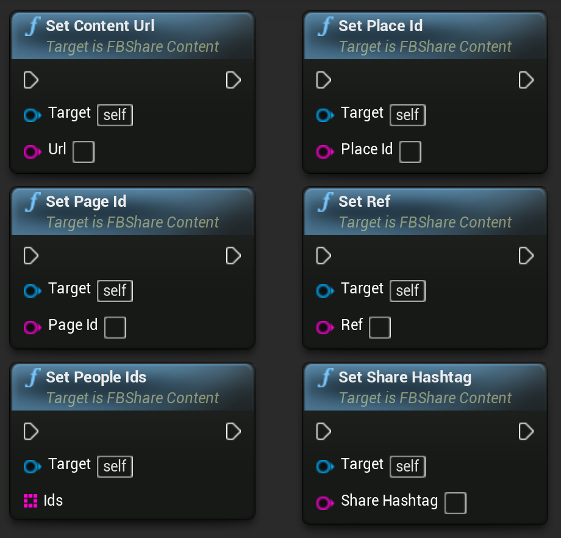

### Share Link Content

You can share a link with an optional quote using the Share Link Content:

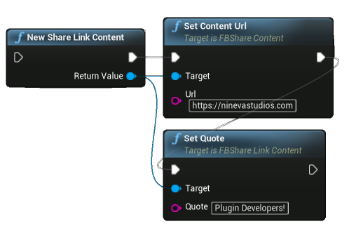

### Share Media Content

You can share multiple photos and videos using the Share Media Content:

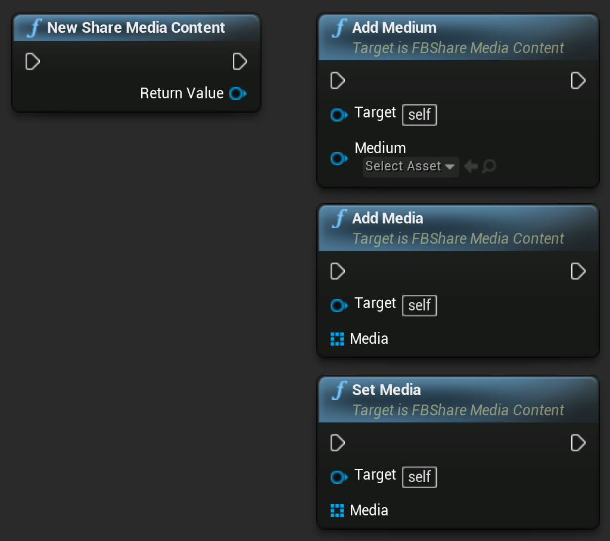

?> The maximum allowed amount of images and videos shared at the same time can be found in the official Facebook documentation for [Android](https://developers.facebook.com/docs/sharing/android#multimedia) and [iOS](https://developers.facebook.com/docs/sharing/ios#multimedia).

### Share Photo Content

You can share single or multiple photos using the Share Photo Content:

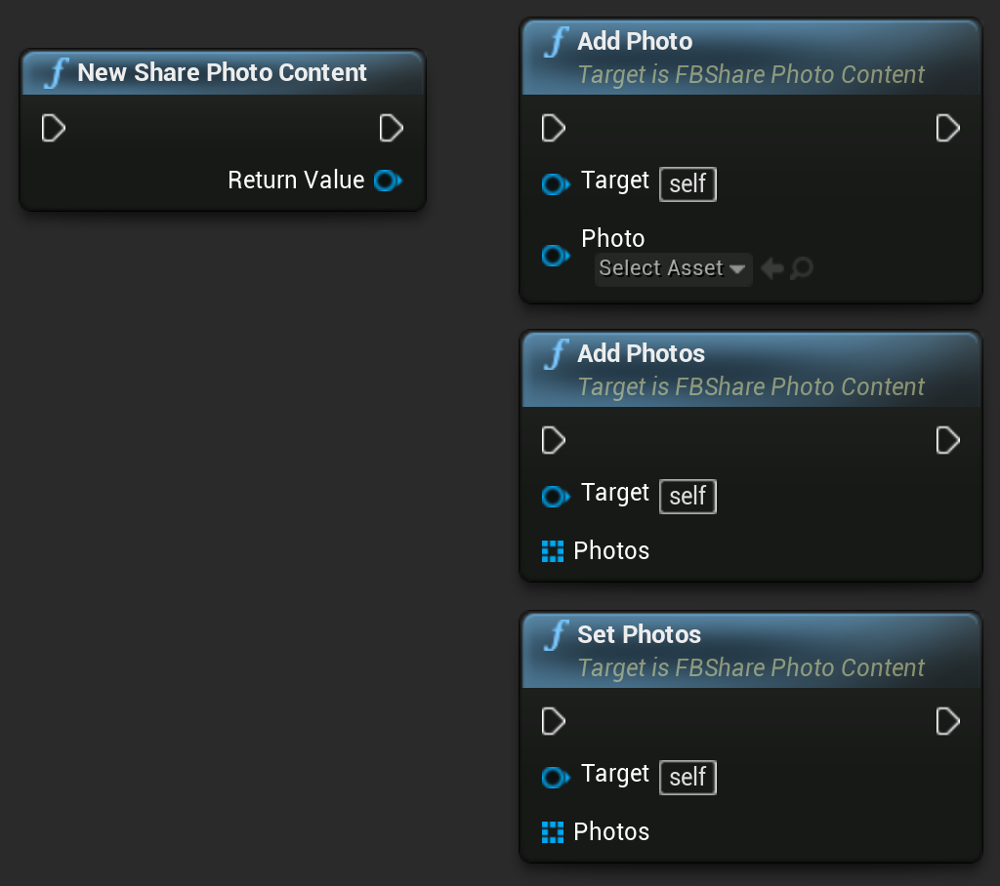

### Share Story Content

You can share content to story using the Share Story Content and providing a sticker asset and either a background asset or background colors:

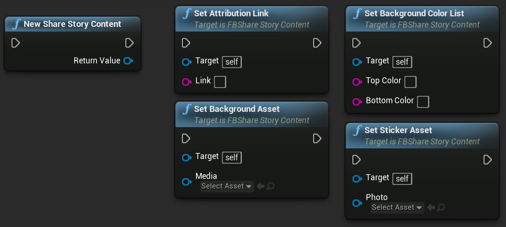

?> On iOS sharing to stories works different under the hood, therefore, the callbacks are not received during it.

### Share Video Content

You can share video using the Share Video Content, providing a previously created Share Video object:

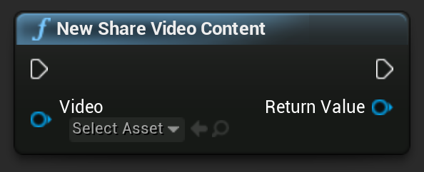
