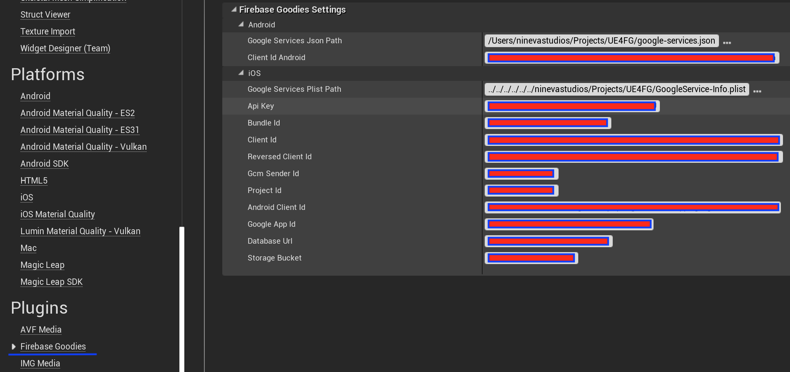
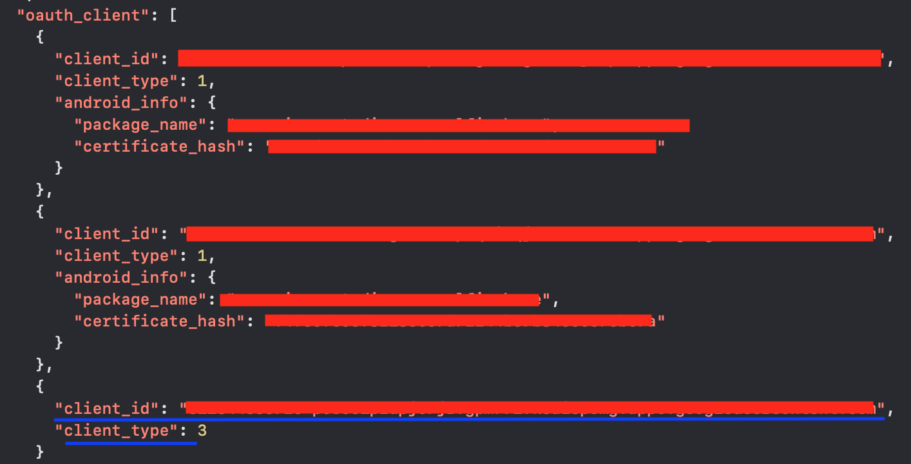

# **Analytics**

## Initial Setup

Analytics collects usage and behavior data for your app. There are two types of information you can log:
* Events - any event that is happenning in you app with or without parameters
* User properties - attributes you asign to a certain group of your users (e. g. language preference)

After enabling analytics in your Firebase console you're all set to start logging events.

?> Events usually take up to an hour to appear on the Firebase console dashboard. For testing you can tell your device to send debug analytics events. Please follow the official instruction [here](https://support.google.com/firebase/answer/7201382) to activate this feature.

## Functions

### State control

* Enable/Disable analytics collection
* Reset analytics data
* Specify session timeout duration (default is 30 minutes)

### User properties

* Set user ID

  Sets the user ID property

* Set user property

  Sets a user property to a given value

### Screen tracking

* Set current screen

### Event loging

* Log event with parameter

  You can log an event with one of the following parameter types: Integer, Float, String. Use a respective CreateParameter node to get the desired type.

* Parameter value

  You can change the parameter's value.

* Log event with parameters

  You can log an event with multiple parameters by putting them in an array.

# **Authentication**

## Initial Setup

You have to setup the user authentication feature in the firebase console for your firebase project to be able to use the auth functionality of the plugin. 

If you have not created the Firebase project yet, please, follow the instructions in this [video](https://www.youtube.com/watch?v=6juww5Lmvgo).

After the project is created, you can go to the Authentication section on the left and there you can enable all the required sign in providers for your application.

!> Some of the providers may require additional setup. Please, check the official Firebase documentation on how to enable the different sign in methods if you are having any problems with it.

In the Project Settings in the Firebase console, create an Android/iOS app providing the required information.
You will have to provide the SHA1 fingerprints for the keystores that will be used to sign the application on Android. The information on how to generate a keystore and read its fingerprint can be found [here](https://stackoverflow.com/questions/15727912/sha-1-fingerprint-of-keystore-certificate).
After this, you should download the google-services.json (for Android) and/or GoogleService-info.plist files, you will need them later.

After the setup is complete in the Firebase console, you can open your UE4 project and go to Project Settings -> Firebase Goodies. You should provide the path to previously downloaded google-services.json (for Android) and/or GoogleService-info.plist files in order for them to be parsed by the plugin. 

You should also provide a Client ID for Android. It can be found in the google-services.json file under the `oauth_client` section - the one with the `client_type` value of `3`.

!> On Mac, the file picker is somehow broken in the UE4, so you will have to manually paste the path to the files. In order to get the full path to the file, right click it in Finder and hold the Option key. After the menu changes, select the Copy as Pathname option and paste it into the corresponding field in the Project Settings.

## Functions

Auth library of the plugin allows manipulating users and sessions. The official documentation can be found here for [Android](https://firebase.google.com/docs/auth/android/start) and [iOS](https://firebase.google.com/docs/auth/ios/start).

First of all, you should activate the listeners that will be triggered whenever user or token authentication state changes, by calling the `InitListeners` method. This will allow you to react to these changes accordingly during the lifetime of the application.

### User registration and login
You can create a new user with an email and password by calling the `CreateUser` method. 

There are several options for sign in. You can either do it with email and password, a custom token, or with a specific credential. There are also methods for obtaining these credentials, but they require an additional integration of the corresponding provider's SDK. For example, you can use Facebook credentials to sign the user in, but you will need a valid Facebook token that can only be obtained if you integrate the Facebook SDK into your project.

We have integrated the Google Sign In SDK as a part of the plugin in order to show an example of how this should be done. Call the `PromptGoogleSignIn` method to show a native sign in with Google dialog. After the user successfully signs in, you will be able to use the AuthCredentials object to either sign the user in Firebase, or link them to an existing account.

You can also use the anonymous sign in by calling the `SignInAnonymously` method.

!> All sign in methods return the FirebaseUser object when successful, that can be used later to read and modify the user's data.

You can also obtain a reference to the current user object at any time by calling the `CreateUser` method.

You can also link a phone number to the existing user. You have to call the `VerifyPhoneNumber` function to start the phone number verification process. On most devices the user experience is the following: when you call this method after obtaining the user's phone number, they will either receive an SMS or a push notification with the code, while the application will receive OnSmsSent callback with the Verification ID needed for creating the AuthCredentials object along with the verification code, obtained by the user. Sometimes on Android devices the operation will be performed silently by the operating system, allowing you to use the AuthCredentials object from the OnSuccess callback. Your application should always be able to handle both cases.

!> You have to add the test phone numbers in the Firebase console in order to test the phone verification functionality during development.

Call `SignOut` function to sign the current user out.

### User management

Whenever you get access to the FirebaseUser object, you should check if it is valid by calling the `IsNotNull` function on it. If the function returns false, you should not perform any operations with it. By calling this function on the `GetCurrentUser` object, you can check whether there is a user signed into your application and prompt the user to sign in otherwise.

You can get some of the user data, for example unique user ID, display name, email, phone number, avatar URL, etc.
You can also update this information by calling the respective methods, for example, `UpdateEmail`.

!> You can only update the user's phone number after successful phone verification with the obtained AuthCredentials object.

You can also link additional credentials to the user, for example, Google and Facebook credentials. You can also get a list of all providers for user (`FetchProvidersForEmail`) and unlink them (`UnlinkProvider`). 

If there is a need, you can reauthenticate or reload the current user by calling the respective methods.

Call `Delete` on the FirebaseUser object to delete the user from your user database.

# **Cloud Storage**

## Initial Setup

If you have not created the Firebase project yet, please, follow the instructions in this [video](https://www.youtube.com/watch?v=6juww5Lmvgo).

After the project is created you can go to the Cloud Storage Section on the left and setup the storage security rules. Refer to this [page](https://firebase.google.com/docs/storage/security/start) for more info.

## Functions

Cloud Storage library of the plugin allows manipulating files. The official documentation can be found here for [Android](https://firebase.google.com/docs/storage/android/start) and [IOS](https://firebase.google.com/docs/storage/ios/start).

!> In order to work with cloud storage user needs to be signed in to firebase. Please refer to [Auth page](#Authentication) for setup of authentication.

### Upload files

You can upload files from device to firebase cloud storage by calling `UploadFromLocalFile` method.

Or upload from memory buffer by calling `UploadFromDataInMemory` method.

Both methods return progress of uploading in % during the whole process. 

### Download files

For downloading files from cloud storage to the device use `DownloadToLocalFile` method.

For android you can choose the directory to download a file to by selecting the corresponding environment from the dropdown list.

For downloading file into a memory buffer use `DownloadInMemory` method.

You can limit the size of a memory buffer by providing custom value to FileSizeLimit variable in Bytes.

In case you need to get Url for downloading the file call `GetDownloadUrl` method.

### File metadata

After uploading a file to cloud storage, you can obtain file's metadata by calling `GetFileMetadata` method.

Successful callback returns metadata object reference, which you can use to retrieve metadata properties, for a full list of properties refer to [this section](https://firebase.google.com/docs/storage/android/file-metadata#file_metadata_properties).

You can update file metadata at any time after the file is uploaded by using `UpdateFileMetadata` method.

First you need to create a `NewStorageMetadataValues` object, and after that set all the metadata properties needed. For the list of all the properties that can be set you can refer to [this section](https://firebase.google.com/docs/reference/android/com/google/firebase/storage/StorageMetadata.Builder#public-method-summary).

!> Method `SetContentLanguage` accepts language abbreviations consisting of two letters, we weren't able to find the exact list, but most of [ISO 639-1 Language Codes](http://www.mathguide.de/info/tools/languagecode.html) work.

### Delete files

To remove files from cloud storage use `DeleteFile` method.

# **Remote Config**

## Initial Setup

To use Firebase Remote Config in you application you need to login to firebase console and add parameters you need, in Remote Config tab. This plugin can be used in many different ways, for more details refer to [Remote Config use cases](https://firebase.google.com/docs/remote-config/use-cases).  

## Functions

Remote Config of the plugin allows you to define parameters in your app and update their values in the cloud, letting you modify the appearance and behavior of your app without distributing an app update. The official documentation can be found here for [Android](https://firebase.google.com/docs/remote-config/use-config-android) and [iOS](https://firebase.google.com/docs/remote-config/use-config-ios)

First of all you should set the minimum fetch interval and fetch timeout of config settings by calling `SetConfigSettings`.

### Fetch remote config values

To fetch parameter values from the Remote Config backend, call `Fetch` method. Any values that that you set in the backend are fetched, adhering to the default minimum fetch interval

 

In case you need to set custom interval for fetching, call `FetchWithInteval` method. It will start fetching configs, adhering to the specified minimum fetch interval. 

Ta make fetched parameter values available to youd app, call `Activate` method.

If you want to fetch and activate values in one call, use `FetchAndActivate` method. 

 

### Read config values

If you set values in the backend, fetch them, and then activate them, those values are available to your app. Now you can get parameter values from the Remote Config. To get the values, call the method listed below that maps to the data type expected by your app, providing the parameter key as an argument:
 - `GetString`;
 - `GetLong`;
 - `GetFload`;
 - `GetBoolean`;

### Default values

You can set in-app default parameter values in Remote Config, so that your app behaves as intended before it connects to the Remote Config backend, and so that default values are available if none are set in the backend.

Prior to setting default values, you first need to make a map of parameter names and default parameter values, then call the `SetDefaults` with passing  afterwards.

