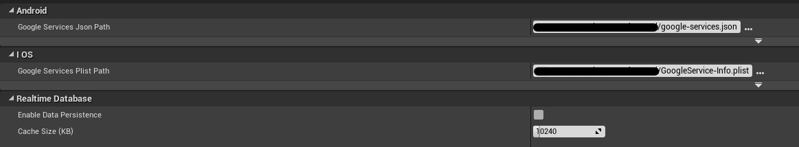
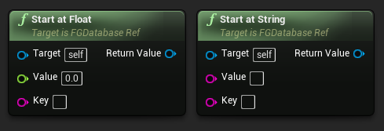

[filename](common/common_ue_header.md ":include")

[filename](common/copy_plugin.md ":include")

# **Firebase Goodies**

Welcome to Firebase Goodies Documentation for Unreal Engine

---

Create a Firebase project, follow the instructions in this [video](https://www.youtube.com/watch?v=6juww5Lmvgo).

In the Project Settings of your Firebase console, create an Android/iOS app providing the required information.
You will have to provide the SHA1 fingerprints for the keystores that will be used to sign the application on Android. The information on how to generate a keystore and read its fingerprint can be found [here](https://stackoverflow.com/questions/15727912/sha-1-fingerprint-of-keystore-certificate).
After this, you should download the _google-services.json_ (for Android) and/or _GoogleService-info.plist_ files.


After the setup is complete in the Firebase console, you can open your UE4 project and go to Project Settings -> Firebase Goodies. You should provide the path to previously downloaded `google-services.json` (for Android) and/or `GoogleService-info.plist` files for them to be parsed by the plugin. This path needs to be absolute for the plugin to properly use this file so it is advised not to commit this setting to your VCS.

You can also place your `google-services.json` inside the plugin directory (Next to UPL xml files) and check the respective checkbox in plugin settings for it to work.

?> On Android you would need to use **JDK 11**, you can set it in the `Project Settings -> Platforms - Android SDK -> Location of JAVA`



For Firebase to work in editor follow the [editor setup](#editorwindowsmac-os-x-support).

!> If you do not provide a valid path to the _google-services.json_ and/or _GoogleService-info.plist_ file your application will crash on start. A descriptive error message in the device logs will indicate that it was not able to find these files.

?> Most of the API tries to be as close as possible to the official Firebase API, because of this we advise to look at the [official documentation](https://firebase.google.com/docs) from Google as this might help you understand some concepts better with the examples they provide.

?> On Android `AndroidFileServer` built-in plugin seems to cause issues sometimes, try disabling it if you get compile errors related to `AFSProject...` or something similar.

# **Analytics**

## Initial Setup

Analytics collects usage and behavior data for your app. There are two types of information you can log:

- Events - any event that is happening in your app with or without parameters
- User properties - attributes you assign to a certain group of your users (e. g. language preference)

After enabling analytics in your Firebase console you're all set to start logging events.

?> Events usually take up to an hour to appear on the Firebase console dashboard. For testing, you can tell your device to send debug analytics events. Please follow the official instruction [here](https://support.google.com/firebase/answer/7201382) to activate this feature.

## Functions

### State control

- Enable/Disable analytics collection
- Reset analytics data
- Specify session timeout duration (default is 30 minutes)


### User properties

- Set user ID

  Sets the user ID property

- Set user property

  Sets a user property to a given value


### Screen tracking

- Set current screen


### Event loging

- Log event with parameter

  You can log an event with one of the following parameter types: Integer, Float, String. Use a respective CreateParameter node to get the desired type.


- Parameter value

  You can change the parameter's value.


- Log event with parameters

  You can log an event with multiple parameters by putting them in an array.


# **Authentication**

## Initial Setup

You have to setup the user authentication feature in the firebase console for your firebase project to be able to use the auth functionality of the plugin. Go to the Authentication section on your Firebase console, and there you can enable all the required sign in providers for your application.


!> Some of the providers may require additional setup. Please, check the official Firebase documentation on how to enable the different sign in methods if you are having any problems with it.

## Functions

Auth library of the plugin allows manipulating users and sessions.

First of all, you should activate the listeners that will be triggered whenever user or token authentication state changes, by calling the `InitListeners` method. This will allow you to react to these changes accordingly during the lifetime of the application.


### User registration and login

You can create a new user with an email and password by calling the `CreateUser` method.


There are several options for sign in. You can either do it with email and password, a custom token, or with a specific credential. There are also methods for obtaining these credentials, but they require an additional integration of the corresponding provider's SDK. For example, you can use Facebook credentials to sign the user in, but you will need a valid Facebook token that can only be obtained if you integrate the Facebook SDK into your project.

### Google Sign In

First of all, make sure your Google sign-in is properly enabled and configured in the dashboard as sign-in provider. Afterwards (for Android), you must re-download and re-pick your `google-services.json` file in the plugin settings (**Make sure to first clear the current path and then pick again the fresh one, this way it triggers the callback that allows the plugin to read the correct settings**).

!> To enable Google sign-in for your Android apps, you must provide the SHA-1 release fingerprint for each app (go to Project Settings > Your apps section)-- your app also must be signed by the keystore with this fingerprint when testing.

!> To enable Google sign-in for your Android apps, you must provide the SHA-1 release fingerprint for each app (go to Project Settings > Your apps section)-- your app also must be signed by the keystore with this fingerprint when testing.

It is also useful to check the official guide from Google regarding the parts of dashboard configuration: https://firebase.google.com/docs/auth/android/google-signin


We have integrated the Google Sign In SDK as a part of the plugin in order to show an example of how this should be done. Call the `PromptGoogleSignIn` method to show a native sign in with Google dialog. After the user successfully signs in, you will be able to use the AuthCredentials object to either sign the user in Firebase, or link them to an existing account. For Google sign in to work, make sure that you properly enable and configure this auth method in the auth dashboard and re-download and re-pick the configuration file in the plugin settings.


---

### Anonymous login

You can also use the anonymous sign in by calling the `SignInAnonymously` method.

---

!> All sign in methods return the FirebaseUser object when successful, that can be used later to read and modify the user's data.

You can also obtain a reference to the current user object at any time by calling the `CreateUser` method.

You can also link a phone number to the existing user. You have to call the `VerifyPhoneNumber` function to start the phone number verification process. On most devices the user experience is the following: when you call this method after obtaining the user's phone number, they will either receive an SMS or a push notification with the code, while the application will receive OnSmsSent callback with the Verification ID needed for creating the AuthCredentials object along with the verification code, obtained by the user. Sometimes on Android devices, the operation will be performed silently by the operating system, allowing you to use the AuthCredentials object from the OnSuccess callback. Your application should always be able to handle both cases.


!> You have to add the test phone numbers in the Firebase console in order to test the phone verification functionality during development.

Call `SignOut` function to sign the current user out.

### User management

Whenever you get access to the FirebaseUser object, you should check if it is valid by calling the `IsNotNull` function on it. If the function returns false, you should not perform any operations with it. By calling this function on the `GetCurrentUser` object, you can check whether there is a user signed in to your application and prompt the user to sign in otherwise.

You can get some of the user data, for example, unique user ID, display name, email, phone number, avatar URL, etc.
You can also update this information by calling the respective methods, for example, `UpdateEmail`.

!> You can only update the user's phone number after successful phone verification with the obtained AuthCredentials object.

You can also link additional credentials to the user, for example, Google and Facebook credentials. You can also get a list of all providers for user (`FetchProvidersForEmail`) and unlink them (`UnlinkProvider`).

If there is a need, you can reauthenticate or reload the current user by calling the respective methods.

Call `Delete` on the FirebaseUser object to delete the user from your user database.

### Sing in with Apple integration

If you are using [iOS Goodies](ue-plugins/ios-goodies) sign in with Apple functionality, you can use it to login to Firebase with Apple auth provider. To do this, you would need to get the id token and the raw nonce fields and use the `GetAppleCredentials` node to create the credentials and login.

Example blueprint setup:


# **Cloud Storage**

## Initial Setup

After the project is created you can go to the Cloud Storage Section in console, and setup the storage security rules. Refer to this [page](https://firebase.google.com/docs/storage/security/start) for more info.


## Functions

Cloud Storage library of the plugin allows manipulating files.

!> In order to work with cloud storage user needs to be signed in to firebase. Please refer to [Auth page](#Authentication) for setup of authentication.

### Upload files

You can upload files from device to firebase cloud storage by calling `UploadFromLocalFile` method.


Or upload from memory buffer by calling `UploadFromDataInMemory` method.


Both methods return progress of uploading in % during the whole process.

### Download files

For downloading files from cloud storage to the device use `DownloadToLocalFile` method.


For Android, you can choose the directory to download a file to by selecting the corresponding environment from the dropdown list.


For downloading a file into a memory buffer use `DownloadInMemory` method.


You can limit the size of a memory buffer by providing custom value to FileSizeLimit variable in Bytes.

In case you need to get Url for downloading the file call `GetDownloadUrl` method.


### File metadata

After uploading a file to cloud storage, you can obtain the file's metadata by calling `GetFileMetadata` method.


Successful callback returns metadata object reference, which you can use to retrieve metadata properties, for a full list of properties, refer to [this section](https://firebase.google.com/docs/storage/android/file-metadata#file_metadata_properties).

You can update file metadata at any time after the file is uploaded by using `UpdateFileMetadata` method.


First, you need to create a `NewStorageMetadataValues` object, and after that set all the metadata properties needed. For the list of all the properties that can be set, you can refer to [this section](https://firebase.google.com/docs/reference/android/com/google/firebase/storage/StorageMetadata.Builder#public-method-summary).

!> Method `SetContentLanguage` accepts language abbreviations consisting of two letters, we weren't able to find the exact list, but most of [ISO 639-1 Language Codes](http://www.mathguide.de/info/tools/languagecode.html) work.

### Delete files

To remove files from cloud storage use `DeleteFile` method.


# **Realtime Database**

## Initial Setup

Firebase supports two types of databases: realtime database and firestore. You can find the differences between these databases and which one will suit you better on the [official site](https://firebase.google.com/docs/database/rtdb-vs-firestore).

If you are set on using the realtime database you will need to first create it in your Firebase console:


?> This plugin can connect only to the default realtime database. Multiple databases are not supported.

Setup rules to be able to read/write data from your database by following the official [instructions](https://firebase.google.com/docs/database/security).

!> If you decide to setup rules that anyone can read/write data do not forget to modify them when releasing your app.

## Settings

- Enable data persistence

  If enabled clients will cache synchronized data and keep track of all writes you've initiated while your application is running.

- Cache size

  Size of the cache used for persistence storage (default is 10 MB).

## Functions

!> The plugin demo contains examples on how to use most of these nodes. The demo will write to your database and some examples require specific data to be already present in the database. Please examine the blueprints before executing any demo functionality.

### Database Reference

The database reference is the entry point from where you modify data.

- Create database root ref

  Get a reference to the root of your database.

- Create database ref from path

  Get a reference to a specific node in your database. Path can be a name or an actual path separated by **/**.

- Root

  Get a reference to the root of your database.

- Child

  Get a reference to a specific child node in your database.

- Parent

  Get a reference to the parent node.

!> You must maintain a reference to your DB if you are subscribing to update events for it to not automatically disconnect after the certain time. Please see the demo for reference implementation.


### Read/Write Data

All data is written and read as database variants. This is a special type that can be transformed into a primitive type (integer, float, bool, string) or a container of other variants. You can convert supported data types to a variant by simply dragging the value out pin to the variant in pin. You will be notified that a conversions is possible, you will see an error otherwise.

#### Write

- Set value


- Set array of values


- Set map of values


- Composite containers

  A variant can be a container that can also contain other containers (e. g. a map where one of its values in an array). Try to avoid deep nesting of containers as the more complicated data you are trying to write the more room for error you introduce.


!> UE4 does not support automatic conversion of collections to collection items. When trying to do this you will see the following error:


?> At any point where automatic conversion to a variant does not work you can invoke the variant conversion node manually. Simply search the node by name _variant_ and you should see it.


- Set priority

  Sets the priority for the current database node.


- Update children

  Update the specific child keys to the specified values.


- Push

  Create a new child at the current location. The name is auto-generated.


#### Read

- Get value

  You can request the value once.


If the value was retrieved properly you will receive it in a callback in the form of a Data Snapshot object. You can get the following data from this object:

- Get value
- Get key
- Get priority


Value and priority are variant objects. You can find out what type of value the variant holds by breaking it and checking the Type field.


There are two ways to get the actual values.

- Direct access by type
  These nodes return the value if the provided type is the same as the variant or a default value for the type requested. This never fails.
- Try get type nodes
  These nodes try to get the value of a specified type and will fail if the variant does not hold this type.


Data snapshots support navigation and these checks:

- Exists

  Returns true if the snapshot contains data.

- Has children

  Returns true if the snapshot contains any children,

- Has child

  Return true if the snapshot contains a specific child.

- Child

  Get a snapshot of a specific child node.

- Get children count

  Get the count of children of this node.

- Get children

  Get all child snapshots as an array.


If an error occurs during value retrieval you can react to it in the error callback.


#### Subscribe

- Value listener

  Subscribe/unsubscribe to receive events when a value changes at the current path.


- Child listener

  Subscribe/unsubscribe to receive events when a child node changes at the current path.


- Child event

  When subscribed to child events you may receive the following event types:

  - Added
  - Changed
  - Removed
  - Moved


!> If you subscribe to the same database location multiple times you will receive multiple callbacks when values change at that locations. If this happens unintentionally double check if you are not subscribing from a database object that was created by a Make function directly as pure blueprint nodes can execute multiple times. In these cases always store the database reference as available.

### Queries

!> Some sort and filtering options cannot be combined. These combinations are checked during runtime so you will spot errors when your app launched or executed a query. On Android, you should see an error message in the device console. On IOS your app will crash if an invalid query is found, refer to the XCode debug console to find the reason.

#### Sort data

- Order By Child
- Order By Value
- Order By Key
- Order By Priority


#### Filter data

- StartAt

  Return items greater than or equal to the specified key or value.



- EndAt

  Return items less than or equal to the specified key or value.


- EqualTo

  Return items equal to the specified key or value.


- Limit

  Sets the maximum number of items to return from the beginning/end of the ordered list of results.


### Transactions

When working with data that could be corrupted by concurrent modifications, such as incremental counters, you can use a transaction.

- Run transaction

  This will execute a transaction handler.


#### Transaction Handler

To create a transaction handler follow the steps:

1. Create a blueprint and inherit from FGTransactionHandler


2. Override the DoTransaction method


3. Implement the handler


The handler operates on a MutableData object. After all of the operations are done you need to return Success for the transaction operation to take effect.

Mutable data supports the following operations:

- Get value
- Get key
- Get priority


- Set value
- Set priority


- Has children
- Has child
- Child
- Get children count
- Get children


### Connection state

Manually disconnect/connect the Firebase Database client from/to the server.


### Keep synced

By executing this node on a location, the data for that location will be automatically downloaded and kept in sync, even when no listeners are attached for that location.


# **Remote Config**

## Initial Setup

To use Firebase Remote Config in your application you need to login to firebase console and add parameters you need, in Remote Config tab. This plugin can be used in many different ways, for more details refer to [Remote Config use cases](https://firebase.google.com/docs/remote-config/use-cases).


## Functions

Remote Config of the plugin allows you to define parameters in your app and update their values in the cloud, letting you modify the appearance and behavior of your app without distributing an app update. The official documentation can be found here for [Android](https://firebase.google.com/docs/remote-config/use-config-android) and [iOS](https://firebase.google.com/docs/remote-config/use-config-ios)

First of all you should set the minimum fetch interval and fetch timeout of config settings by calling `SetConfigSettings`.


### Fetch remote config values

To fetch parameter values from the Remote Config backend, call `Fetch` method. Any values that you set in the backend are fetched, adhering to the default minimum fetch interval


In case you need to set a custom interval for fetching, call `FetchWithInteval` method. It will start fetching configs, adhering to the specified minimum fetch interval.


Ta make fetched parameter values available to your app, call `Activate` method.


If you want to fetch and activate values in one call, use `FetchAndActivate` method.


### Read config values

If you set values in the backend, fetch them, and then activate them, those values are available to your app. Now you can get parameter values from the Remote Config. To get the values, call the method listed below that maps to the data type expected by your app, providing the parameter key as an argument:

- `GetString`;
- `GetLong`;
- `GetFload`;
- `GetBoolean`;

### Default values

You can set in-app default parameter values in Remote Config, so that your app behaves as intended before it connects to the Remote Config backend, and so that default values are available if none are set in the backend.

Before setting the default values, you first need to make a map of parameter names and default parameter values, then call the `SetDefaults` methods with this map.


# **Cloud Messaging**

Official documentation regarding the Firebase Cloud Messaging can be found [here](https://firebase.google.com/docs/cloud-messaging).

?> The iOS setup is quite complex and it's easy to miss a step. Please, follow the instructions very carefully. You also have to go to Project Settings -> Feirebase Goodies and set the bEnableAPNForIOS to true.


## Manage device ID

Call `GetInstanceIdData` to receive Firebase Cloud Messaging (FCM) token and Instance ID.
Those values are used to target specific devices.


To generate another instance ID and token, call the `DeleteInstanceId` function.

?> This will also delete all unsent upstream messages.

## Set up the callbacks

Once you have set up the firebase console part of the application, you can start implementing the Cloud Messaging features by binding the important callbacks.

Call the `BindEventToOnMessageReceived` function to handle the remote messages on Android devices, and the `BindEventToOnRemoteNotificationReceived` for iOS.

?> The remote message on iOS is received as a JSON payload that you will need to parse yourself.

!> The above-mentioned callbacks are only invoked when the message is received by the application in foreground. On both Android and iOS the system notification is shown to user, if the application is in the background or killed.

You can setup additional callbacks to handle the upstream message sending from the application: `BindEventToOnMessagesDeleted, BindEventToOnMessageSent, BindEventToOnMessageSendError`.

?> These callbacks are only invoked on Android devices.

You can also subscribe to the token change events (`BindEventToOnNewToken`). This event is fired when the application is firstly opened on the device and after every `DeleteInstanceId` call.

## Send and receive messages

You can send upstream messages using the `SendMessage` method. You need to call the `NewRemoteMessageBuilder` to create a message builder object, set the necessary fields before sending it.

?> Note!!! Sending upstream messages only works if your app server implements the XMPP Connection Server protocol.


You can also subscribe to and unsubscribe from specific topics for the downstream messages:


# **Crashlytics**

Official documentation regarding the Firebase Crashlytics can be found [here](https://firebase.google.com/docs/crashlytics). The crashes of the application are automatically uploaded to Firebase once you have setup the Crashlytics in the Firebase console.

<!-- tabs:start -->

#### **Android Setup**

No further instructions required.

#### **iOS Setup**

You will have to upload the Debug Symbols for your iOS application in order to see the reports.

You can download the required tool [here](https://drive.google.com/file/d/1L4O7wdkCatOQx_mgyJesw2TLYdk0cxIR/view?usp=sharing) or find it in the Plugin's Resources folder (`upload-symbols`).
In order for UE4 to generate these files during build, you have to go to Project Settings -> iOS -> Build and enable the following options:


Then you should run the following command in Terminal: `<PATH-TO-UPLOAD-SYMBOLS> -gsp <PATH-TO-GoogleService-Info.plist> -p ios <PATH-TO-PROJECT/Binaries/IOS/PROJECT_NAME.dSYM>` to upload the Debug Symbols to Firebase (for example, `/Users/Borsch/Downloads/Firebase/FirebaseCrashlytics/upload-symbols -gsp /Users/Borsch/Downloads/GoogleService-Info.plist -p ios /Users/Borsch/Projects/playground-unreal/Binaries/IOS/NinevaPlayground.dSYM`).
On some machines you will have to add permission using the `chmod +x` argument before the filepath (`chmod +x <command>`).

<!-- tabs:end -->

## Configuring session parameters

You can add custom parameters to add to the crashlytics reports, for example, User ID (`SetUserId`), and/or other custom parameters (`SetCustomBoolKey, SetCustomFloatKey, SetCustomIntKey, SetCustomLongKey, SetCustomStringKey`).

## Reporting errors

Use the `LogMessage` and `RecordException` functions to send error and exception reports.

?> On iOS `RecordException` is the same as `LogMessage`

You can toggle automatic data collection by calling `SetCrashlyticsCollectionEnabled`.
If it is disabled, you can use the `CheckForUnsentReports`, `SendUnsentReports` and `DeleteUnsentReports` functions to control the flow.

You can also check if the application crashed on previous launch using the `DidCrashOnPreviousExecution` function.

# **Cloud Functions**

In order to write and deploy cloud functions you need to set up Node.js and Firebase CLI, for more details refer to [functions setup guide](https://firebase.google.com/docs/functions/get-started#set-up-node.js-and-the-firebase-cli) and [project initialization](https://firebase.google.com/docs/functions/get-started#initialize-your-project).

!> Note: Use only the [functions.https](https://firebase.google.com/docs/reference/functions/providers_https_) backend API to write callable functions. The [HTTP trigger API](https://firebase.google.com/docs/reference/functions/cloud_functions_#httpsfunction) is entirely separate and not interoperable with callable functions.

After cloud functions are deployed you can view them in **Functions** tab in Firebase console.


In order to call them from your app use Cloud Function method of respective return type.


!> Note: If you don't specify region functions run in the `us-central1` region by default.

You can pass any amount of parameters of different types inside the `Parameters` map, including arrays and maps. To pass them use Value Variant convertor.


In case cloud function returns map in a callback use `Break MapWrapper` to extract map from incoming `MapWrapper` struct.


# **Firestore Database**

Official documentation regarding the Firestore Database can be found [here](https://firebase.google.com/docs/firestore).

In Cloud Firestore, the unit of storage is the document. A document is a lightweight record that contains fields, which map to values. Each document is identified by a name.

Every document in Cloud Firestore is uniquely identified by its location within the database.

A reference is a lightweight object that just points to a location in your database. You can create a reference whether or not data exists there, and creating a reference does not perform any network operations.

Documents live in collections, which are simply containers for documents. For example, you could have a users collection to contain your various users, each represented by a document.

## Collections

To obtain a collection reference, call `GetCollection` function providing a relative path to the collection. For example, if you pass `boi` as collection path, you will receive the reference to this collection, located in the root of the database:


Collection reference is a subclass of [Query](https://docs.ninevastudios.com/#/ue-plugins/firebase-unreal?id=queries-1) that is responsible for sorting, ordering and filtering collection items, and also allows to get the snapshot of the documents, contained in the collection.


To add an item to the collection, call the `Add` function providing a map of the values to be contained withing the newly created document.


The collection also contains the `GetPath` call to obtain the path to the collection relative to the database root, and the `GetId` function to obtain the unique identifier used for querying the collection items.

## Queries

Queries allow to sort, order and filter collections and collection groups.

To get a reference to a query, call the `GetQuery` function and providing an ID of the collection or collection group.

The `Query` supports the following filtering and sorting operations: `WhereEqualTo`, `WhereNotEqualTo`, `WhereLessThan`, `WhereLessThanOrEqualTo`, `WhereGreaterThan`, `WhereGreaterThanOrEqualTo`, `WhereArrayContains`, `WhereArrayContainsAny`, `WhereIn`, `WhereNotIn`, `OrderBy`, `Limit`, `LimitToLast`, `StartAt`, `StartAfter`, `EndBefore`, `EndAt`.

Official documentation regarding the queries and rules can be found [here](https://firebase.google.com/docs/firestore/query-data/queries).

You can also add a listener to subscribe to the updates in the items in the query.


You have to store a reference to the resulting `ListenerRegistration` object, so you can `Remove` it when you no longer wish to receive the updates.


To get the snapshot of the documents in the `Query`, call the `Get` function:


All of the `Query` functions also work on the `CollectionReference` objects.

## Documents

You can obtain a reference to any of the documents in the collection using the `GetDocument` function and providing a relative path to the item within the collection.

Document can contain any amount of fields with the following types: string, integer, boolean, float, map and array.

Call `GetPath` call to obtain the path to the document relative to the database root, and the `GetId` function to obtain the unique identifier of the document.

Call the `GetDocumentSnapshot` to gain an access to the snapshot of the document values.


Document snapshot contains the values in form of a map, accessible via `GetData` function, as well as a reference to the original document and metadata values (`IsFromCache` and `HasPendingWrites`).

To change the document data, you can use the `SetData` function, providing the fields to set in the document.


You can also call the `UpdateData` function to change the document fields, and also specifying whether to rewrite the document fields or merge them.


You can add a document listener the same way as with queries:


You have to store a reference to the resulting `ListenerRegistration` object, so you can `Remove` it when you no longer wish to receive the updates.

To delete the document reference, call the `Delete` function. Do not forget to remove the listener, if you have added it, prior to this operation.


## Batching

If you are doing several consecutive operations in a row, you should use batching.

First, you create the batch request using the `GetBatch` function. Then you can use any number of the `AddSetDataOperation`, `AddUpdateDataOperation` and `AddDeleteDataOperation` calls to form the batch body. After that you need to call the `Commit` function to apply the changes. The following example shows how to update the odd items in the query, while deleting the even ones:


# **Dynamic Links**

The entry point for the Dynamic Links in your app are [App Links](https://developer.android.com/training/app-links) for Android and [Universal Links](https://developer.apple.com/documentation/xcode/allowing_apps_and_websites_to_link_to_your_content?language=objc) for iOS.

!> Universal Links and App Links offer a potential attack vector into your app, so make sure to validate all URL parameters and discard any malformed URLs. In addition, limit the available actions to those that don’t risk the user’s data. For example, don’t allow universal links to directly delete content or access sensitive information about the user. When testing your URL-handling code, make sure your test cases include improperly formatted URLs.

## Add associated domains

Go to plugin settings (Project Settings -> Firebase Goodies -> Dynamic Links) and set the respective fields for the platform(-s) you plan to build for:


?> Note: you have to enable dynamic links for iOS manually in the project settings.

## Verify ownership of the domains

Both iOS and Android require domain ownership verification for your application to be allowed to handle the specified URL's. You can do it manually, or configure your domain as described [here](https://firebase.google.com/docs/dynamic-links/custom-domains#manual).

For manual setup, please, check the guide below.

### Android

You have to add a specific `JSON` file to your domain at the following address: `https://YOUR_HOST_NAME/.well-known/assetlinks.json`

Its content is more thoroughly described [here](https://developer.android.com/training/app-links/verify-site-associations).

You can take a look at our example [here](https://deeplinks.ninevastudios.com/.well-known/assetlinks.json).

Example:

```json
[{
	"relation": ["delegate_permission/common.handle_all_urls"],
	"target": {
		"namespace": "android_app",
		"package_name": "YOUR_PACKAGE_NAME",
		"sha256_cert_fingerprints": ["SHA256_FINGERPRINT_1", "SHA256_FINGERPRINT_2"]
	}
}]
```

### iOS

!> Due to some limitations, for iOS to work properly the plugin must be copied to the project `Plugins` folder.

You have to add a specific file to your domain at the following address: `https://YOUR_HOST_NAME/.well-known/apple-app-site-association`

?> Note: the file has to be without the `.json` resolution in the end.

Official documentation on this topic can be found [here](https://developer.apple.com/library/archive/documentation/General/Conceptual/AppSearch/UniversalLinks.html).

You can take a look at our example [here](https://deeplinks.ninevastudios.com/.well-known/apple-app-site-association).

?> There is a newer approach to form this file (should work only on iOS 13 and higher), described [here](https://developer.apple.com/documentation/safariservices/supporting_associated_domains?language=objc), but it hasn't worked for us.

Example:

```json
{
	"applinks": {
		"apps": [],
		"details": [
			{
				"appID": "TEAM_ID_1.PACKAGE_NAME_1",
				"paths": [ "*" ],
			},
			{
				"appID": "TEAM_ID_2.PACKAGE_NAME_2",
				"paths": [ "*" ],
			},
		]
	}
}
```

### Add entitlements for iOS

Unfortunately, we could not add an automated task to add the Associated Domains capability to the output xcode project during build time, so you will have to add those entitlements manually and relaunch the application on the device.

It has to be in the following format: `applinks:YOUR_DOMAIN_NAME`


But if you are using an Engine version from Github, you can add the following lines to the `Engine\Source\Programs\UnrealBuildTool\Platform\IOS\IOSExports.cs` in the body of the `WriteEntitlements` method just before the

```csharp
// End of entitlements
Text.AppendLine("</dict>");
Text.AppendLine("</plist>");
```

lines:

```csharp
/// <summary>
///
/// </summary>
/// <param name="Platform"></param>
/// <param name="PlatformGameConfig"></param>
/// <param name="AppName"></param>
/// <param name="MobileProvisionFile"></param>
/// <param name="bForDistribution"></param>
/// <param name="IntermediateDir"></param>
public static void WriteEntitlements(UnrealTargetPlatform Platform, ConfigHierarchy PlatformGameConfig,
string AppName, FileReference MobileProvisionFile, bool bForDistribution, string IntermediateDir)
{
	...

	// Associated Domains
	List<string> AssociatedDomains;

	if (PlatformGameConfig.GetArray("/Script/FirebaseGoodies.FirebaseGoodiesSettings", 	"AssociatedDomains", out AssociatedDomains))
	{
		Text.AppendLine("\t<key>com.apple.developer.associated-domains</key>");
		Text.AppendLine("\t<array>");

		foreach (var Domain in AssociatedDomains)
		{
			if (string.IsNullOrEmpty(Domain))
			{
				continue;
			}

			Text.AppendLine(string.Format("\t\t<string>applinks:{0}</string>", Domain));
		}

		Text.AppendLine("\t</array>");
	}

	...

	// End of entitlements
	Text.AppendLine("</dict>");
	Text.AppendLine("</plist>");
```

## Handle the URL

Basically, there are two scenarios that your application needs to handle:

- your application was not open when the link prompted it to be opened;
- your application was open when the link prompted it to be opened.

In first case, you can check the URL in the `EventConstruct` node in your blueprint.


?> Note: it is recommended to clear the deep link URL after handling it. It makes its handling when the application was reopened when it was on pause a lot easier.

You also should subscribe to the `ApplicationHasEnteredForeground` event to handle the case when your application was in the background when another application opened the link that the application is subscribed to.


To check whether your application was open via URL, call the `WasAppOpenViaDynamicLink` function.

?> Note: URL processing on iOS is asynchronous, so if `WasAppOpenViaDynamicLink` returns `true`, but the URL is empty, you should wait, and check again after a small amount of time.


# **Editor/Windows/Mac OS X support**

We have added Firebase C++ SDK as a part of the plugin for editor/desktop support on Windows and Mac.

## Limitations

!> Unfortunately, we can't get it working on Mac in UE5 (it works in UE4). We are working on this but without any success so far.

!> On Windows, Visual Studio 2019 must be installed as Google provides the latest versions of native libs compiled with it

!> For the plugin to work in the editor/desktop you have to copy the plugin from the engine directory to the `[Project]/Plugins/` directory.

## Setup

- Go through the [initial setup](#firebase-goodies) in the beginning of this guide and make sure you have your `google-services.json` or `GoogleService-Info.plist` file picked in the plugin settings. If you make changes in the dashboard, make sure to re-download and re-pick it!

- First of all, your project must be a C++ project, you can easily convert your Blueprint-only project to C++ project by creating a random C++ class in the inspector

- Go to the Project Settings -> Firebase Goodies and toggle the Enable Editor support toggle.


!> After that close the Editor, go to the `[Project]/Plugins/FirebaseGoodies` directory and delete the `Build`, `Binaries` and `Intermediate` folders. This will force the plugin to be rebuilt and include the desktop dependencies.


?> You have to do this every time you change this setting.

- You can also check whether you have all the required C++ tools installed in Visual Studio, here is my configuration which you can compare with in case the plugin does not compile for the Editor:


The complete table of feature support can be found below.

!> The C++ libraries are still experimental, so the behaviour might be unpredictable. Please, use them only to test in the editor, and not in the production standalone builds.

| Module                |      Submodule       | Availability |
| :-------------------- | :------------------: | :----------: |
| **Authentication**    |     Sign in/out      |      ✅      |
|                       | Get/Update User Data |      ✅      |
|                       | Sign-in with Google  |      ❌      |
|                       | Verify Phone Number  |      ❌      |
| **Remote Config**     |          ✅          |      ✅      |
| **Cloud Functions**   |          ✅          |      ✅      |
| **Realtime Database** |          ✅          |      ✅      |
| **Firestore**         |          ✅          |      ✅      |
| **Cloud Storage**     |          ✅          |      ✅      |
| **Analytics**         |          ❌          |      ❌      |
| **Cloud Messaging**   |          ❌          |      ❌      |
| **Crashlytics**       |          ❌          |      ❌      |
| **Dynamic links**     |          ❌          |      ❌      |

---

# Changelog

### 4.4.0

+ FIX Some includes for non-unity builds
+ FIX Realtime DB listeners not working correctly in some cases
+ IMPROVE Refactor auth
+ ADD Now Firebase BOM version is a setting and can be changed in the plugin settings
+ UPDATED Android and iOS libs to newer versions (see plugin files for reference)
+ ADD A possibility to get the payload for the notification when the app was launched via notification. See `UFGCloudMessaging::GetLaunchNotificationPayloadJson()`.
+ IMPROVE Some demos

### 4.3.4

+ FIX login with phone number method
+ IMPROVE Login with phone number demo
+ ADD `com.google.android.gms.permission.AD_ID` on Android automatically if advertising id collection is enabled in settings
+ FIX unlink provider crashes on error callbacks


### 4.3.2

- FIX Some packaging issues for iOS frameworks that contain `.bundle` resource bundles (GoogleSignIn, grpc)
- FIX Firestore crashes on iOS related to threading
- FIX the query `AddSetDataOperation` firestore method on Android
- ADDED Ability to access more details on the token upon auth

### 4.2.5

- FIX Firestore set data method not working on Android

### 4.2.4

- FIX Some more include compile issues
- FIX Some compile issues for UE 5.3

### 4.2.1

- FIX string conversion for realtime DB queries on desktop
- IMPROVE Add plugin setting to fix compat issues with Android File Server plugin
- IMPROVE How timestamps work for firebase/firestore
- FIX some includes

### 4.0.1

- FIXED Android firestore crashes because of callback objects being created off Game Thread
- FIXED Cloud storage SetMetadata on Android
- IMPROVE Lot's of code refactoring
- IMPROVE Other minor bug fixes
- Added `IsEmailVerified` property on Account object

---

### 3.0.4

- FIX some linux compilation issue
- FIX realtime DB child listener callback (desktop)
- ADDED is email verified check on the user
- Moving all initialization to subsystem
- FIXED rare iOS crash on app startup
- FIXED Refactoring to avoid `NewObject<>` calls on game thread

---

### 3.0.3

- UPDATE UE 5.1 support
- Fixing includes in non-unity builds
- Various bug fixes

---

### 2.2.0

- ADDED Method to fetch iOS Game Center credentials (after Game Center user is authenticated)
- UPDATE Mac CPP libs to v9.6.0
- FIXED Realtime DB listeners leak on desktop
- FIXED Plugin init issues with packaged desktop builds
- UPDATE Some Android dependencies

---

### 2.1.5

- UPDATE firebase BOM to 30.3.1 from 29.1.0
- FIXED dynamic links breaking other apps openURL method call usage, it was conflicting with `FacebookGoodies` login

---

### 2.1.3

- FIXED Android remote config `SetDefaults` node crash
- FIXED iOS - download to local file progress callback not invoked
- FIXED Some packaging issues when building from source

---

### 2.1.0

- FIXED Memory leak on Android when creating `jstring` objects
- FIXED Transactions on realtime DB not working properly
- FIXED Realtime DB queries not working properly
- IMPROVED Refactoring the realtime DB codebase

---

### 2.0.5

- FIXED Incorrect Unicode string encodings which resulted in not displayed symbols
- FIXED Fixed compile issues on Android by updating gradle
- FIX UE5 Compilation issues
- FIX File download on iOS

---

### 2.0.0

- ADDED Support for UE 5
- UPDATED Reworked callbacks for firestore DB that fixes the issue of multiple parallel calls invoking only the last callback.
- UPDATED iOS native libs to 8.14.0
- FIXED Broken Google login
- FIXED Rare desktop compilation issues
- UPDATE A few Android dependencies

---

### 1.7.2

- FIXED uploading Cloud storage file upload on iOS issue
- FIXED putting `google-services.json` file inside the plugin directory now also works in editor.
- UPDATE Android Firebase version to `29.1.0`

---

### 1.7.0

- Add possibility to put `google-services.json` file inside the plugin directory - makes CI integration easier
- FIXED Gradle build under some circumstances by explicitly adding `ANDROID_TOOLS_BUILD_GRADLE_VERSION` to gradle properties
- FIXED Removed Win32 from supported platforms
- FIXED Demo crash in editor because child listener on realtime DB were no unsubscribed when exiting play mode
- FIXED Some compile issues when engine is built from source code
- FIXED Firestore demo, so it doesn't crash when document does not exist

### 1.6.6

- FIXED 'exported' tag on acitivities for Android 12

### 1.6.5

- FIXED Some logging error when building for iOS
- AddItem Firestore method randomly crashing on iOS

### 1.6.3

- FIXED Sign-in with email result check for invalid user
- FIXED Editor crash when json/plist file with project settings is missing
- FIXED Error with missing category

### 1.6.0

- ADDED Dynamic links feature support for iOS and Android
- FIXED A cloud storage issue on iOS with 'Download file to location'
- FIXED A missing category compile issue

### 1.5.4

- FIXED **Cloud storage** now works on Editor/Windows/Mac
- ADDED Possibility to add timestamps in **Firestore**

### 1.5.2

- ADDED Possibility to add timestamps in the realtime DB
- ADDED Possibility to use multiple realtime DBs from the same project

### 1.5.0

- UPDATED Firebase BOM version on Android
- IMPROVED Updated and improved Crashlytics support for Android
- IMPROVED Analytics customization on iOS

### 1.4.2

- ADDED More customization options for analytics

### 1.4.1

- ADDED Firestore support
- ADDED Editor (Windows+Mac) support

### 1.3.5

- ADDED New node to create Sign In with Apple credentials

### 1.3.5

- ADDED New node to create Sign In with Apple credentials

### 1.3.4

- FIXED Issue on add child listerner not being triggered
- FIXED Small blueprint issues

### 1.3.3

- FIXED iOS crash when no realtime database was created
- ADDED Separate settings for Crashlytics debug/release symbols upload for Android
- FIXED Crashes related to `OnNewToken` method on Cloud Messaging for Android
- IMPROVED Better CFBundleURLTypes plist handling in iOS UPL file
- IMPROVED Added logging to UPL files for easier debugging

### 1.3.0

- ADDED Cloud functions
- FIXED Crashlytics did not report crashes for native code on Android

### 1.2.1

- FIXED Crash on startup when JNI modules were not initialized
- FIXED Deprecation warning in Auth module

### 1.2.0

- ADDED Crashlytics
- ADDED Cloud messaging

### 1.1.0

- UPDATE Android SDK to version 17.5.0
- FIXED Proguard errors in shipping builds
- FIXED Various crashes

?> This release uses AndroidX libraries and may cause conflicts with other Android plugins

### 1.0.2

- UPDATE Settings screen

### 1.0.0

- Initial release

---
