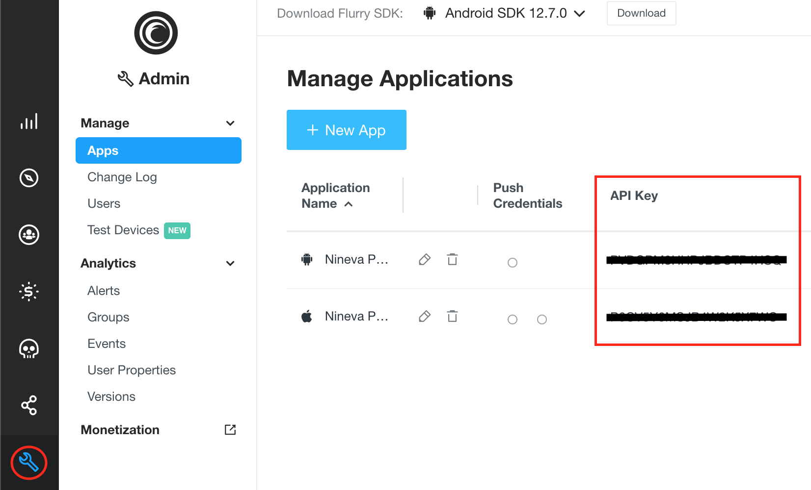
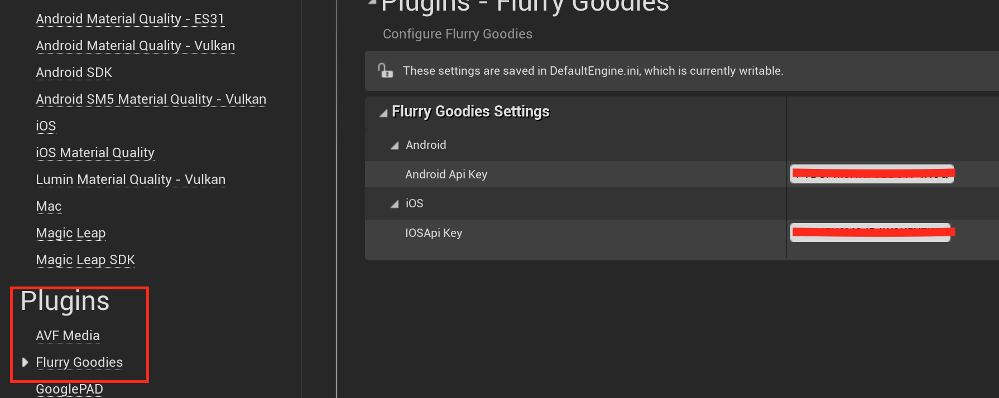
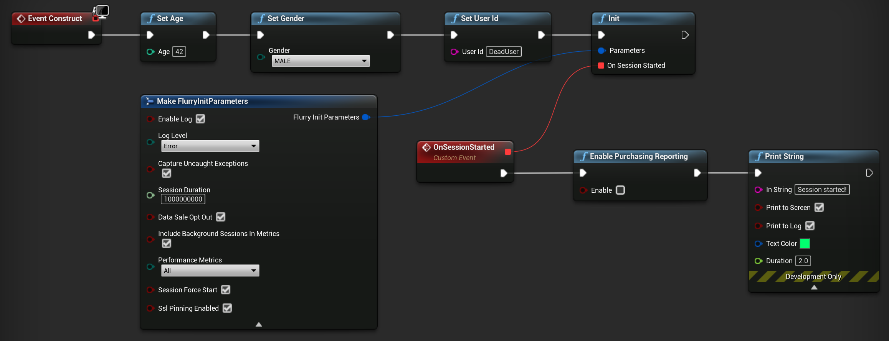
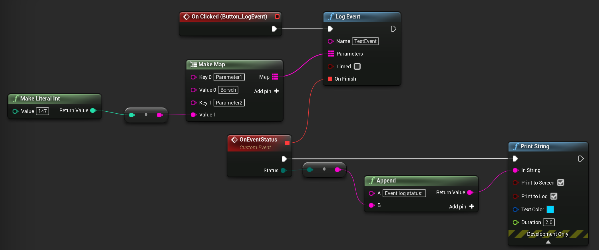
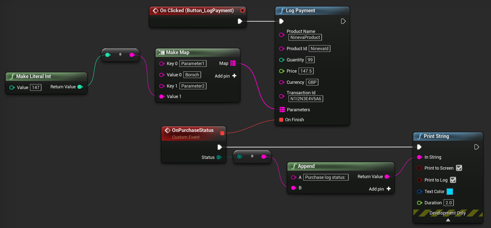
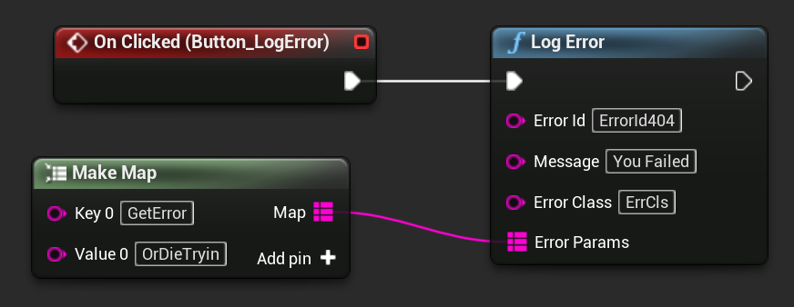

# **Flurry Goodies**

Welcome to Flurry Goodies Documentation for Unreal Engine

?> **Join our [Discord server](https://bit.ly/nineva_support_discord) and ask us anything!**

---

# **Setup**

Official documentation on how to create projects for Flurry can be found [here](https://developer.yahoo.com/flurry/docs/).

After you have created applications in the Flurry console, you have to copy the relevant API key(s) and set them in the Plugin Settings.

# **Initialization**

You have to initialize a Flurry session before using any Flurry functionality with the exception of three functions (`SetUserId`, `SetAge` and `SetGender`) that are recommended to be called before it.

# **Analytics**

## Events

You can log events to track user interaction with you application by calling the `LogEvent` function.

?> When you log a timed event, you can later call the `EndTimedEvent` function to record its duration.

## Payments

Call the `LogPayment` function to log the information about an in-app-purchase.

?> If you call the `EnablePurchasingReporting(true)` function on iOS, the purchases will be automatically reported, but you can not report them manually.

## Errors

Call the `LogError` function to record and send an error report to Flurry analytics.

!> This function generates a mini-dump, and freezes the application on iOS for a considerable time.

