[filename](common/common_ue_header.md ':include')

# **Game Center Goodies**

Welcome to Game Center Goodies Documentation for Unreal Engine

---

# **Setup**

Please follow the official Apple guidelines on how to setup an app in App Store Connect. Once everything is configured make sure that the App Connect bundle ID and your iOS game bundle ID are the same.

## Game Center Entitlement

?> If for some reason, the Game Center entitlement is not added to your XCode project automatically, try enabling the built-in Game Center support in UE (`Enable Game Center Support` checkbox in `Online` section of iOS settings in project settings).

To make sure that [game center entitlement](https://developer.apple.com/documentation/bundleresources/entitlements/com.apple.developer.game-center) is added to your XCode project open your XCode project in `[Path_to_UE_Project]/Intermediate/ProjectFilesIOS/[Project_Name].xcodeproj` and check the **Capabilities** tab of the project settings.

If for some reason, the Game Center entitlement is still not added to your XCode project, you can add the following lines to `DefaultGame.ini`:

```ini
[/Script/IOSRuntimeSettings.IOSRuntimeSettings]
bEnableGameCenterSupport=true
```

# **Auth**

## Login

To login simply call the `Login` node. If the player already has an active Game Center account on his devices a banner will popup welcoming them. If this is the first time the player uses Game Center a sign up view will be displayed. Once the `Login Success` event is raised it is safe to query data for the logged in local player.

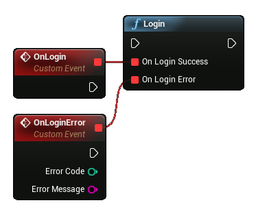

## Player details

Now that the player is logged in you can access the following information:

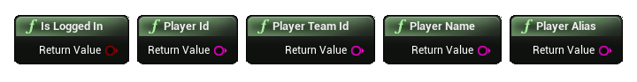

* Is Logged In - check if the local player is logged in
* ID - unique identifier for a player of the game.
* Team ID - unique identifier for a player of all the games that you distribute using your developer account.
* Name - string to display for the player.
* Alias - string chosen by the player to identify themselves to other players.

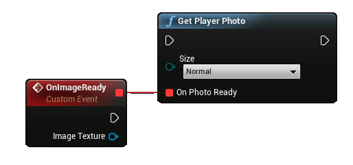

The `Get Player Photo` node will retrieve the photo asynchronously. You can display a default photo until the `On Photo Ready` event is raised.

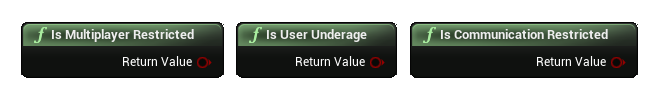

On iOS14 or newer you can check if the local account is restricted to use certain features:

* kultiplayer - If this property is true, the player can’t join multiplayer games.
* Communication - If this property is true or the local player is underage, the player can’t create personalized messages on invites or enable voice communication in multiplayer games.
* Underage - some Game Center features are not available if the user is underage.

# **Social**

## Achievements

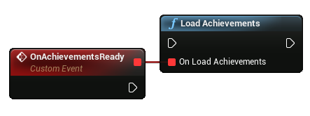

It is recommended to call this node during the `Login Success` event so that the current achievement progress is retrieved from Game Center. If this is not called the node `Get Achievement Progress` nay return invalid data.

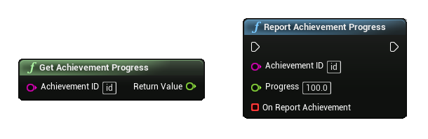

You can get and set the progress on an achievement by its ID. Progress is stored as a float value from 0 to 100.

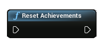

During testing you can reset achievement progress for the current player.

## Leaderboards

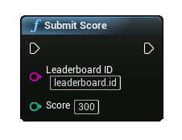

Once you've configured leaderboards on App Store connect you can easily submit a score using the `Submit Score` node.

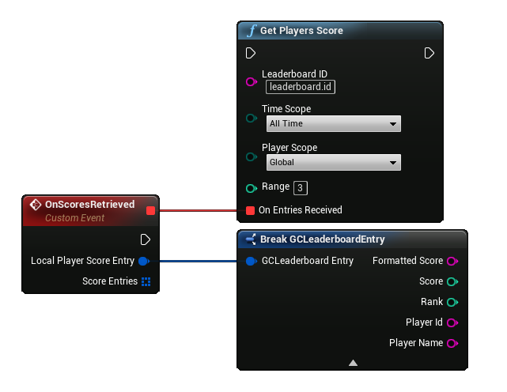

Use this node to get the score of the local player and an array of top scores.

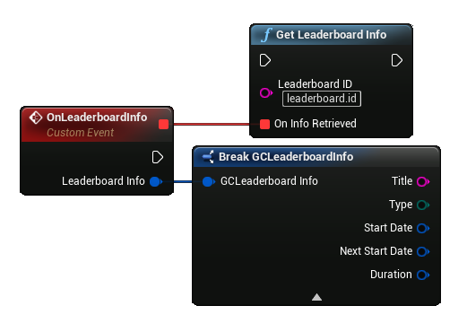

This node retrieves the information associated with the leaderboards. You can check the type to determine if the leaderboard is recurring and if yes - use the start date and duration to determine if it is active.

# **Game Center UI**

You can open the Game Center UI for the logged in player.

?> If these nodes are called when the player is not logged in an error message will be displayed.

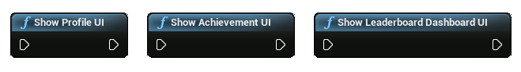

* Profile UI - displays the local profile page
* Achievements UI - displays the page containing all of your game's achievements
* Leaderboard Dashboard UI - displays page with all available leaderboards

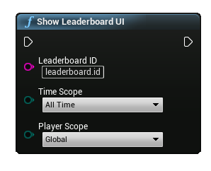

Use this node to open a specific leaderboard.

!> On iOS14 or newer you can set filters for the leaderboard but currently there is a bug in iOS that does not take these filters into account


# CHANGELOG

v1.1.5

+ FIXED Downloading avatar image on newer iOS versions
+ FIXED Some deprecation warnings

v1.1.4

+ ADDED Error callback for fetching leaderboard scores
+ Added `IsValid` check for leaderboard player score
