---
!> **Please read the [limitations](#limitations) before purchasing**

Join our [Discord server](https://discord.gg/SuJP9fY) and ask us anything!

---


The plugin allows you to embed **Native [GoogleMapsView](https://developers.google.com/android/reference/com/google/android/gms/maps/MapView)** into your Unreal Engine 4 game on Android. Note, this is **NOT** a Web View and **NOT** a Texture, its native interactive Google Map View.

# Limitations

**Please read the limitations carefully before purchasing**

* Minimum supported Android version is **API level 16 (Jelly Bean)**

* The view is **ALWAYS** shown on top of everything in your UE4 game. The view is implemented as an Android native dialog on top of UE4 `GameActivity`.

* The plugin does NOT work in Editor! It is a native Android/iOS view (not a web view), so performance is awesome but there is no way to get native Android/iOS view working in Unreal Editor or desktop.

* You have to handle device orientation changes.

* **You can't move the view (e.g scroll in Unreal view)**. The view for now is static and can't be moved around. Repositioning might be implemented in the future. Please submit an issue to this repo to request this.

# Setup (Plugin)

Follow these steps to use GoogleMapsView plugin in your project.

1. Copy folder with GoogleMapsView plugin to _Plugins_ folder in the root of your project.

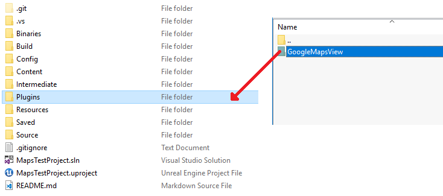

2. Go to Unreal _Editor Edit -> Plugins -> Code Plugins_ screen and make sure that GoogleMapsView is enabled.


Now you should be able to use plugin functionality in blueprints.

To use it in C++ add GoogleMapsView module dependency to your project `*.Build.cs` file:

```csharp
PublicDependencyModuleNames.AddRange(new string[] { "Core", ... , "GoogleMapsView" });
```

3. Follow setup steps for:
* [Android](#setupandroid)
* [iOS](#setupios)

# Setup(Android)

## Enable **Maps SDK for Android** API in Gooogle Console

Go to [Google Console dashboard](https://console.developers.google.com/apis/dashboard) and click on `ENABLE APIS AND SERVICES` button, then find **Maps SDK for Android** and make sure it is enabled.

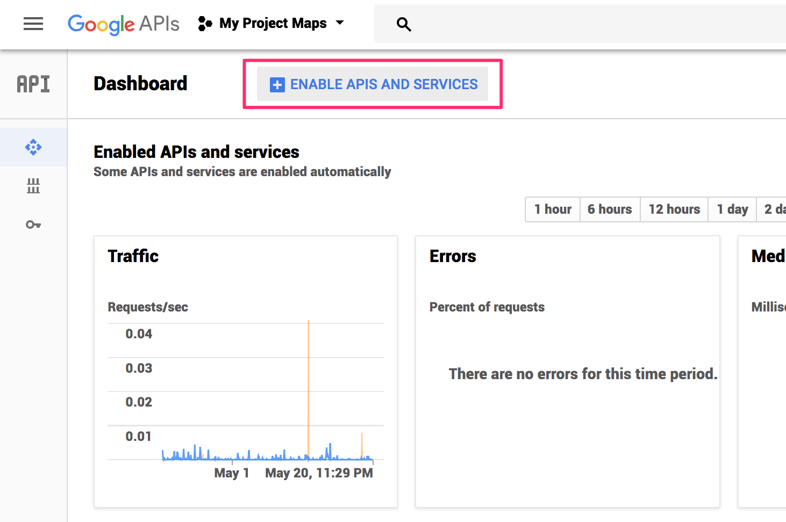
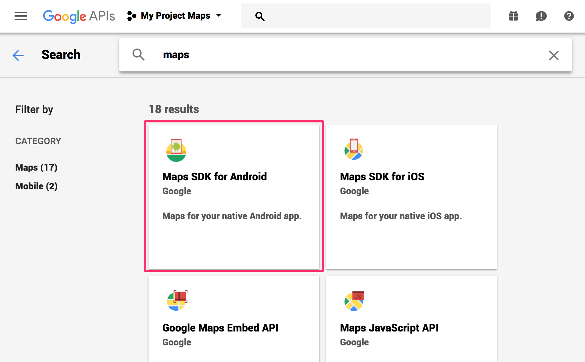
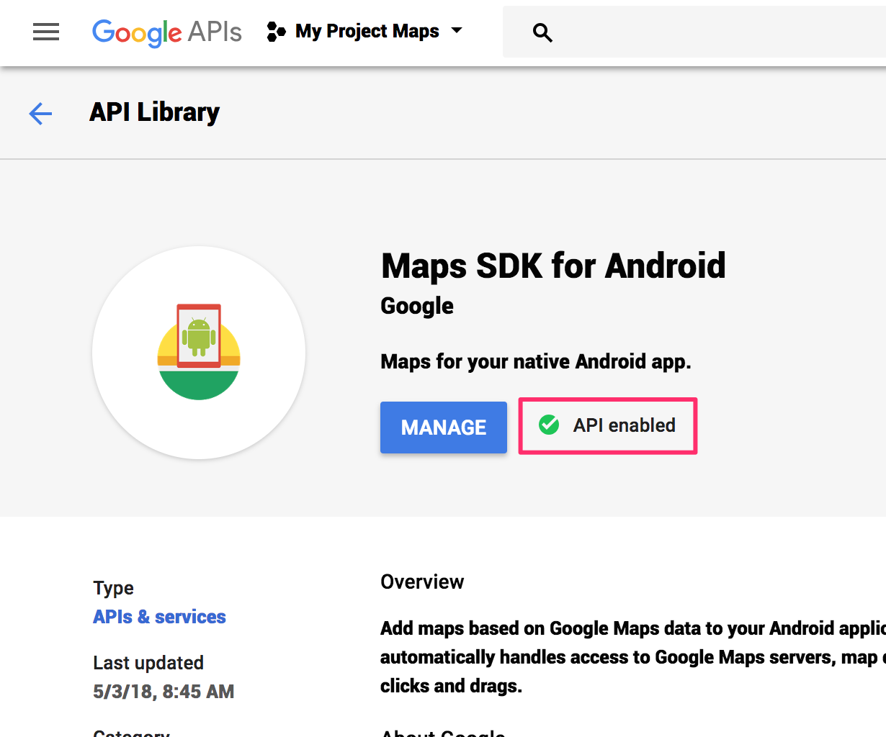

## Change the default Bundle id to your Bundle Id (package name)

Go to Unreal Editor Project Settings and set the Package Name, e.g. `com.ninevastudios.googlemapsview` and save it. **This is important as Google API Key in the next step is bound to the package you set.** In this document I will refer to your package as ```${YOUR_PACKAGE_NAME}```

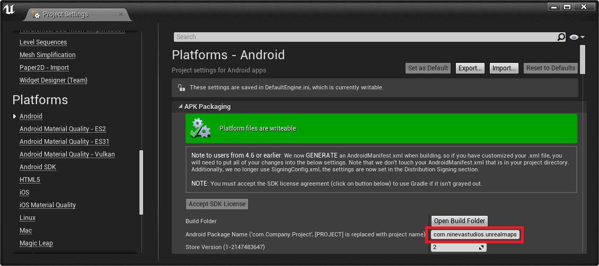

## Obtaining Google API Key

This part is a bit tricky so please follow instructions carefully.

* If you don't already have a [Google Console](https://console.developers.google.com) account create one and login.
* Go to [Android API documentation](https://developers.google.com/maps/documentation/android-sdk/get-api-key#get-the-api-key) and follow the instructions on how to get an API key.

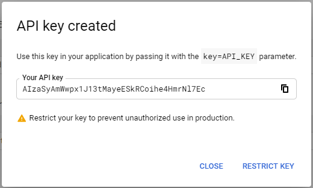

* Now copy your key and save it, you will need it later. After this click `Restrict key` button.

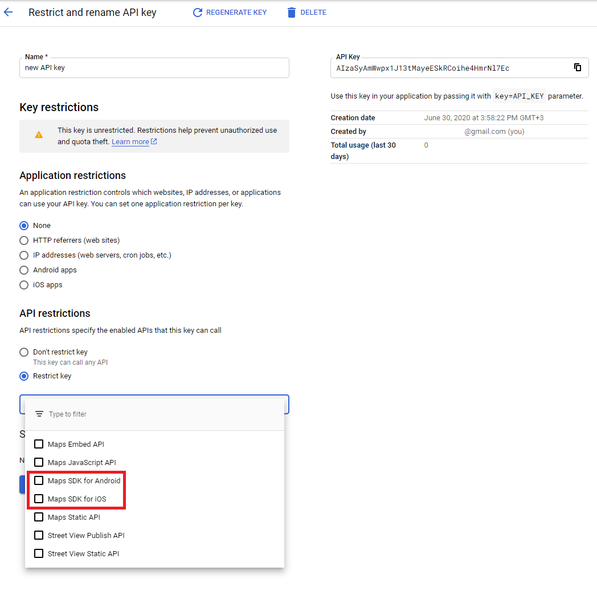

* What we need to do now and its very important that we restrict usage of this key to only our Android application (So other people can't use it if the obtain your key). In `Key restriction section` choose `Android apps` and click on `+ Add package name and fingerprint` button.

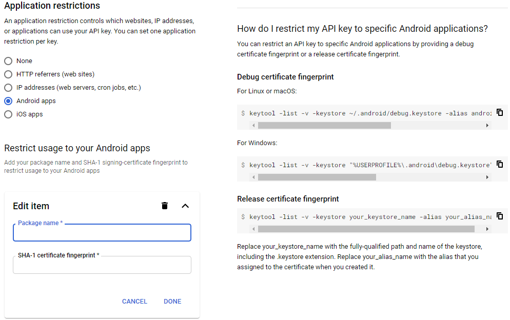

* The form that appears maps app package names to SHA-1 certificate fingerprints. Put **Package name** from your project that you set up in [Step 1](#change-the-default-bundle-id-to-your-bundle-id-package-name) into the package field.

### Obtaining **SHA-1 certificate fingerprint**

To obtain **SHA-1 certificate fingerprint** run this command in your terminal pointing to your keystore that application is signed with:

`keytool -list -v -keystore mystore.keystore`

For example in my case it is `keytool -list -v -keystore ~tarasleskiv/.android/debug.keystore` as I am using default debug keystore.

If you use your Windows machine its very similar, in my case I specified full path to keytool: `"C:\Program Files\Java\jdk1.8.0_91\bin\keytool" -list -v -keystore C:\Users\tarasleskiv\.android\debug.keystore`.

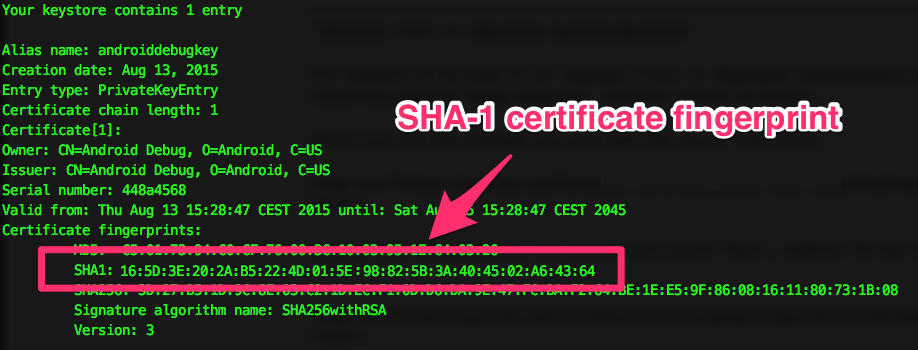

* Now copy your **SHA-1 certificate fingerprint** into the form in Google Console. After you filled in all the information click `Save`. 

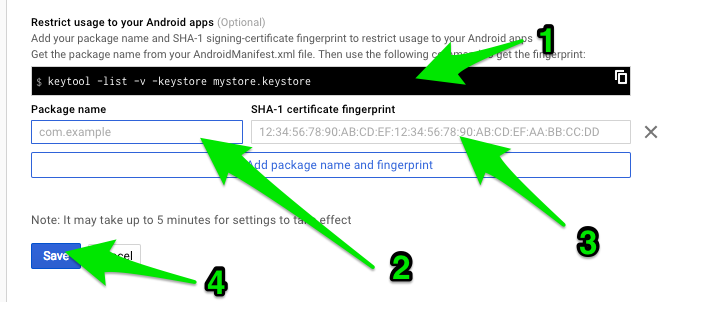

* Repeat adding package-**SHA-1 certificate fingerprint** pairs for all keystores that you sign the app with. For example I usually have two entries - one with my debug keystore to develop locally and another pair for Google Play publishing.

!> It may take up to 5 minutes for settings to take effect after you save them

### Adding Google Play **SHA-1 certificate fingerprint** if you use Google Play App Signing

If you are not using new [ Google Play App Signing](https://support.google.com/googleplay/android-developer/answer/7384423) mechanism please skip this part.

If you are using new Google Play App Signing mechanism you also have to create another entry that maps your package name to app signing certificate that Google generates for you. You can find your app signing certificate and **SHA-1 certificate fingerprint** under Release Management -> App Signing. This is the **SHA-1 certificate fingerprint** that you have to use.

You have to do this because with the new [Google Play App Signing](https://support.google.com/googleplay/android-developer/answer/7384423) Google re-signs your app with another certificate. If you forget this place picker functionality will not work when downloaded from Google Play.

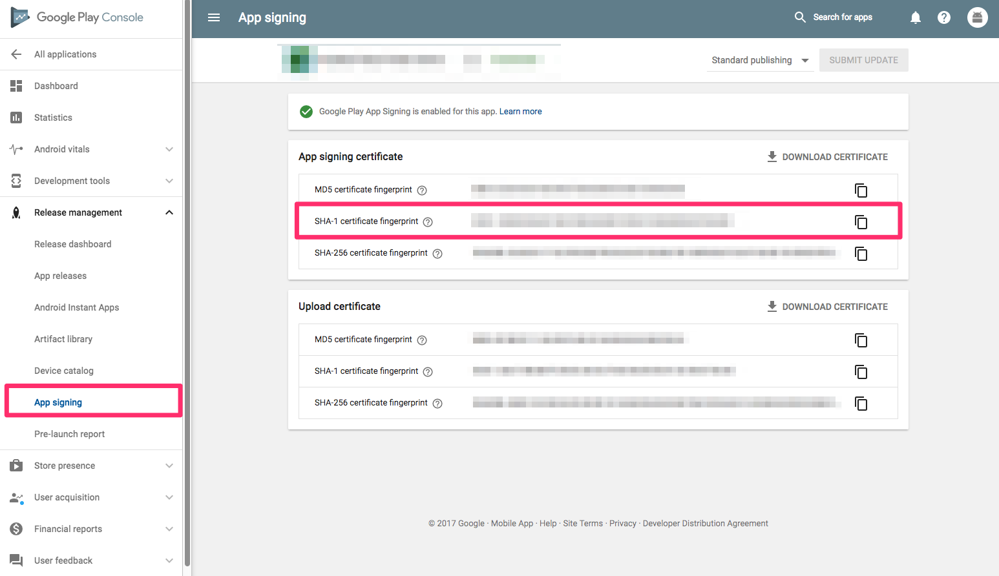

## Put the API key inside your `AndroidManifest.xml` by editing Unreal Project settings.

Once you have your key (it starts with "AIza"), in Unreal Editor go to _Edit -> Project Settings -> Android_ and put the following `meta-data` tag in _Advanced APK Packaging -> Extra Settings for <application> section (\n to separate lines)_ field (replace the `YOUR_API_KEY_HERE` value with the API key that you recently retrieved).

```xml
<meta-data android:name="com.google.android.geo.API_KEY" android:value="YOUR_API_KEY_HERE"/>
```

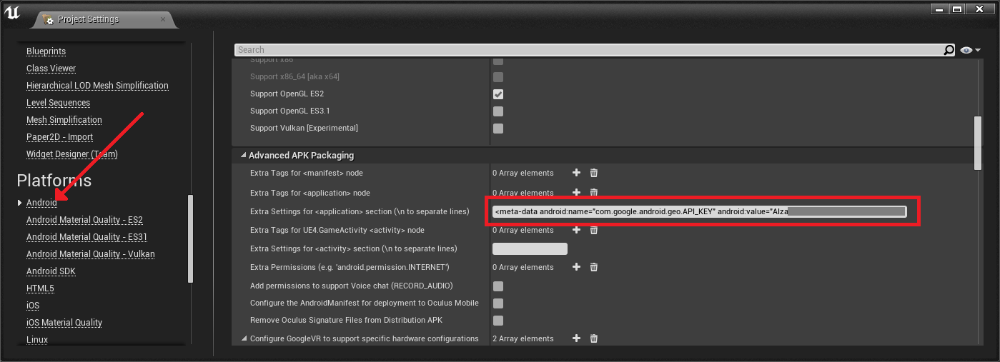

## Run the Demo Project

* Open demo level in _Content Browser -> Content -> Levels_
* Connect Android device and launch the level (Device must have Google Play Services installed)

After running the application on your device you will see the demo scene, now you can play around with the map.

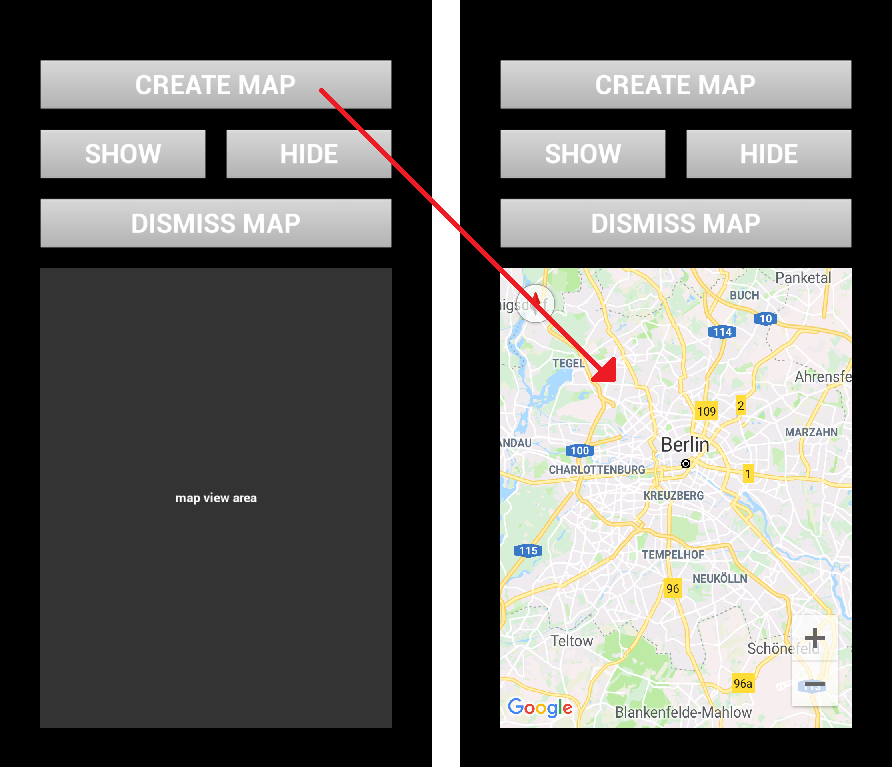


# Setup(iOS)

## What's different on iOS?

There are a few differences and things to note about iOS implementation:
* Most of the functionality is identical but there are some methods and properties that can be used only on Android. This means referring this functionality will have no effect on iOS.
* API key is provided by calling `UGoogleMapsViewBlueprintLibrary::SetAPIKey(apiKey)` function unlike providing it in the manifest file on Android.

## Make sure that Google Maps is enabled for iOS SDK

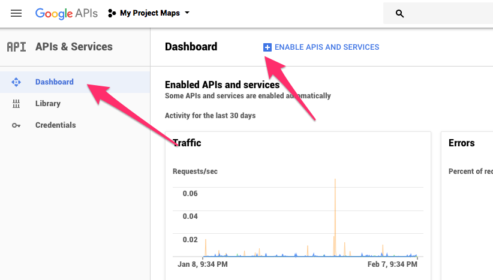
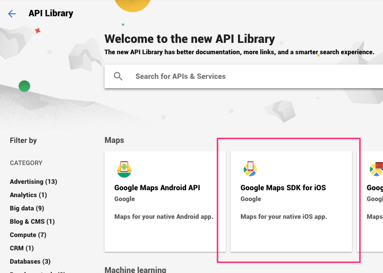
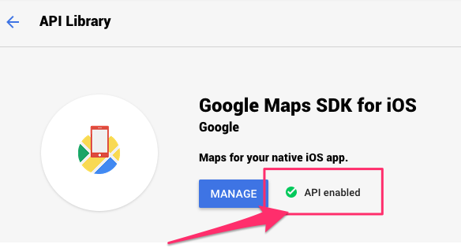

## Getting Google Maps API Key from Google Developer Console

Please [follow the same steps from Android setup](#setupandroid) but choose `iOS Apps` when you get to the **Credentials** screen. Here you can optionally restrict key usage to certain application packages.

## Setting API key in the app

Unlike Android where you have to provide the key in the `AndroidManifest.xml` file in iOS you have to call the method **BEFORE** any calls to the API.

Setting API key via blueprint:

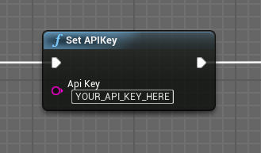

or in C++:

```cpp
UGoogleMapsViewBlueprintLibrary::SetAPIKey("YOUR_API_KEY_HERE");
```

***Note!*** When building for iPhone XS/XS Max, add these lines of code to the Engine/UE4/Source/UE4Game.Target.cs and Games/YourProjectName/Source/YourProjectName.Target.cs:

```csharp
if (Target.Platform == UnrealTargetPlatform.IOS)
{
     GlobalDefinitions.Add("FORCE_ANSI_ALLOCATOR=1");
}
```

Otherwise, you might experience app crashes when creating map view followed by error messages like "attemping to free pointer we didn't allocate".
More info about this issue can be found [here](https://www.artstation.com/alyamkin/blog/9VEQ/ue4-ios-and-pointer-being-freed-was-not-allocated).