[filename](common/common_ue_header.md ':include')

# **Google Play Goodies**

Welcome to Google Play Goodies Documentation for Unreal Engine

---

# **Setup**

!> It is recommended to follow the official [Google Documentation for Setting Up Google Play Games Services](https://developers.google.com/games/services/console/enabling#android) instead of this guide. You can also follow the guide below but please refer to the official docs if something is not clear regarding the project setup.

!> If you encounter issues please check the [list of the most common problems](https://developers.google.com/games/services/console/enabling#avoiding_common_setup_problems) and double-check everything

## Google Play Console

### Create an app in Google Play Console

First of all create a new app on Google Play Console or you can use the existing one.

### Create a game in Google Play Console

After this you need to create a new game. A game is like a project for using Google Play Games services. To do this go to your [Google Play Console](https://play.google.com/apps/publish), click *ADD NEW GAME* (You might need to switch to old console to do this).

?> Note that Google is rolling out new console design so your UI may be somewhat different.

You can either create and new project or link to existing one if you already have a Firebase project or have previously created a project on Google Developers Console.

### Add your game to your app

In the list of games select your newly created game and add it to the app you need. To do this go to the **Manage game projects** tab in [Google Play Console](https://play.google.com/apps/publish) and click on your game project. Afterwards select the app to add it.

In the process it will ask whether your game already uses Google APIs. For example, if your game already uses firebase you can link it to the already existing project. If so, choose to use the existing Play Game Services project and choose the project. Otherwise choose the option to create a new project.

When finished, you can open your app and you will see the section called **Play Games Services**. Now we need to continue the setup under the **Configuration** section.

Now go through all the warnings on the configuration page and resolve them if any appear.

Also check the properties screen by clicking **Edit properties** on the **Configuration** page and resolve issues there.

### Add Android Credentials

?> When setting up the project that is linked to an existing Firebase project you should be able to select the Android OAuth client that was created by the Firebase project. (Assuming you added your Android app to your Firebase project settings). After selecting the project check the details carefully if everything matches (app package, fingerprint SHA)

To use Google Play Games services in your Android app you must create Android Credentials in the **Configuration** tab.

Click on **Add credential** button

Choose **Android** option and scroll down to **Authorization** section. Here you can select the existing OAuth client or create a new one required for your Android app.

Follow the link and create the Android OAuth client in the Google Cloud Platform. When setting up the keystore fingerprint refer to [this page](https://developers.google.com/games/services/console/enabling#c_specify_client_id_settings)

When done it should display your settings.

## UE Project Settings

Unreal Engine already has built-in support for some Google Play Games features but they are limited and rely on old library versions. Because of this, some settings are in the platform settings section instead of the plugin settings.
The main field to configure is the *Game App ID*. Navigate to `Project Settings -> Platforms -> Android -> Google Play Services` section and input your *Game App ID* in the respective field.

Now you can build your game and test the demo level provided with the plugin. **Note that the Android package name in your UE project must match the package name from your Android OAuth Credential and that the build must be signed with the same keystore that you took SHA1 from to put into Android OAuth Client setup**

?> If *Enable Google Play Support* is checked then Unreal Engine will pull in its own Google Play Games Services dependencies. This might lead to undefined behavior if these dependencies  collide with our own. We cannot test every scenario so if you encounter any problems contact us on our Discord server.

## Integration with Firebase Goodies Auth

When logging in with Google Play Games you can also request an access token that can be used to authenticate the user in our [Firebase Goodies](ue-plugins/firebase-unreal) plugin. This section describes how to setup the integration.

### Linking Firebase project

?> Please check the [official guide](https://firebase.google.com/docs/auth/android/play-games) how to integrate Google Play Games Login with Firebase Auth to get a better idea how it works.

First of all you need to link your Google Play Games project with the Firebase project. The easiest way to do it is to select existing Firebase project when creating the Game.

### Setting Android Credential

After this, when you create the Android App in Firebase project settings you would be able to select it as OAuth client in you play games project.

### Obtaining and filling WEB Client ID and Client secret

To receive an access token as the part of account details you must fill in a **Web Client ID** in the plugin's settings. To do so go to your project in Google Cloud Console and find the credential with name `Web client (auto created by Google Service)`

!> Make sure you find the correct OAuth Client ID of the type WEB, not the Android one that you have created previously

Copy your **Client ID** and **Client secret** values

Paste your client id into the plugin settings in UE

!> Note that there can be issues if you use Google Login and Google Play Games login at the same time. You should disable Google login if you use Google Play Games login or vice versa.

Open the **Authentication** section of your Firebase project, in the **Sign-in method** tab Choose **Play Games**, enable it and paste your **Client ID** and **Client secret** values.

### How to use the token

After [logging in](#login) your account should contain a token that you can use to [login with a credential in Firebase Goodies](ue-plugins/firebase-unreal?id=user-registration-and-login) or link a Google Play Games account.

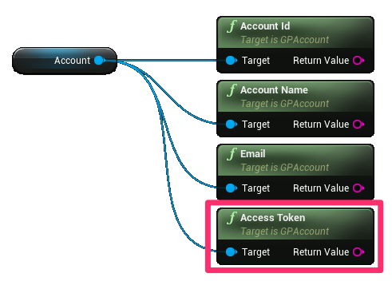

# **Auth**

## Login

The authentication flow contains 4 nodes:

* Login - use this node to show a login UI to your users. After a successful login, an event will be raised where you will have access to the logged-in user's [Account](#account-details) (requires permissions flags) and [Player](#player-details) info. By enabling silent login the UI will not be shown after the first successful login and the last user will be logged in automatically.
* Logout - this will logout the current user.
* Is Logged In - checks if a user is logged in.
* Revoke Access - if you requested additional permissions (e. g. email) during login and they were granted you can revoke them using this node.

## Account details

Account data requires additional permissions during login. If these permissions were not requested or granted the data here will be empty strings.

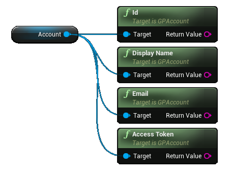

* Id - account unique ID (requires ID permission)
* Name - account display name (requires Profile permissions)
* Email - account email (requires email permission)
* Access Token - token used to authenticate with other services (requires ID Token permission)

## Player details

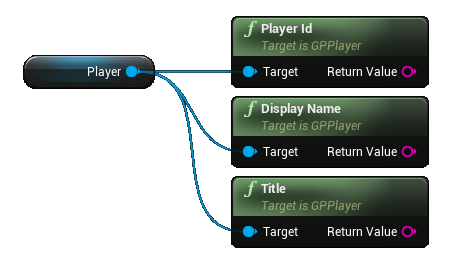

* Id - player unique ID
* Name - player display name
* Title - player title

You can grab the player icon and/or banner image using the following nodes. This is an asynchronous operation so the texture can only be used when the respective callback event is invoked.

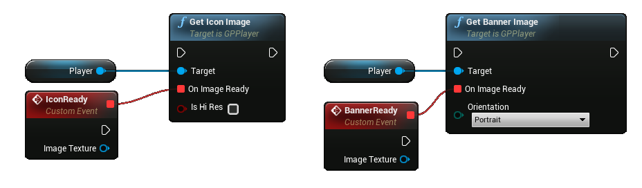

## Player stats

You can retrieve some statistics for the logged in user and act upon them.

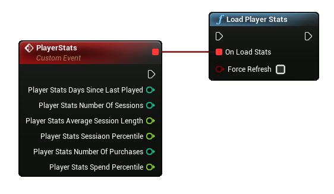

* Days since last played: The approximate number of days since the player last played.
* Average session length: The average session length of the player in minutes. Session length is determined by the time that a player is signed in to Google Play Games services.
* Number of purchases: The approximate number of in-app purchases for the player.
* Number of sessions: The approximate number of sessions of the player. Sessions are determined by the number of times that a player signs in to Google Play Games services.
* Session percentile: The approximation of sessions percentile for the player, given as a decimal value between 0 to 1 inclusive. This value indicates how many sessions the current player has played in comparison to the rest of this game's player base. Higher numbers indicate that this player has played more sessions.
* Spend percentile: The approximate spend percentile of the player, given as a decimal value between 0 to 1 inclusive. This value indicates how much the current player has spent in comparison to the rest of this game's player base. Higher numbers indicate that this player has spent more.

# **Social**

## Achievements

Read about how to configure and use *Achievements* [here](https://developers.google.com/games/services/common/concepts/achievements).

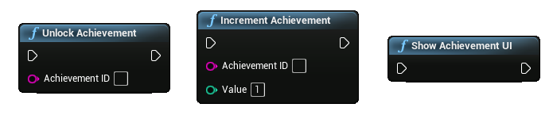

To unlock an achievement for the user use the `Unlock Achievement` node. If an achievement is incremental you can increase its value with `Increment Achievement`. Once an incremental achievement gets to the specified goal it will unlock automatically,

To show an external UI with all of the achievements use the `Show Achievement UI` node.

## Leaderboards

Read about how to configure and use *Leaderboards* [here](https://developers.google.com/games/services/common/concepts/leaderboards).

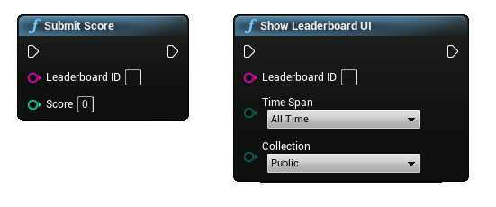

To post a score invoke the `Submit Score` node. If the submitted score is less than it was it will be discarded. To show a leaderboard use the `Show Leaderboard UI` node. You can specify the default leaderboard time span (daily, weekly, or all-time) and the collection scope (public or friends only). These filters can be changed in the eternal UI.

### Load player scores

You can load the player centered scores and other info using the `Load Player Centered Scores` node. (See the demo level for more details)

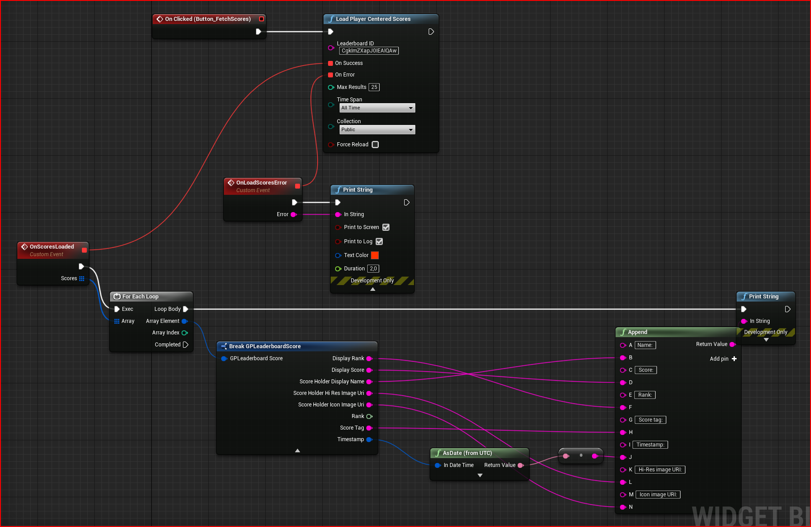

## Events

Read about how to configure and use *Events* [here](https://developers.google.com/games/services/common/concepts/events).

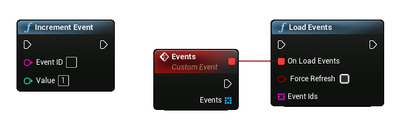

`Increment Event` will increment an event by the specified value. The `Load Events` node allows you to retrieve all available events for your project. You can specify an array of Event Ids so that only they are loaded. Once you load the events you can access this data on them:

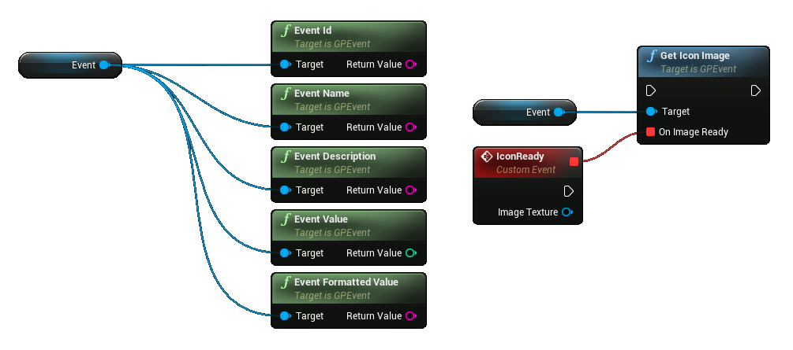

---

### Changelog

v.1.1.0

* ADDED A function to fetch player and players close to him leadebord information

v.1.0.0

* Initial release

# **Friends**

## Load Friends

This method allows you to get the list of your friends.

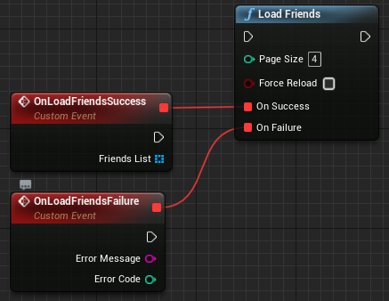

* Page size must be bigger than 1 (PageSize >= 1);
* Force Reload must be false by default;

### OnLoadFriendsSuccess

If loading friends is successful, you get you get list of your friends.

### OnLoadFriendsFailure

If loading friends failed, you get Error Message and Error Code.

## View Another Player Profile

It shows you profile of your friend.

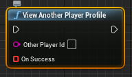

* Other Player Id - your friend's profile Id

## View Another Player Profile With Alternative Hints

If the player sends an invitation to the profile they are viewing, their game-specific name can be included.

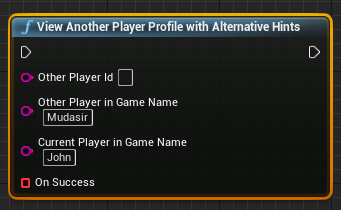
 
