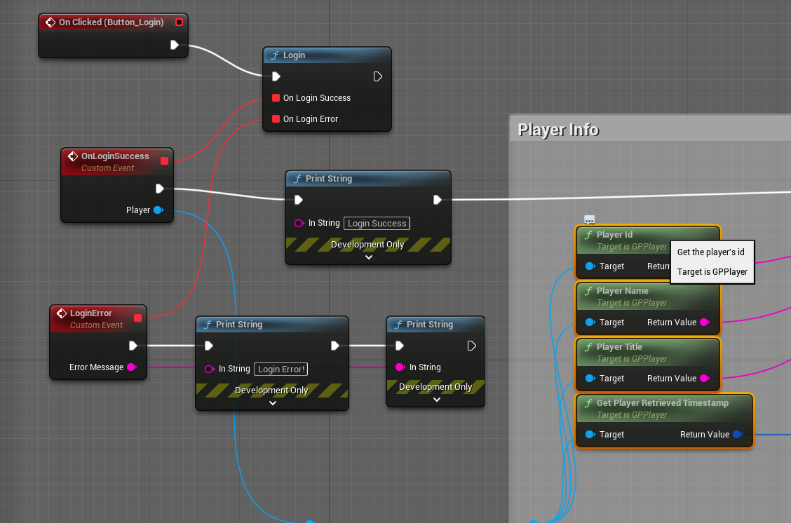

# **Google Play Goodies**

Welcome to Google Play Goodies Documentation for Unreal Engine

?> **Join our [Discord server](https://bit.ly/nineva_support_discord) and ask us anything!**

---

# **Setup**

## Google Play Console

TODO

## UE Project Settings

Unreal Engine already has built-in support for some Google Play Games features but they are limited and rely on old library versions. Because of this, some settings are in the platform settings section instead of the plugin settings.
The main field to configure is the *Game App ID*. Navigate to Project Settings -> Platforms -> Android -> Google Play Services section and input your *Game App ID* in the respective field.

?> If *Enable Google Play Support* is checked then Unreal Engine will pull in its own Google Play Games Services dependencies. This might lead to undefined behavior if these dependencies  collide with our own. We cannot test every scenario so if you encounter any problems contact us on our Discord server.

## Integration with Firebase Goodies Auth

When logging in with Google Play Games you can also request an access token that can be used to authenticate the user in our Firebase Goodies plugin.

To receive an access token as the part of account details you must fill in a **Web Client ID** in the plugin's settings. TODO - explain where to get it.

# **Auth**

## Login

The authentication flow contains 4 nodes:

* Login - use this node to show a login UI to your users. After a successful login, an event will be raised where you will have access to the logged-in user's [Account](#account-details) (requires permissions flags) and [Player](#player-details) info. By enabling silent login the UI will not be shown after the first successful login and the last user will be logged in automatically.
* Logout - this will logout the current user.
* Is Logged In - checks if a user is logged in.
* Revoke Access - if you requested additional permissions (e. g. email) during login and they were granted you can revoke them using this node.

## Account details

Account data requires additional permissions during login. If these permissions were not requested or granted the data here will be empty strings.

* Id - account unique ID (requires ID permission)
* Name - account display name (requires Profile permissions)
* Email - account email (requires email permission)
* Access Token - token used to authenticate with other services (requires ID Token permission)

## Player details

* Id - player unique ID
* Name - player display name
* Title - player title

You can grab the player icon and/or banner image using the following nodes. This is an asynchronous operation so the texture can only be used when the respective callback event is invoked.

## Player stats

You can retrieve some statistics for the logged in user and act upon them.

* Days since last played: The approximate number of days since the player last played.
* Average session length: The average session length of the player in minutes. Session length is determined by the time that a player is signed in to Google Play Games services.
* Number of purchases: The approximate number of in-app purchases for the player.
* Number of sessions: The approximate number of sessions of the player. Sessions are determined by the number of times that a player signs in to Google Play Games services.
* Session percentile: The approximation of sessions percentile for the player, given as a decimal value between 0 to 1 inclusive. This value indicates how many sessions the current player has played in comparison to the rest of this game's player base. Higher numbers indicate that this player has played more sessions.
* Spend percentile: The approximate spend percentile of the player, given as a decimal value between 0 to 1 inclusive. This value indicates how much the current player has spent in comparison to the rest of this game's player base. Higher numbers indicate that this player has spent more.

# **Social**

## Achievements

Read about how to configure and use *Achievements* [here](https://developers.google.com/games/services/common/concepts/achievements).

To unlock an achievement for the user use the `Unlock Achievement` node. If an achievement is incremental you can increase its value with `Increment Achievement`. Once an incremental achievement gets to the specified goal it will unlock automatically,

To show an external UI with all of the achievements use the `Show Achievement UI` node.

## Leaderboards

Read about how to configure and use *Achievements* [here](https://developers.google.com/games/services/common/concepts/leaderboards).

To post a score invoke the `Submit Score` node. If the submitted score is less than it was it will be discarded. To show a leaderboard use the `Show Leaderboard UI` node. You can specify the default leaderboard time span (daily, weekly, or all-time) and the collection scope (public or friends only). These filters can be changed in the eternal UI.

## Events

Read about how to configure and use *Events* [here](https://developers.google.com/games/services/common/concepts/events).

`Increment Event` will increment an event by the specified value. The `Load Events` node allows you to retrieve all available events for your project. You can specify an array of Event Ids so that only they are loaded. Once you load the events you can access this data on them:

