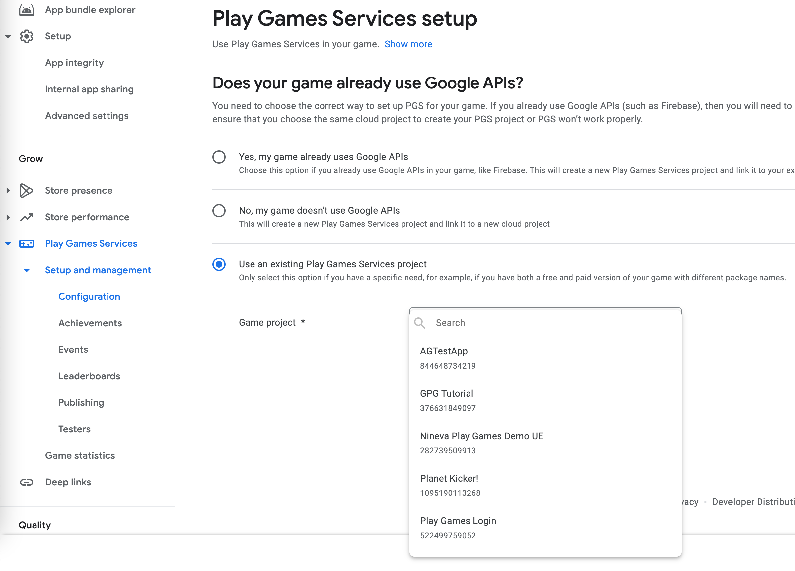
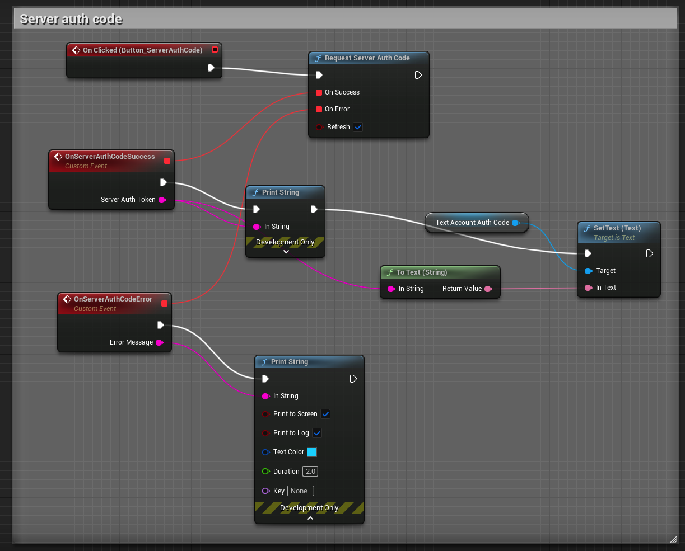

[filename](common/common_ue_header.md ":include")

# **Google Play Goodies**

Welcome to Google Play Goodies Documentation for Unreal Engine

!> WARNING This plugin is INCOMPATIBLE with Google Play Subsystem of UE (UE uses very old versions of dependencies), for this plugin to work, it must be disabled. We will not approve refunds on the grounds that it breaks the built-in Google Play login (The plugin has it's own login implementation).

---

# **Setup**

!> It is recommended to follow the official [Google Documentation for Setting Up Google Play Games Services](https://developer.android.com/games/pgs/console/setup) instead of this guide. You can also follow the guide below but there is little sense in duplicating everything Google explains here, so please refer to the official docs if something is not clear regarding the project setup.

!> If you encounter issues please check the [list of the most common problems](https://developers.google.com/games/services/console/enabling#avoiding_common_setup_problems) and double-check everything

[filename](common/afs_fix.md ":include")

First of all, if the project fails to build in UE5 - try disabling `Android File Server` built-in plugin.

## Google Play Console

### Create an app in Google Play Console

First of all create a new app on Google Play Console or you can use the existing one.

### Add Play Games Services Project to your game

After this you need to add play services to your game. To do this go to your [Google Play Console](https://play.google.com/apps/publish), choose your game that you wold like to add the functionality to and go to `Play Game Services -> Setup and management -> Configuration`. If you don't have an existing Play Games Services project, create one by choosing `No, my game doesn’t use Google APIs` option and choose a GPS project name. This will create a new Play Games Services project and link it to a new cloud project

?> Note that Google is rolling out new console design from time to time so your UI may be somewhat different.

You can either create and new project or link to existing one if you already have a Firebase project or have previously created a project on Google Developers Console.

When finished, you can open your app and you will see the section called **Play Games Services**. Now we need to continue the setup under the **Configuration** section.

Now go through all the warnings on the configuration page and resolve them if any appear.

Also check the properties screen by clicking **Edit properties** on the **Configuration** page and resolve issues there.

### Generate an OAuth 2.0 client ID

!> For this part please follow the official guide here: [Generate an OAuth 2.0 client ID setup guide](https://developer.android.com/games/pgs/console/setup#generate_an_oauth_20_client_id)

Follow the instructions on this screen and after done, click `Confirm configuration`

### Add Android Credentials

!> For this part please follow the official guide here: [Create a credential](https://developer.android.com/games/pgs/console/setup#create_a_credential)

?> When setting up the project that is linked to an existing Firebase project you should be able to select the Android OAuth client that was created by the Firebase project. (Assuming you added your Android app to your Firebase project settings). After selecting the project check the details carefully if everything matches (app package, fingerprint SHA)

To use Google Play Games services in your Android app you must create Android Credentials in the **Configuration** tab.

Click on **Add credential** button

Choose **Android** option and scroll down to **Authorization** section. Here you can select the existing OAuth client or create a new one required for your Android app.

Follow the link and create the Android OAuth client in the Google Cloud Platform. When setting up the keystore fingerprint refer to [this page](https://developers.google.com/games/services/console/enabling#c_specify_client_id_settings)

When done it should display your settings.

## Enable testing

!> For this part please just follow the official guide here: [Enable testing](https://developer.android.com/games/pgs/console/setup#test)

## Avoiding common issues

If yor login fails when you test, most likely it is a setup mistake, [this sections explains how to troubleshoot common issues](https://developer.android.com/games/pgs/console/setup#avoid_common_issues). Please check it out carefully if something goes wrong.

## UE Project Settings

Unreal Engine already has built-in support for some Google Play Games features but they are limited and rely on old library versions. Because of this, some settings are in the platform settings section instead of the plugin settings.
The main field to configure is the _Game App ID_. Navigate to `Project Settings -> Platforms -> Android -> Google Play Services` section and input your _Game App ID_ in the respective field.

?> When you build the game, make sure that the file `Build/Android/res/values/GooglePlayAppID.xml` exists containing your app_id string. Sometimes UE does not generate it when moving the project to another machine, in this case copy-paste the project ID again in project settings to trigger its generation or copy this file from previous project.

Now you can build your game and test the demo level provided with the plugin. **Note that the Android package name in your UE project must match the package name from your Android OAuth Credential and that the build must be signed with the same keystore that you took SHA1 from to put into Android OAuth Client setup**

?> If _Enable Google Play Support_ is checked then Unreal Engine will pull in its own Google Play Games Services dependencies. This might lead to undefined behavior if these dependencies collide with our own. We cannot test every scenario so if you encounter any problems contact us on our Discord server.

## Integration with Firebase Goodies Auth

When logging in with Google Play Games you can also request an access token that can be used to authenticate the user in our [Firebase Goodies](ue-plugins/firebase-unreal) plugin. This section describes how to setup the integration.

### Linking Firebase project

?> Please check the [official guide](https://firebase.google.com/docs/auth/android/play-games) how to integrate Google Play Games Login with Firebase Auth to get a better idea how it works.

First of all you need to link your Google Play Games project with the Firebase project. The easiest way to do it is to select existing Firebase project when creating the Game.

### Setting Android Credential

After this, when you create the Android App in Firebase project settings you would be able to select it as OAuth client in you play games project.

### Obtaining and filling WEB Client ID and Client secret

To receive an access token as the part of account details you must fill in a **Web Client ID** in the plugin's settings. To do so go to your project in Google Cloud Console and find the credential with name `Web client (auto created by Google Service)`

!> Make sure you find the correct OAuth Client ID of the type WEB, not the Android one that you have created previously

Copy your **Client ID** and **Client secret** values

Paste your client id into the plugin settings in UE

!> Note that there can be issues if you use Google Login and Google Play Games login at the same time. You should disable Google login if you use Google Play Games login or vice versa.

Open the **Authentication** section of your Firebase project, in the **Sign-in method** tab Choose **Play Games**, enable it and paste your **Client ID** and **Client secret** values.

### How to use the server auth code

After [logging in](#login) your account use `Request Server Auth Code` node to get the server auth code that you use to login with a credential in Firebase Goodies or link a Google Play Games account.

# **Auth**

With the new Google Play Services version it now logins automatically on the app launch, also there are no login permission flags available any more. Also **you can't log out any more**.

## Login

Even though it will now automatically log you in when the app starts, you can use login node to get the player details and confirm that login was actually successful:

## Sever Auth Code

Now getting server auth code is a separate node:

## Player details

- Id - player unique ID
- Name - player display name
- Title - player title
- Retrieved Timestamp - when the player was retrieved

You can grab the player icon and/or banner image using the following nodes. This is an asynchronous operation so the texture can only be used when the respective callback event is invoked.

## Player stats

You can retrieve some statistics for the logged in user and act upon them.

- Days since last played: The approximate number of days since the player last played.
- Average session length: The average session length of the player in minutes. Session length is determined by the time that a player is signed in to Google Play Games services.
- Number of purchases: The approximate number of in-app purchases for the player.
- Number of sessions: The approximate number of sessions of the player. Sessions are determined by the number of times that a player signs in to Google Play Games services.
- Session percentile: The approximation of sessions percentile for the player, given as a decimal value between 0 to 1 inclusive. This value indicates how many sessions the current player has played in comparison to the rest of this game's player base. Higher numbers indicate that this player has played more sessions.
- Spend percentile: The approximate spend percentile of the player, given as a decimal value between 0 to 1 inclusive. This value indicates how much the current player has spent in comparison to the rest of this game's player base. Higher numbers indicate that this player has spent more.

# **Social**

## Achievements

Read about how to configure and use _Achievements_ [here](https://developers.google.com/games/services/common/concepts/achievements).

To unlock an achievement for the user use the `Unlock Achievement` node. If an achievement is incremental you can increase its value with `Increment Achievement`. Once an incremental achievement gets to the specified goal it will unlock automatically,

To show an external UI with all of the achievements use the `Show Achievement UI` node.

## Leaderboards

Read about how to configure and use _Leaderboards_ [here](https://developers.google.com/games/services/common/concepts/leaderboards).

To post a score invoke the `Submit Score` node. If the submitted score is less than it was it will be discarded. To show a leaderboard use the `Show Leaderboard UI` node. You can specify the default leaderboard time span (daily, weekly, or all-time) and the collection scope (public or friends only). These filters can be changed in the eternal UI.

### Load player scores

You can load the player centered scores and other info using the `Load Player Centered Scores` node. (See the demo level for more details)

## Events

Read about how to configure and use _Events_ [here](https://developers.google.com/games/services/common/concepts/events).

`Increment Event` will increment an event by the specified value. The `Load Events` node allows you to retrieve all available events for your project. You can specify an array of Event Ids so that only they are loaded. Once you load the events you can access this data on them:

---

# **Friends**

For more information on friends API see the [official docs](https://developers.google.com/games/services/common/concepts/friends).

## Load Friends

This method allows you to get the list of your friends.

- Page size must be bigger than 1 (PageSize >= 1);

### OnLoadFriendsSuccess

If loading friends is successful, you will get list of your friends.

### OnLoadFriendsFailure

If loading friends failed, you will get Error Message and Error Code.

## View Another Player Profile

It shows you profile of your friend.

- Other Player Id - your friend's profile Id;

## View Another Player Profile With Alternative Hints

If the player sends an invitation to the profile they are viewing, their game-specific name can be included.

---

# **Cloud Saves**

For more detailed information on Saved Games API see the [official docs](https://developers.google.com/games/services/android/savedgames) and explore the demo level inside the plugin `Content` folder.

The term 'snapshot' here is used to represent the saved game.

## Showing save games UI

This method will show a Google Play Save Games native UI screen.

When showing the save games UI you can receive the following callbacks:

- **On Add New Snapshot** - user pressed the "Add" button, you can implement the flow to create a new save after this
- **On View Snapshot Metadata** - user selected an existing snapshot, the metadata of the selected snapshot is passed as a parameter, you can use it to open the selected snapshot.
- **On Error** - an error happened, message is passed as a parameter
- **On Cancel** - user just closed the screen with a close button

## Opening a Snapshot

Before reading or writing a snapshot you first must open it.

### Opening a snapshot with Metadata

### Opening a snapshot by filename

## Fetching all save games

## Writing saves

## Reading saves

## Resolving conflicts

Read more about conflicts [here](https://developers.google.com/games/services/android/savedgames#handling_saved_game_conflicts). We recommend to pick one of the automatic conflict resolution policies when using the 'Open Snapshot' methods. If you choose the the 'Manual' conflict resolution policy you would have to handle the conflict resolution yourself.

!> Note that resolving a conflict might result into yet another conflict. You can try resolving it a few times or try a few times recursively.

Currently the plugin does not support the method to merge two snapshots into one. You must pick to go with either local or remote version of the snapshot.

# **Video recording API**

For more detailed information on Video recording API see the [official docs](https://developers.google.com/games/services/android/videoRecording) and explore the demo level inside the plugin `Content` folder.

Video recording API allows you to launch recording of the game play video while your game is running.

## Starting the recording

Before starting the recording you should check whether the recording is supported on the correct device and if yes, present the video recording overlay.

## Check if capture supported

## Show video recording overlay

## Getting the information

To fetch the information about what functionality is supported on device, use `Get Capture Capabilities` node.

## Listening to recording state changes

You can register an event to listen for the recording state changes

## Unregister from recording state changes

You can also unregister from recording state changes event

---

# **=== CHANGELOG ===**

v2.2.3

!> BREAKING CHANGES!

- UPDATED to newest Google Play Services SDK v2
- Reworked auth, see the docs above

v2.1.2

- ADDED load top leaderboard scores function

v2.1.1

- FIXED 'exported' tag on activities for Android 12

v2.0.0

- Added functionality to fetch friends and view other player profile

v.1.1.0

- ADDED A function to fetch player and players close to him leadebord information

v.1.0.0

- Initial release
