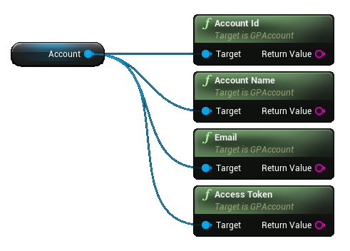
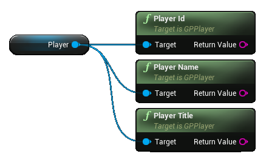

# **Google Play Goodies**

Welcome to Google Play Goodies Documentation for Unreal Engine

?> **Join our [Discord server](https://bit.ly/nineva_support_discord) and ask us anything!**

---

# **Setup**

## Google Play Console

TODO

## UE Project Settings

Unreal Engine already has built-in support for some Google Play Games features but they are limited and rely on old library versions. Because of this, some settings are in the platform settings section instead of the plugin settings.
The main field to configure is the *Game App ID*. Navigate to Project Settings -> Platforms -> Android -> Google Play Services section and input your *Game App ID* in the respective field.

?> **DO NOT** check the *Enable Google Play Support* checkbox. This will instruct Unreal Engine to use dependencies that will collide with our plugin and may lead to undefined behavior.

If you need an access token from the login operation (e. g. required for integration with Firebase Auth) you will need to setup a Client ID in the plugin's settings.

# **Auth**

## Login

The authentication flow contains 4 nodes:

* Login - use this node to show a login UI to your users. After a successful login an event will be raised where you will have access to the logged in user's [Account](#account-details) (requires permissions flags) and [Player](#player-details) info.
* Logout - this will logout the current user.
* Is Logged In - checks if a user is logged in.
* Revoke Access - if you requested additional permissions (e. g. email) during login and they were granted you can revoke them using this node.

## Account details

Account data requires additional permissions during login. If these permissions were not requested or granted the data here will be empty strings.

* Id - account unique ID (requires ID permission)
* Display Name - account display name (requires Profile permissions)
* Email - account email (requires email permission)
* Access Token - token used to authenticate with other services (requires ID Token permission)

## Player details

* Id - player unique ID
* Display Name - player display name
* Title - player title

You can grab the player icon and/or banner image using the following nodes. This is an asynchronous operation so the texture can only be used when the respective callback event is invoked.

