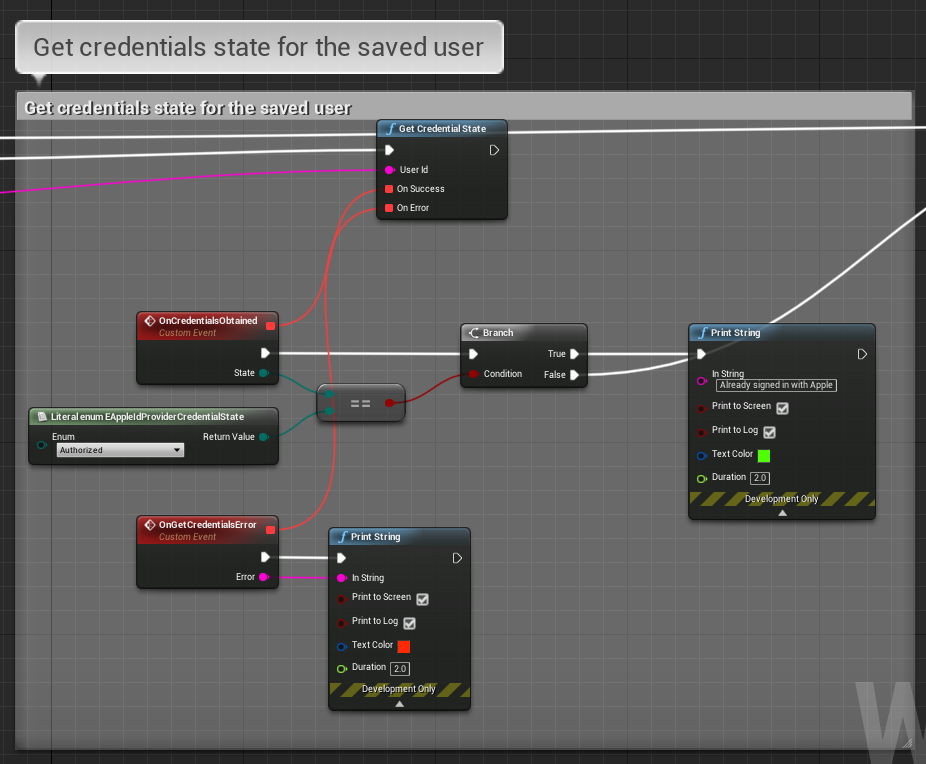
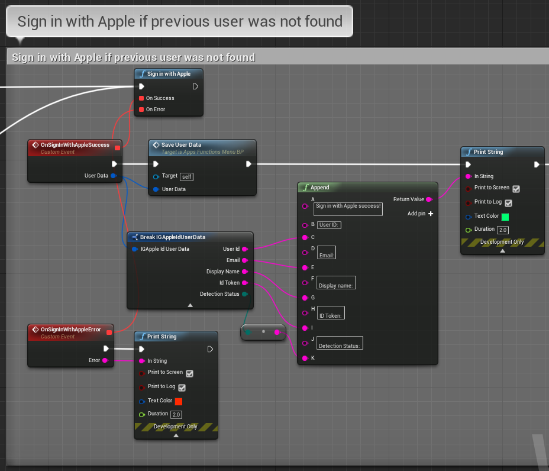
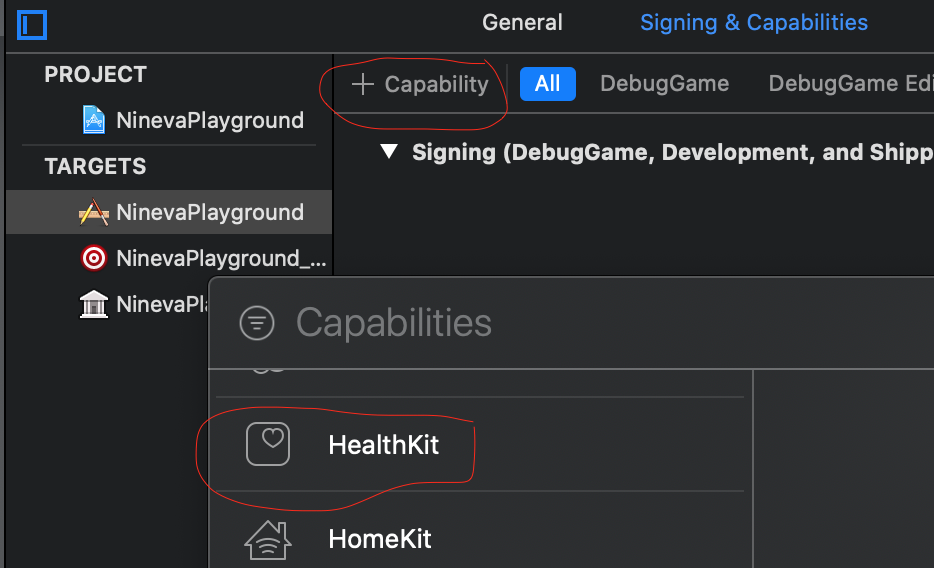
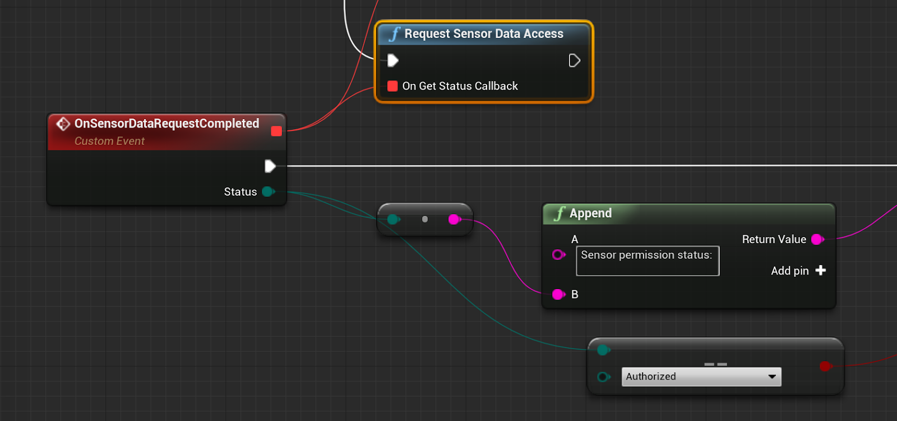
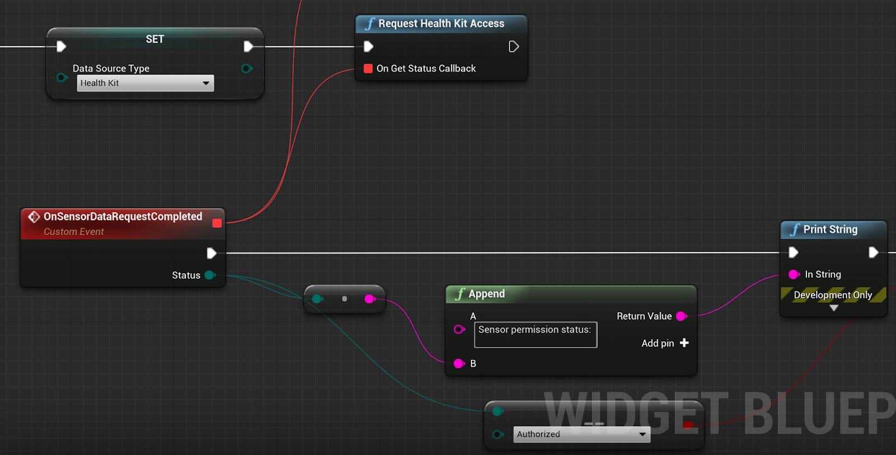
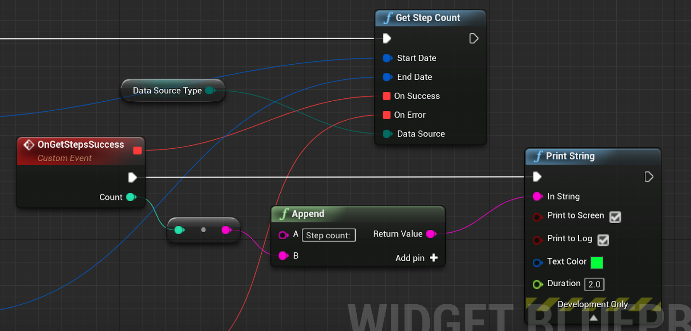

[filename](common/common_ue_header.md ':include')

[filename](common/copy_plugin.md ':include')

# **iOS Goodies**

Welcome to iOS Goodies Documentation for Unreal Engine

---


# **FAQ**

## .plist

iOS Goodies plugin in order to make all of its features work properly adds extra entries to .plist file. Note that those entries overwrite ones that were added in project settings. In order to remove/edit those entries, you have to edit IOSGoodies_UPL.xml (included in the plugin sources) accordingly.
# **Native dialogs**

You can show standard iOS native dialogs with:

* [Single button](#dialog-with-single-button)
* [Two buttons (i.e. Yes/No, Ok/Cancel)](#dialog-with-two-buttons)
* [Three buttons (chooser)](#dialog-with-three-buttons)
* [Input dialog](#input-dialog)
* [Action sheet](#action-sheet)
* [Action sheet with destructive button](#action-sheet-with-destructive-button)
* [Loading dialog](#loading-dialog)

	Native dialogs support callbacks for different events like a button click or dialog cancellation. The user must provide appropriate event handlers for those callbacks.

## Dialog with single button

Show this dialog by calling `ShowSingleButtonDialog` function.


Result:


## Dialog with two buttons

Show this dialog by calling `ShowTwoButtonsDialog` function.


Result:


## Dialog with three buttons

Show this dialog by calling `ShowThreeButtonsDialog` function.


Result:


## Input dialog

Call `ShowInputFieldDialog` to show a native dialog with an input field. You can customize it by passing title, body text, confirmation and cancellation button titles. After the user confirms input, you will receive a callback with the typed string.


## Action sheet

Show action sheet by calling `ShowActionSheetSimpleDialog` function. It takes an array of strings as a parameter which represents names of action sheet buttons. When some action button is clicked user will receive a callback with the index of clicked button.


Result:


!> If you plan your application to be run on iPad, pass additional parameters (posX and posY), which represent the position of the popover view on iPads. Default values (0; 0) will cause the view to appear in the top left corner of the screen. These values will be ignored on iPhone.

## Action sheet with destructive button

Show action sheet with destructive button by calling `ShowActionSheetComplexDialog` function. It takes an array of strings as a parameter which represents names of action sheet buttons. When some action button is clicked user will receive a callback with the index of clicked button.


Result:


!> If you plan your application to be run on iPad, pass additional parameters (posX and posY), which represent the position of the popover view on iPads. Default values (0; 0) will cause the view to appear in the top left corner of the screen. These values will be ignored on iPhone.

## Loading dialog

This function fades screen and displays native loading spinner at the middle. Call `ShowLoadingDialog` to begin showing a loading screen. Call `DismissLoadingDialog` to dismiss it after the background work is done.

!> All user interface iteractions are blocked during the lifetime of the loading screen

# **App Store rate dialog**

Use `RequestRating` function to produce a dialogue asking the user to rate your app on the AppStore.


# **Date and time pickers**

You can show the default iOS date and time picker.

## Showing date picker

To show the default iOS date picker call `ShowDatePicker` function.


There is an option to show date picker but with a limited range of dates that can be selected (i.e. only dates between 15-Oct-1991 and 16-Nov-2018). Use `ShowDatePickerWithLimits` function to do that.


Result:


## Showing time picker

To show the default iOS time picker call `ShowTimePicker` function.


There is an option to show time picker but with a limited range of time values that can be selected (i.e. only time within 14:45 and 19:57 interval). Use `ShowTimePickerWithLimits` function to do that.


Result:


## Showing date and time picker

It possible to show picker that allows selecting both date and time. Use `ShowDateTimePicker` function to do that.


Like with pickers described above you can limit the range of date-time values that can be selected with `ShowDateTimePickerWithLimits` function instead.

Result:


## Showing timer

To show picker with countdown timer style use `ShowCoundownTimer` function. It allows picking values between 1 minute and 23 hours 59 minutes.


Result:


# **Device Info**

Device information functions allow retrieving various information about iOS device.

## Getting device information

You can retrieve one of the properties, defined in `UIDevice` class, such as `systemName` , `model` , `UUIDString` and others.

## Getting the battery information

The plugin allows you to use functions for getting and setting the battery monitoring status, as well as retrieving current battery level (0-100) and battery state (one of: `Unplugged` , `Charging` or `Full` ).

!> Battery monitoring has to be enabled in order to retrieve battery information.

## Getting proximity information

You can also enable/disable proximity monitoring status and retrieve the proximity state of the device.

More documentation can be found [here](https://developer.apple.com/documentation/uikit/uidevice).

# **Native Sharing**

Native sharing allows you to share content using the following ways:

## General sharing

You can use the `ShareText`, `ShareImage`, or `ShareLink` methods to open a selector view, where the user can choose a program to share the object with.
`ShareTextWithImage` and `ShareTextWithUrl` methods allow you to do the same but include an image or an URL along with the text, and you can use `ShareTextWithImageAndLink` method to share all three types of objects.

!> If you plan your application to be run on iPad, pass additional parameters (posX and posY), which represent the position of the popover view on iPads. Default values (0; 0) will cause the view to appear in the top left corner of the screen. These values will be ignored on iPhone.


## Sending an SMS

You can send an SMS via default SMS-app on the device using `SendSMSViaDefaultApp` method. But if you want to be notified about the outcome of the sending, you should use `SendSMS` method instead. You should check if the device can send SMS using `CanSendSMS` method before performing any actions.


## Sending an e-mail

You can send an e-mail via default mailing application on the device using `SendEmailViaDefaultApp` method. But if you want to be notified about the outcome of the sending, you should use `SendEmail` method instead. You should check if the device can send e-mails using `CanSendEmail` method before performing any actions.


# **App Interaction**

You can perform application related actions and interactions between applications using the `UIGApps` class.

## Application Settings

To open application settings use `OpenAppSettings` function.


## Open YouTube video

To open YouTube video in the YouTube application, call `OpenYouTubeVideo` function, passing the ID of the video as a parameter. If the application is not installed, a link to the video will be opened in the browser.


## Start FaceTime call

To perform a call using FaceTime, use `StartFaceTimeVideoCall` or `StartFaceTimeAudioCall` function, passing the user identifier as a parameter.


## Dial a phone number

To open dialer dialogue with a specified number, use `OpenDialer` function, passing phone number as a parameter.


## Open AppStore page

To open an application page in the AppStore, use `OpenAppOnAppStore` function, passing application ID as a parameter.


# **Apple Maps Interaction**

You can send different queries to Apple Maps application using `UIGMaps` class.

## Open map location

Use `OpenMapLocation` function to open a location with given values of latitude(-90 to 90) and longitude(-180 to 180). You can also specify a title of the label, pinned at the location and map view type (standard, satellite, hybrid, or transit).


## Open map address

To open the map at the specific address, use `OpenMapAddress` function, passing the address string, as well as a title of the label, pinned at the location and map view type (standard, satellite, hybrid, or transit).


## Get map directions

To open Apple Maps application with directions from point A to point B, use `GetDirections` function. This function takes destination and source addresses as parameters. You can also specify transport type (car, feet or public transport) and map view type (standard, satellite, hybrid, or transit).


## Perform a search

You can perform a search for a location or a place using `PerformSearch` function. Pass the search query string (for example, "Eiffel Tower, Paris"), as well as map view type (standard, satellite, hybrid, or transit).
You can also perform the search nearby the specified location, using `PerformSearchNearLocation` function. It takes additional parameters: latitude(-90 to 90) and longitude(-180 to 180) of the location to search nearby, and zoom. Zoom values should lie within range 2-23.


# **Camera and Gallery**

This feature set allows taking photos with your device camera and access gallery (save/load images). Images captured with a camera or picked from the gallery are converted to 2D-texture objects.

## Camera

To take a new photo, call `PickPhotoFromCamera` function. You can specify whether it is allowed to edit image, select camera for taking photo and flash mode. Also, function callback handlers must be provided - first for processing captured image and second for handling image taking cancellation.


## Pick images from the gallery

To pick an image from the gallery, call `PickImageFromGallery` function. You can specify whether it is allowed to edit image and select source type ("Photo Library" or "Photo Album"). Also, function callback handlers must be provided - first for processing the picked image and second for handling image picking cancellation.


Optionally you can pass X and Y coordinates of image picking dialog window to this function that are taken into account on iPad.

## Pick media

You can alternatively call the `PickMediaFromGallery` and `PickMediaFromCamera` to pick a file (picture or video, for example) and obtain some useful data, as well. You can provide the media types you wish to be able to pick from (`public.image` for images and `public.movie` for videos). In successful callback you will receive an `IGPickedMedia` structure with a texture field (if it was an image), a picked file type string (`public.image`, for example), a full path to the picked file, as well as a reference URL (can be used by other libraries, for example, to share a video via [Facebook Plugin](https://docs.ninevastudios.com/#/ue-plugins/facebook-goodies?id=share-video)).

?> Not all of the fields in the picked media struct will be set, depending on the type of media picked. For example, you will not get a full path to the image by taking a photo.


## Save an image to the gallery

To save an image to gallery call `SaveImageToGallery` function.


## Delete an image from gallery

You can call `DeleteImageFromGallery` function to show an image picker dialog, allowing the user to choose a picture from the specified source to delete. Also, function callback handlers must be provided - first for processing the picked image and second for handling image picking cancellation.


Optionally you can pass X and Y coordinates of image picking dialog window to this function that are taken into account on iPad.

## Take a screenshot

Call the `TakeScreenShot` function to obtain a 2D-texture object with captured screenshot and provide callback handler to specify how it should be processed.


# **Flashlight**

You can use this class to access the flashlight on the device.

## Check if the device has a flashlight

Call `DeviceHasFlashlight` function to get a boolean value, indicating whether the device has a flashlight.

## Toggle flashlight on/off

Use `EnableFlashlight` function to enable/disable flashlight, passing boolean value (`true` for enabling, `false` for disabling).

## Change flashlight intensity

To make flashlight brighter/dimmer, use `SetFlashlightLevel`, passing a float value between 0 and 1 (0 for off, 1 - for maximum brightness).

# **Haptic Feedback**

This class allows you to send haptic feedbacks and vibrate the device.

Check [this](https://developer.apple.com/design/human-interface-guidelines/ios/user-interaction/feedback/) page to find more details about haptic feedback.

## Requirements

Haptic feedbacks do not work on iPads, because they do not have the Taptic engine.
They can only be used on iPhone 7 and newer, with iOS version 10 and higher.

You can check if the device supports haptic feedbacks using `IsHapticFeedbackSupported`.

## Haptic feedbacks

There are three types of haptic feedbacks: notification, selection and impact. You can generate them using `SendNotificationHapticFeedback`, `SendSelectionHapticFeedback` and `SendImpactHapticFeedback` functions respectively.

## Vibrate

To make the device vibrate with the default pattern, use the `Vibrate` function. It can also be used as the fallback from haptic methods if haptic feedbacks are not supported on the device.

# **Events**

## Open calendar

You can open the calendar app at the current date using `OpenCalendar` function.


You can also use `OpenCalendarAt` function and pass a `DateTime` parameter to it to open the calendar app at the specified date.


## Create calendar event

Use `CreateCalendarEvent` function to create a calendar event, specifying actions to be performed after a successful/unsuccessful creation of the event, event title, notes, start and end dates.


The event identifier you get from successful callback of the event creation can be used later to delete the event from the calendar.

## Create repeating calendar event

Call `CreateRepeatingCalendarEvent` function to create a repeating calendar event. It takes additional parameters such as date to repeat event until, a recurrence rule type (daily, weekly, monthly, or yearly) and repeat interval. For example, if you choose `RecurrenceRuleType.Daily` and pass 5 as interval, the event will be repeated every 5 days.


## Delete a calendar event

You can use `RemoveCalendarEvent` function to cancel a calendar event. This method takes the unique event identifier as a parameter (can be obtained from callback of successful calendar event creation).

## Creating a reminder

To create a reminder call `CreateReminder` function and pass title, start and end dates as parameters. Also, function callback handlers must be provided - first for successful reminder creation and second for processing error.


## Mark a reminder as complete/incomplete

Call `CompleteReminder` function to complete a reminder with a specified unique identifier (can be obtained from callback of successful reminder creation), passing a boolean value, indicating whether to mark the reminder as completed/incomplete. Function will return `true` if reminder was successfully marked as completed and `false` otherwise.


## Delete a reminder

Use the `RemoveReminder` function to remove a reminder with specified unique identifier (can be obtained from callback of successful reminder creation). Function will return `true` if reminder was successfully deleted and `false` otherwise.


# **Contacts**

## Get the list of contacts

You can obtain a list of all contacts from device phonebook using `GetAllContacts` function. Provide callback handler for the function that will receive an array of contacts.

## Search for specific contacts

There are two options for searching contacts: by name and by number. To do that, call `GetContactsWithName` and `GetContactsWithNumber` functions respectively. Provide callback handler for the function that will receive an array of contacts matching search criteria.

## Create new contact

To create a new contact call `AddContact` function.  Provide initialized `Contact` structure as a parameter. Also, provide callback handler for the function that will receive a flag indicating whether the operation was successful.

# **Sign in with Apple**

If you target devices with iOS 13 and later, you can implement the sign in with Apple logic.

Official documentation on the application flow and best practices can be found [here](https://developer.apple.com/sign-in-with-apple/get-started/). 

!> Sign in with Apple capability is automatically added to your project in UE 4.25 and later. If you want to use this functionality in earlier engine versions, you will have to add it manually!

There are two methods that you can use: `GetCredentialState` to retrieve the status for the given user ID that allows you to check whether the user is already authenticated, and `SignInWithApple` to perform the sign in, if there is no current user. It is up to the developer to save the user credentials after the successful sign in. In the demo level we have used the built-in UE4 FSaveGame class to save the user data and retrieve it on the next application launch.




# **Sensor Data**

## Step Counter

### Setup

There are two ways of obtaining step count data for iOS:
- use device sensor (CMPedometer class);
- use HealthKit framework.
Device sensor requires less platform-specific setup, but can only fetch data from the last 7 days. It also only contains data from the device sensor while the HealthKit data is synchronized between devices (phone and watch, for example).

HealthKit requires additional setup (Project Settings -> IOSGoodies) -> Enable Health Kit. Additionally, HealthKit requires a capability to be added to the output XCode project. If you are just launching on the device, you can open the output xcode project in the PROJECT_PATH/Intermediate/ProjectFilesIOS/ ProjectName.xcproj, go to Signing & Capabilities, and add the HealthKit capability:



After that you can relaunch from the xcode (do not delete the application from the device), and it will work.

This approach, however, will not work if you are packaging the project. The only way for you to add the capability is to modify the Engine Sources (requires engine from GitHub repository).

To do this you have to edit the `ENGINE_FOLDER\Engine\Source\Programs\UnrealBuildTool\Platform\IOS\IOSExports.cs` file.

You have to find the following lines:
```csharp
// for Sign in with Apple
bool bSignInWithAppleSupported = false;
PlatformGameConfig.GetBool("/Script/IOSRuntimeSettings.IOSRuntimeSettings", "bEnableSignInWithAppleSupport", out bSignInWithAppleSupported);

if (bSignInWithAppleSupported)
{
  Text.AppendLine("\t<key>com.apple.developer.applesignin</key>");
  Text.AppendLine("\t<array><string>Default</string></array>");
}
```

And add this snippet right after them:

```csharp
// for Health Kit
bool bHealthKitSupported = false;
PlatformGameConfig.GetBool("/Script/IOSGoodies.IOSGoodiesSettings", "bEnableHealthKit", out bHealthKitSupported);

if (bHealthKitSupported)
{
  Text.AppendLine("\t<key>com.apple.developer.healthkit</key>");
  Text.AppendLine("\t<true/>");
  Text.AppendLine("\t<key>com.apple.developer.healthkit.access</key>");
  Text.AppendLine("\t<array/>");
}
```

### Usage

If you use the pedometer data, you have to request the permission using the following call:



In case of Health Kit you should request permission using this call:



Only if you get the “Authorized” status, you can get the step counter data:



The method takes the following parameters: start date, end date, callbacks to be invoked with step count or error, if it happens, and the data source type (device sensor or health kit).

___

# Changelog

v.1.6.5

* ADDED Nonce generation to Sign in with Apple to allow intergration with 3rd party services like Firebase

v.1.6.0

* ADDED Pedometer support via HealthKit
* ADDED Alternative method for taking photos
* FIXED Issues with date picker on iOS 13+

v.1.5.0

* ADDED [Sign in with Apple](https://developer.apple.com/sign-in-with-apple/get-started/)

v.1.4.0

* ADDED [FilePicker](https://developer.apple.com/documentation/uikit/uidocumentpickerviewcontroller?language=objc)
* ADDED PickedImage abstraction to expose more properties for the media picked by ImagePicker

v.1.3.1

* ADDED Unreal Engine 4.25 support
* UPDATED Image pickers

v.1.3.0

* ADDED Added possibility to change size of image picked from gallery
* ADDED Status bar show/hide functionality
* FIXED Issue with image picker rotation in lanscape mode
* FIXED Native UI elements appearence when dark theme is enabled
* FIXED Some threading issues on iOS 13

v.1.2.3

* ADDED Unreal Engine 4.24 support
* FIXED Added zero-initializer for enumerations to avoid build issues

v.1.2.2

* ADDED Fetching contacts info
* UPDATED Improved mechanism for handling iOS native callbacks

v.1.2.1

* ADDED Unreal Engine 4.22 support
* UPDATED Removed some limitations for sharing via default apps

v.1.2.0

* ADDED Screenshot taking
* ADDED Picking and deleting images from gallery
* ADDED Capturing photos with device camera
* ADDED Calendar events and reminders

v.1.1.0

* ADDED Haptic feedback

v.1.0.0

* Initial release

___
