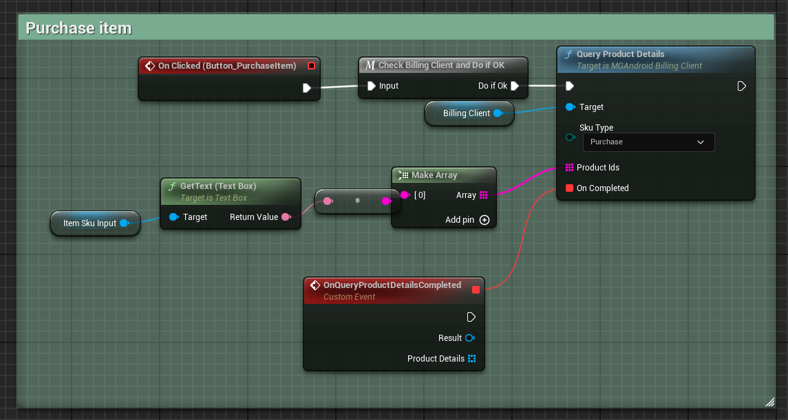
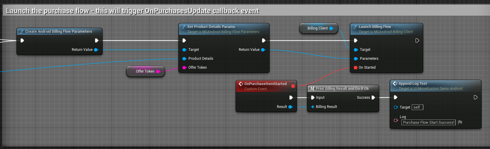

[filename](common/common_ue_header.md ":include")

# **Monetization Goodies**

This plugin wraps native payments for Android and iOS. On Android it wraps the [Billing library](https://developer.android.com/google/play/billing/integrate), and on iOS - [Original In-App-Purchase API](https://developer.apple.com/documentation/storekit/original_api_for_in-app_purchase?language=objc).

?> The plugin functionality wraps around native calls and should be used with the same recommendations and flows, as the original SDKs.

Due to the native API's being different, the implementations and functions are different for each platform, meaning that you will have to write your own implementation for each platform separately.

# Setup

The plugin contains demo levels for both Android and iOS in the `Content` folder.

Disable `Online Subsystem Google Play` in project Plugins window.


You also need to remove the dependency by removing these lines if you have it in your `Target.cs` and `Build.cs` files:

- `PrivateDependencyModuleNames.Add("OnlineSubsystemGooglePlay");`
- `ExtraModuleNames.Add("OnlineSubsystemGooglePlay");`

You might also need to add/modify the `Config/Android/AndroidEngine.ini` file contents fo have all the built-in Google Play Billing features disabled:

```ini
[OnlineSubsystemGooglePlay.Store]
bSupportsInAppPurchasing=false
bUseStoreV2=false
bUseGooglePlayBillingApiV2=false
```


## Android

?> Please, follow the recommendations from the [official documentation](https://developer.android.com/google/play/billing/integrate) for most use cases and best practices.

[filename](common/afs_fix.md ":include")

### Initialize Client

Android Billing Client class is the main entry point for communication with the billing library. It is recommended to create an instance of it as early as possible, and to keep a reference to it for future calls.


While doing so, you also provide the main purchase callback handler delegate. It gets invoked every time a purchase transaction is added, updated or removed. It is a right place to handle the transactions depending on their status.

?> Billing library requires every successful purchase to be acknowledged before consuming it or granting content to the user.

You can also check whether some features are supported on the device, and act accordingly:


Once you have created the billing client, you can call the start connection function to start the actual communication with the Play Store. You also provide delegate function to handle the result of the connection, as well a function to be invoked when the connection is disrupted. It is recommended to write your reconnect logic for such cases.


You can also check the connection state at any time.


It is recommended to query pending purchases after the connection is successfully established.


### Make purchase

You have to obtain product details before launching the purchase flow. Use the `Query Product Details` function for that.



You can either fetch the product details for the required item before the purchase, or fetch the product details for all the required items beforehand and store them for future use.

Once you have the required product details, you can call the `Launch Billing Flow` function and providing a valid `BillingFlowParameters` object.



The result of the purchase will be received in the `OnPurchasesUpdated` callback, provided during Billing Client creation.

?> Billing library requires every successful purchase to be acknowledged before consuming it or granting content to the user.

You can also check if the purchase is already acknowledged:


### Query data

You can query the purchase history for Items or Subscriptions at any time.


### Stop connection

It is recommended to stop connection after you are done working with the Billing Client to free system resources.


## iOS


?> Please, follow the recommendations from the [official documentation](https://developer.apple.com/documentation/storekit/original_api_for_in-app_purchase?language=objc) for most use cases and best practices.

To test in-app purchases on iOS after the setup you need to either 1) Upload the App to internal testing via the TestFlight or 2) Create a [sandbox Apple Id](https://developer.apple.com/documentation/storekit/in-app_purchase/testing_in-app_purchases_with_sandbox?language=objc) in App Store Connect. You can
test the demo level inside the plugin first and then build your implementation upon it.

Make sure to follow the setup instructions at the beginning of this page before implementing In-App-Purchases for iOS. Usually, the problems are with the setup, check the [discussion section for potential misconfiguration issues](https://developer.apple.com/documentation/storekit/skproductsresponse/1505985-invalidproductidentifiers?language=objc).

?> When setting up the purchases in the App Store Connect, make sure they are added to the application on the app page


If having issues, make sure your `Online Subsystem iOS` is enabled in the plugins section. Make sure that your `IOSEngine.ini` (or `BaseIOSEngine.ini` in the engine) contains the lines to enable the Online Subsystem IOS in-app purchases.

```ini
[OnlineSubsystemIOS.Store]
bSupportsInAppPurchasing=true
bUseStoreV2=true;
```

### Initialize

`PaymentQueue` is main entry point for communication with App Store.

You should get and store a reference to the default queue as soon as possible to initialize callbacks.
It is also important to check if the user is authorized to make purchases.


Once you get a reference to the queue object, you can add transaction observer and bind delegate functions to handle the native callbacks.


!> Due to the threading issues (delegate functions have to be executed in the main game thread), some delegates can not be overriden in blueprints, and you have to write the logic for them in the code.

These are two methods in the `MGIosPaymentQueue.cpp` file:


And one method in the `MGIosTransactionObserver.cpp` file.


### Purchase items

Before making purchases you have to query and store the available product's data.


After that you can use the product details objects to request the purchases.


### Other functionality

Restore purchases:


Present code redemption sheet:


The plugin wraps all of the native [Original In-App-Purchase API](https://developer.apple.com/documentation/storekit/original_api_for_in-app_purchase?language=objc), so you can view most of the use cases and references in the official documentation.

# Changelog

### 2.1.3

- UPDATED billing client to v7
- FIXED Some threading issues on iOS
- 

---

### 2.1.1

- IMPROVED iOS version no longer requires the plugin to be copied to the project
- FIXED Demo crash on iOS when products array is empty when trying to purchase an item
- IMPROVED Remove price confirmation flow that was removed in billing client v5

---

### 2.0.2

- IMPROVED Update Android billing client version to 6.0.1
- FIXED Period unit bug on iOS

---

### 2.0.1

- FIXED Some crash on iOS
- IMPROVE Updated billing client on Android to v5

---

### 1.0.0

- Initial release

---
