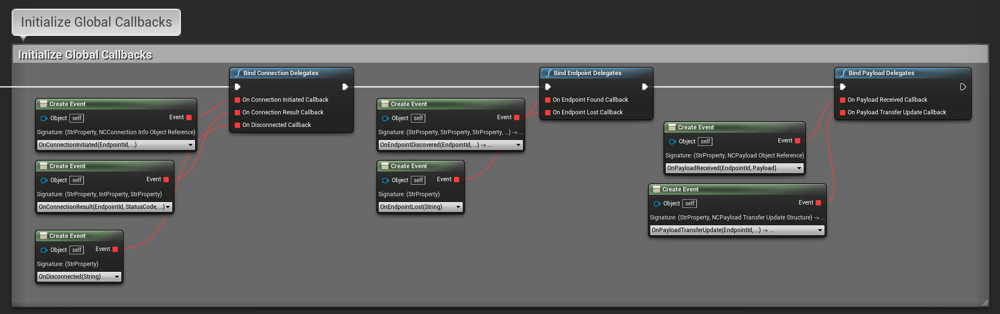
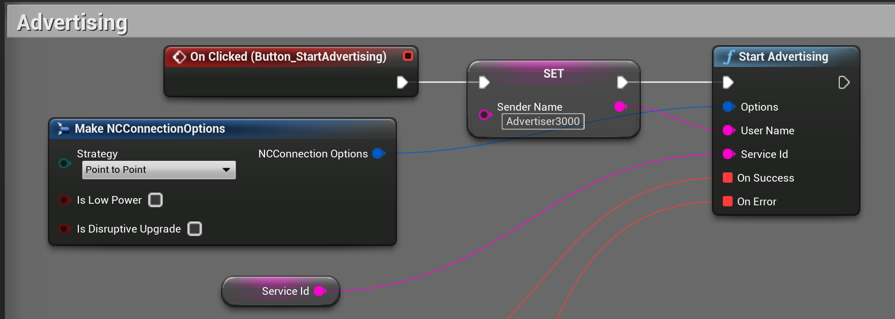
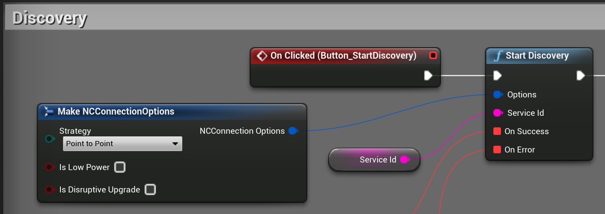
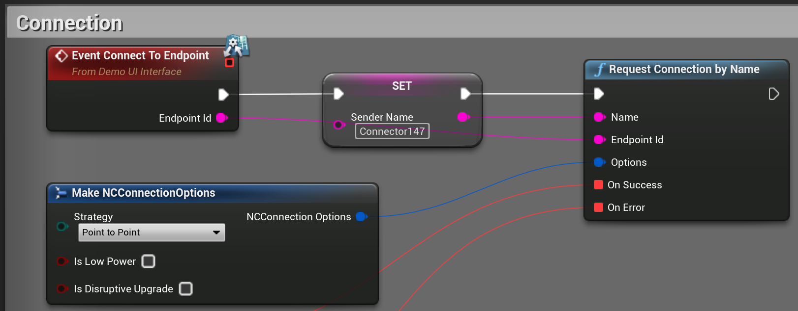
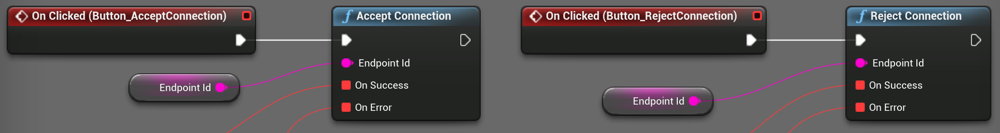
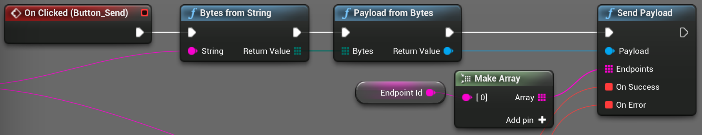
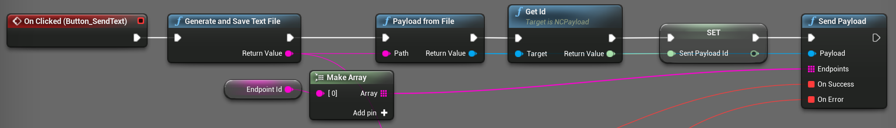

[filename](common/common_ue_header.md ':include')

# **Nearby Connections**

Welcome to Nearby Connections Documentation for Unreal Engine.

# About

This plugin wraps the native Android [Nearby Connections](https://developers.google.com/nearby/connections/overview) library.

!> Note: the plugin only works on Android devices, and does **NOT** work in the Editor, or desktop platforms.

The plugin contains Demo level with basic examples of connection flow, as well as payload and file exchange.

# Setup

The plugin adds several Android [permissions](https://developers.google.com/nearby/connections/android/get-started#request_permissions), because the native library requires them to function properly.

You have to make sure they are granted before actually using the plugin functionality, as some calls might result in errors.

The `android.permission.READ_EXTERNAL_STORAGE` is only used if you are planning to exchange files between devices.

If you do not need it, you should go to the plugin directory, and modify the `NearbyConnections/Source/NearbyConnections/NearbyConnections_Android_UPL.xml` file, specifically, remove the `<addPermission android:name="android.permission.READ_EXTERNAL_STORAGE"/>` line.

# Status codes

Some callbacks in the plugin return status codes that can be used to determine whether the preceding API call was successful, or to see the type of error that has occured. Please, refer to the official documentation [here](https://developers.google.com/android/reference/com/google/android/gms/common/api/CommonStatusCodes) and [here](https://developers.google.com/android/reference/com/google/android/gms/nearby/connection/ConnectionsStatusCodes) for the possible status codes and their meaning.

# Global callbacks

There are several callback groups that are set once per lifetime of your application. They should be initialized as soon as possible.

## Connection callbacks

- `OnConnectionInitiated` - invoked whenever one user is initiating the connection with the advertiser. It is invoked on both devices, and the connection confirmation flow should be shown on both devices using the `EndpointId` and `ConnectionInfo` data.

?> Among other data, the `ConnectionInfo` structure contains `Authentication Digits` that are the same on both devices if the connection is secure and untampered with.

- `OnConnectionResult` - invoked when both parties accept the incoming connection, either one rejects it, or an error occurs. The callback contains `StatusCode` parameter that can be used to determine whether the result is successful. Please, refer to status [codes](ue-plugins/nearby-connections-unreal?id=status-codes) for more explanation.
- `OnDisconnected` - invoked whenever you are disconnected from an endpoint (`EndpointId` is received in callback).

## Endpoint Discovery Callbacks

- `OnEndpointDiscovered` - invoked whenever a new endpoint is discovered after `StartDiscovery` has been called. `EndpointId` is guaranteed to be valid, while `ServiceId`, `EndpointName`, and `EndpointInfo` can be present or not, depending on the advertising device setup.
- `OnEndpointLost` - invoked whenever a previously discovered endpoint has become unavailable (stopped advertising, has gone out of range, etc.) with an `EndpointId` as parameter.

## Payload Callbacks

- `OnPayloadReceived` - invoked whenever a payload has been received. You can check the payload type, and get the neccessary data from this callback.

?> For file payloads this callback is received when the file download has only started. Byte payloads are ready to be used right-away.

- `OnPayloadTransferUpdate` - invoked whenever payload transfer status/progress is changed. 

?> This callback is also received for byte payloads, but without the respective data, so you have to handle the byte payloads in the `OnPayloadReceived` callback, while handling the file payloads in this one, when the [status](https://developers.google.com/android/reference/com/google/android/gms/nearby/connection/PayloadTransferUpdate.Status) is `Success`.

# Advertise and Discover

Please, refer to the official [guidelines](https://developers.google.com/nearby/connections/android/discover-devices) for the connection flow recommendations.

## Choose Connection Strategy

Please, refer to the official [guidelines](https://developers.google.com/nearby/connections/strategies) on how to properly choose the connection strategy, and how it affects your setup.

## Advertisement

On the devices that should advertise, call the `StartAdvertising` function, providing the preferred connection strategy, username, service ID, and callbacks. The incoming connection requests will be received in the `OnConnectionInitiated` [callback](ue-plugins/nearby-connections-unreal?id=connection-callbacks).

?> It is always a good practice to call the `StopAdvertising` function after the advertising is no longer needed, as it poses an additional load on the system resources.

## Discovery

On the devices that should discover, call the `StartDiscovery` function, providing the preferred connection strategy, service ID, and callbacks.

?> It is always a good practice to call the `StopDiscovery` function after the discovery is no longer needed, as it poses an additional load on the system resources.

# Manage Connections

Please, refer to the official [guidelines](https://developers.google.com/nearby/connections/android/manage-connections) on how to initiate and manage the connections.

## Initiate a Connection

Once the device that has been in discovery mode discovers a device, you can either store the `EndpointId` from the `OnEndpointDiscovered` callback, and display UI to reflect the endpoint data, or you can initiate the connection right-away using the received `EndpointId`.

If the `RequestConnection` call was successful, both parties will receive an `OnConnectionInitiated` callback with the details of the request.

After this both participants can accept or reject the connection using the `EndpointId` in the callback.

?> Both devices have to accept the connection for it to establish.

## Disconnect

Users can disconnect from the connected endpoint at any time using the `DisconnectFromEndpoint` function.

# Exchange Data

Please, refer to the official [information](https://developers.google.com/nearby/connections/android/exchange-data) about the data exchange and best practices.

!> The plugin supports only `Bytes` and `File` payload types.

?> The plugin contains several demo functions to send and receive text messages as byte payloads, but they are made just for demo purposes and can be glitchy with different symbols.

You can send byte and file payloads with the plugin.

You have to provide a full file path to create a file payload.

Handling incoming payloads should be done in the payload [callbacks](ue-plugins/nearby-connections-unreal?id=payload-callbacks).

# Changelog

1.0.0

* Initial release

---
