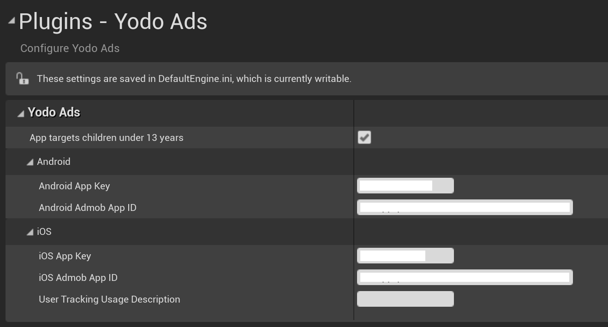
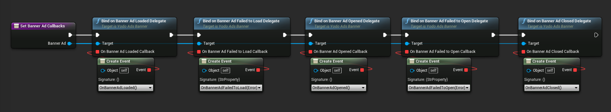
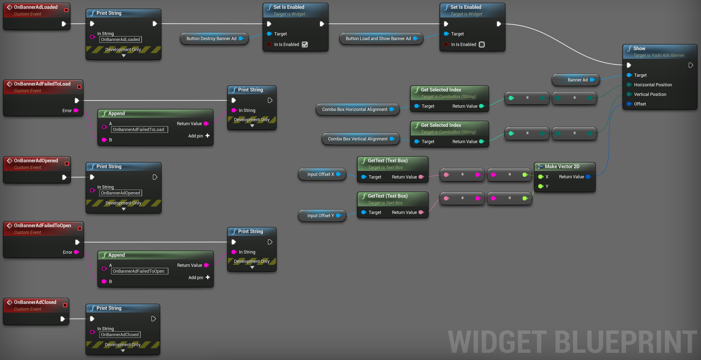

[filename](common/common_ue_header.md ':include')

# **Yodo Ads**

The plugin wraps native iOS and Android SDK for [Yodo Ads](https://developers.yodo1.com/article-categories/sdk-docs/).

The API calls are the same for Android and iOS.

## Setup

Before you get started you need to create a project in the [Yodo Console](https://developers.yodo1.com/knowledge-base/signing-up-to-mas/). Please, follow the steps in the official documentation to get the App ID and Admob ID for iOS and/or Android projects.

Enter these values in the Project Settings -> Yodo Ads.

## SDK Initialization

You have to Initialize SDK before showing ads.

You can also show the user agreement dialog to gather the necessary data and adjust the ads.

## Global callbacks

Interstitial and Rewarded Ad lifetime callbacks are global for the SDK and can be set this way (only set the required ones):

## Banner Ads

As of recent versions of Yodo Ads SDK, you can show multiple banners.

Make sure to call the `Show` function only when the banner is loaded.

Make sure to destroy the banner ad when it is no longer needed.

## Interstitial and Rewarded ads

The flow with Interstitial and Rewarded ads is pretty straightforward - check if it's loaded, and show if it is.

Ad loading in SDK is automatic.

# Changelog

1.0.0

* Initial release

---
